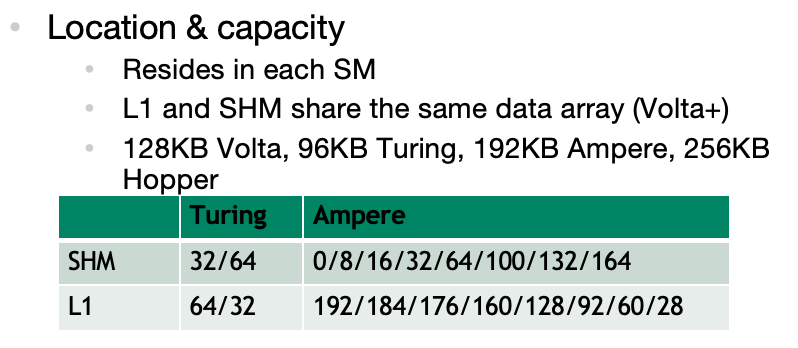
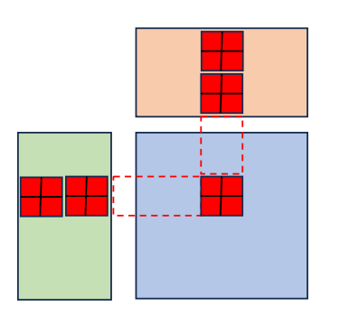
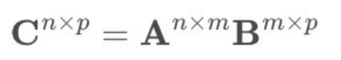
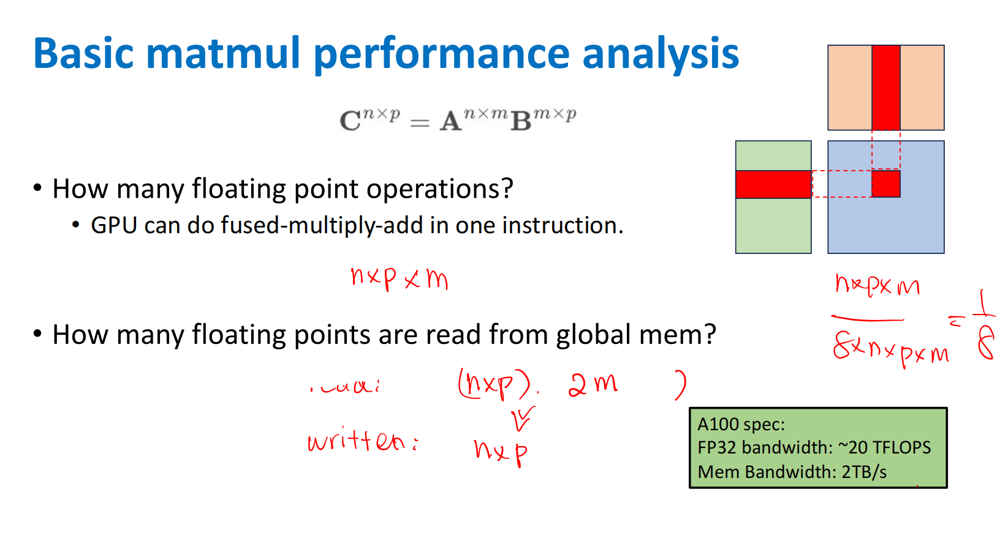
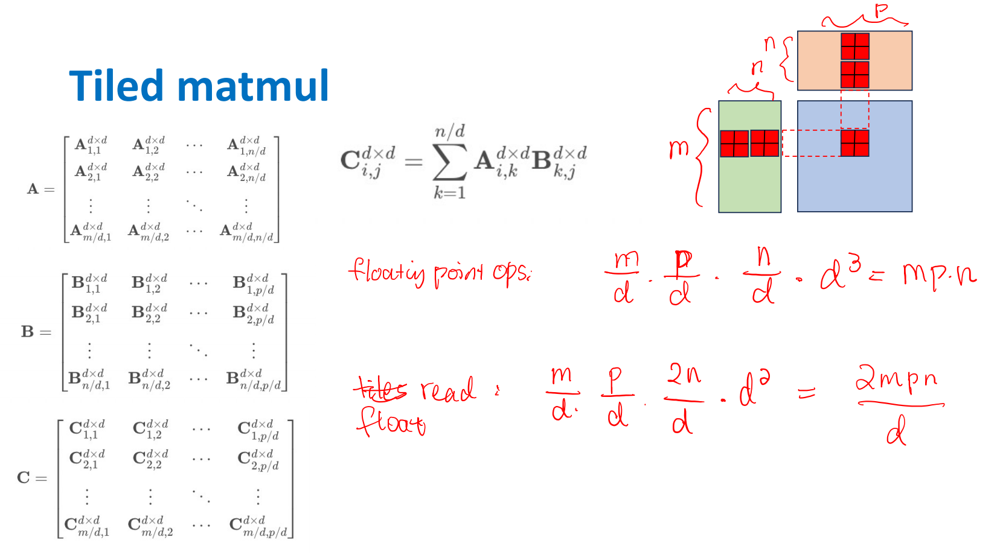
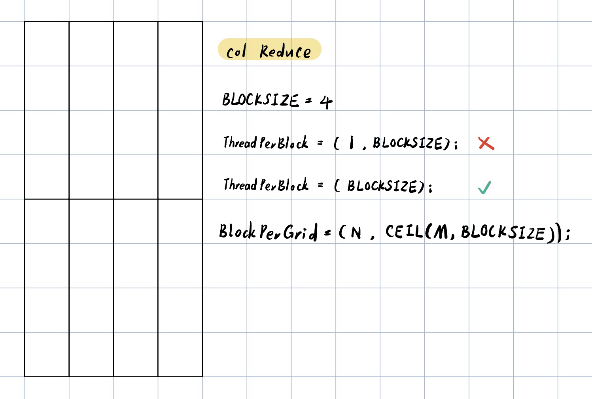
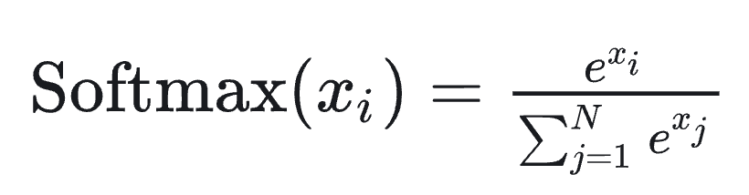
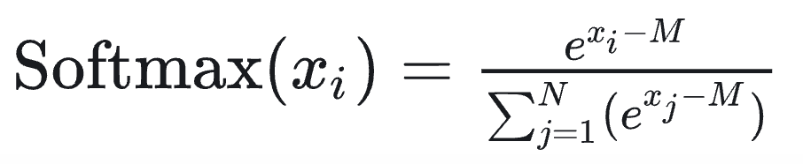
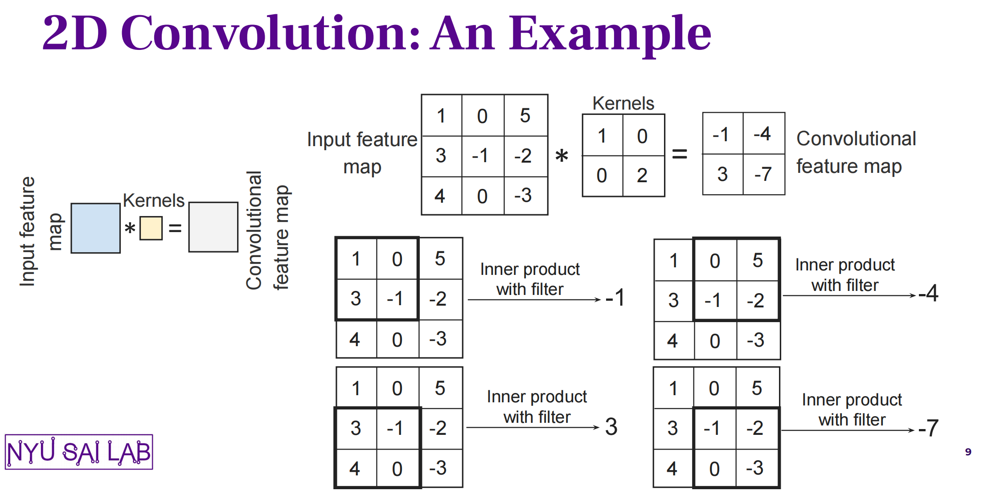
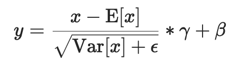

# 02-常见CUDA手写实现(with code)

**[Quick Ref for 手写code]**：一些基础CUDA算子 ｜ [ipynb](../code/02-cuda-ops.ipynb) ｜ [Colab](https://drive.google.com/file/d/1tcFq7B5rouZHKX239F4514f-_INscfvm/view?usp=drive_link)


## 前言

本来第二部分准备写并行的，但是最近面试国内，就还是先复习一下CUDA好了！

根据之前的经验，常见会问到的CUDA手写题包括：

- Add 加法（1D/2D）- elementwise
- matMul 矩阵乘（naive/tiled）
- Transpose 转置
- Sum Reduce 规约（1D/2D行列，naive/折半归约/warp shuffle）

以下则是一些可能问到的：

- Softmax规约
- Conv 卷积
- Layer Norm

Plus：Float4向量化也需要会写，原本以为不太需要，结果在考reduce时被问了一次（故此处所有的都加上了合并访存版，elementwise和reduce系列都比较适合float4）。

可以在这里进行练习，但有点怀疑它只能过编译：[leedcode for CUDA](https://leetgpu.com/challenges)

其他参考资料：

- NYU CSCI-GA.3033-077 Big Data and Machine Learning Systems 相关课件
- 相关帖子：https://zhuanlan.zhihu.com/p/12661298743；https://zhuanlan.zhihu.com/p/678903537

先准备这些常见的吧！我都加了 Test case，可以下载 [ipynb 文件](../code/02-cuda-ops.ipynb)（或在 [Colab](https://drive.google.com/file/d/1tcFq7B5rouZHKX239F4514f-_INscfvm/view?usp=drive_link) 上）运行（CUDA 部分需要 GPU 环境）。

plus：频率是从面intern的角度来评价的。


## 说明

面试时不会提供运行环境，也不会要求自己写test case运行，一般来说只要写出kernel函数和调用函数即可。

**【通常是分3步走🤔】**

- 宏定义：ceilling函数 / 全局定义BLOCKSIZE / float4向量化访问

  - `&(value)` 取得 `value` 的内存地址，`reinterpret_cast<float4*>` 将该地址强制转换为 `float4*` 类型的指针

  - 最终将 `value` 的内存当作 `float4` 对象使用，四个元素依次用 `x,y,z,w` 访问


  ```c++
  # define CEIL(a, b) ((a + b - 1) / (b))
  #define FLOAT4(value) (reinterpret_cast<float4*>(&(value))[0])
  ```

- 实现调用函数 - threadPerBlock, blockPerGrid, <<<>>>, cudaDeviceSynchronize
- 实现kernel函数（定义一个block里的每个thread要做什么）

**【为什么kernel函数是定义每个block的呢？】**这涉及到 **SM 如何调度线程执行**：

- Block是逻辑调度单元：一个block分配给一个SM，SM内部按warp调度。
- Warp：每个warp包含32个线程，SM以warp为最小单位进行调度。

- **重要的一点：关于Idx的顺序，threadIdx.y对应tensor中的row，threadIdx.y对应tensor中的col。**

  ```c++
  threadIdx.x = threadIdx % width; 	// 本质是col
  threadIdx.y = threadIdx / width;	// 本质是row
  ```

**【float4类型合并访存】**

- 使用float4类型访存，用向量化的LDG.128和STG.128指令从DRAM一次读4个元素，以减少指令数（读ptx层就能看到这些指令）
- 为什么是float4？
  - PTX指令集（GPU底层指令）仅明确定义了`LDG.32`、`LDG.64` 和 `LDG.128`，128是最大的
  - 128是指 128 bits，float32 = 32 bits，128/32 = 4


## 1. Add

考察频率：中。

一般都直接上矩阵乘，简单的考Add反而少，but去年面NV考过。

### 1.1 1D vecAdd

```c++
# define BLOCKSIZE 1024
// input: A[N],B[N] -> output: C[N]

__global__ void vecAddKernel(float *A, float *B, float *C, int N){
  int idx = blockIdx.x * blockDim.x + threadIdx.x;
  if (idx < N){
    C[idx] = A[idx] + B[idx];
  }
}
```

```c++
void vecAdd(float *A, float *B, float *C, int N){
  dim3 threadPerBlock(BLOCKSIZE);
  dim3 blockPerGrid(CEIL(N, BLOCKSIZE));
  
  vecAddKernel<<<blockPerGrid, threadPerBlock>>>(A, B, C, N);
  cudaDeviceSynchronize();
}
```

### 1.2 1D vecAdd + Float4

启用向量化合并访存。每个thread处理4个元素，因此`blockPerGrid`变少。

```c++
# define BLOCKSIZE 1024

__global__ void vecAddKernel(float *A, float *B, float *C, int N){
  int idx = (blockIdx.x * blockDim.x + threadIdx.x) * 4;
  if (idx + 3 < N){
    float4 tmp_A = FLOAT4(A[idx]);
    float4 tmp_B = FLOAT4(B[idx]);
    float4 tmp_C;
    tmp_C.x = tmp_A.x + tmp_B.x;
    tmp_C.y = tmp_A.y + tmp_B.y;
    tmp_C.z = tmp_A.z + tmp_B.z;
    tmp_C.w = tmp_A.w + tmp_B.w;
    FLOAT4(C[idx]) = tmp_C;
  }
}
```

```c++
void vecAdd(float *A, float *B, float *C, int N){
  dim3 threadPerBlock(BLOCKSIZE);
  dim3 blockPerGrid(CEIL(CEIL(N,4), BLOCKSIZE));	// modify
  
  vecAddKernel<<<blockPerGrid, threadPerBlock>>>(A, B, C, N);
  cudaDeviceSynchronize();
}
```


### 1.3 2D matAdd

逻辑和1D几乎没区别，就是row/col需要熟悉一下计算index

```c++
# define BLOCKSIZE 32

__global__ void MatAddKernel(float *A, float *B, float *C, int M, int N){
  int row = blockIdx.y * blockDim.y + threadIdx.y;
  int col = blockIdx.x * blockDim.x + threadIdx.x;
  
  if (row < M && col < N){
    int idx = row * N + col;
    C[idx] = A[idx] + B[idx];
  }
}
```

```c++
// A[M*N]
void MatAdd(float *A, float *B, float *C, int M, int N){
  dim3 threadPerBlock(BLOCKSIZE, BLOCKSIZE)
  dim3 blockPerGrid(CEIL(N, BLOCKSIZE), CEIL(M, BLOCKSIZE));
  
  MatAddKernel<<<blockPerGrid, threadPerBlock>>>(A, B, C, M, N);
  cudaDeviceSynchronize();
}
```


## 2. matMul 矩阵乘

考察频率：超级高。

经典题嘛，当然有事没事就考它，建议被问直接上tiled版本。

### 2.1 naive版矩阵乘

```c++
# define BLOCKSIZE 32
// A[M*K], B[K*N], C[M*N]

__global__ void matMulKernel(float *A, float *B, float *C, int M, int N, int K){
	int row = blockIdx.y * blockDim.y + threadIdx.y;
  int col = blockIdx.x * blockDim.x + threadIdx.x;
  
  // get C[row][col]
  if (row < M && col < N){
    float sum = 0;
    // sum A[row][i] * B[i][col]
    for (int i = 0; i < K; i++){
      sum += A[row*K + i] * B[i*N + col];
    }
    C[row*N + col] = sum;
  }
}
```

```c++
void matMul(float *A, float *B, float *C, int M, int N, int K){
	dim3 threadPerBlock(BLOCKSIZE, BLOCKSIZE);
	dim3 blockPerGrid(CEIL(N, BLOCKSIZE), CEIL(M, BLOCKSIZE));
	
	matMulKernel<<<blockPerGrid, threadPerBlock>>>(A, B, C, M, N, K);
	cudaDeviceSynchronize();
}
```


### 2.2 Tiled Matmul - tiled矩阵乘

> thread_tile 版

考察频率：高。

使用 shared memory 的经典优化版本，没事问一下。基础知识罢了，请熟练背诵。

**【思路和原理】**

GPU 上各种内存的访问速度为 Global memory << shared memory。其中：

- **Global memory** - 所有thread可访问
  - 对应到硬件上为DRAM
  - 它不在芯片上，通过高带宽总线连接（DDR/GDDR）连接  -> 最慢

- **shared memory** - per-block
  - 同一个block中的所有thread可共享
  - ON CHIP！对应到硬件是SM 内部的 SRAM，物理上是和L1 cache share的



Global memory 大而慢， shared memory 小而快，因此减少内存访问延迟的一个常见的策略就是 Tiling —— 将数据分片，然后将每个小分片缓存到 shared memory 中。

- 为了匹配thread，每个sub matrix形如（BLOCKSIZE, BLOCKSIZE）
- 为了计算C中的sub matrix，多次迭代load A/B 中的sub matrix 进入shared memory，每次计算一个分块矩阵乘，然后叠加得到这部分结果




**【复杂度分析】**

GPU 的计算能力（TFLOPS）通常远大于其内存带宽 bandwidth（TB/s），所以内存带宽往往才是瓶颈。

假设

- Naive Matmul

  - each C element: $m$ - load
  - Total: $n*p$ - elements
  - Total Load + store: $2mnp$

  

- Tiled Matmul

  - Tiled Size: $d*d$
  - each C sub matrix: $n/d$ - loads of $d*d$ = $nd$
  - Total: $m*p/d^2$​ - elements
  - Total Load + store: $2mnp/d$

  

结论：load/store相差了一个d的倍数。


**【实现】**

```c++
# define BLOCKSIZE 32
// A[M*K], B[K*N], C[M*N]

__global__ void matMulTiledKernel(float *A, float *B, float *C, int M, int N, int K){
  // assign shared memory
  __shared__ float As[BLOCKSIZE][BLOCKSIZE];
  __shared__ float Bs[BLOCKSIZE][BLOCKSIZE];
  
  // global pos in C
  int row = blockIdx.y * blockDim.y + threadIdx.y;
  int col = blockIdx.x * blockDim.x + threadIdx.x;
  
  float sum = 0;
  int numTiles = CEIL(K, BLOCKSIZE);
  
  for (int t = 0; t < numTiles; t++){
    // compute padding
    int offset = t * BLOCKSIZE;
    
    // load Tiled A - 😖 each thread help to load one
    int loadA_col = offset + threadIdx.x;
    if (row < M && loadA_col < K) {
      As[threadIdx.y][threadIdx.x] = A[row * K + loadA_col];
    } else {
      As[threadIdx.y][threadIdx.x] = 0;
    }  
    
    // load Tiled B
    int loadB_row = offset + threadIdx.y;
    if (col < N && loadB_row < K) {
      Bs[threadIdx.y][threadIdx.x] = B[loadB_row * N + col];
    } else {
      Bs[threadIdx.y][threadIdx.x] = 0;
    }  
    
    // wait for all thread done, then compute
    __syncthreads();
    
    for (int k = 0; k < BLOCKSIZE; k++){
      sum += As[threadIdx.y][k] * Bs[k][threadIdx.x];
    }
    
    // wait and sync, ensure SMEM is avaiable next round
    __syncthreads();
  }
  
  // store C[x][y]
  if (row < M && col < N){
    C[row * N + col] = sum;
  }
}
```

```c++
void matMul(float *A, float *B, float *C, int M, int N, int K){
	dim3 threadPerBlock(BLOCKSIZE, BLOCKSIZE);
	dim3 blockPerGrid(CEIL(N, BLOCKSIZE), CEIL(M, BLOCKSIZE));
	
	matMulTiledKernel<<<blockPerGrid, threadPerBlock>>>(A, B, C, M, N, K);
	cudaDeviceSynchronize();
}
```


## 3. Transpose 转置

考察频率：中。

去年被问过一次，总之就是很简单。

```c++
# define BLOCKSIZE 32

__global__ void matTransposeKernel(float *A, float *B, int M, int N){
  int row = blockIdx.y * blockDim.y + threadIdx.y;
  int col = blockIdx.x * blockDim.x + threadIdx.x;
  
  if (row < M && col < N){
    int idx_A = row*N + col;
    int idx_B = col*M + row;
    B[idx_B] = A[idx_A];
  }
}
```

```c++
void matTranspose(float *A, float *B, int M, int N){
  dim3 threadPerBlock(BLOCKSIZE, BLOCKSIZE);
  dim3 blockPerGrid(CEIL(N,BLOCKSIZE), CEIL(M,BLOCKSIZE));
  
  matTransposeKernel<<<blockPerGrid, threadPerBlock>>>(A, B, M, N)
  cudaDeviceSynchronize();
}
```


## 4. Reduce 1D规约

考察频率：高。

以sum为代表，被问过sum和avg。建议被问直接上wrap shuffle版本。Reduce系列也适合上float4。


### 4.1 naive版-atom

原子操作：该操作绝不会在执行完毕前被任何其他任务或事件打断，是最小的执行单位。CUDA的原子操作可以理解为对一个变量进行“读取-修改-写入”这三个操作的一个最小单位的执行过程 ==> 不可并行

相关操作：atomicAdd、atomicSub、atomicExch（交换操作）、atomicMin等。

```c++
# define BLOCKSIZE 1024

__global__ reduceKernelV1(float *A, float *output, int N){
  int idx = blockIdx.x * blockDim.x + threadIdx.x;
  if (idx < N){
    atomicAdd(output, A[idx]);
  }
}
```

```c++
void reduce(float *A, float *output, int N){
  dim3 threadPerBlock(BLOCKSIZE);
  dim3 blockPerGrid(CEIL(N,BLOCKSIZE));
  float h_output = 0;
  cudaMemcpy(output, &h_output, sizeof(float), cudaMemcpyHostToDevice);
  
  reduceKernelV1<<<blockPerGrid, threadPerBlock>>>(A, output, N);
  cudaDeviceSynchronize();
}
```


### 4.2 block内折半归约

block内进行折半归约。需要：BLOCK_SIZE是2的幂。

```c++
# define BLOCKSIZE 1024

__global__ void reduceBlockKernel(float *A, float *output, int N){
  int idx = blockIdx.x * blockDim.x + threadIdx.x;
  int tid = threadIdx.x;
  __shared__ float As[BLOCKSIZE];
  
  // load to SMEM
  As[tid] = (idx < N) ? A[idx] : 0;
  __syncthreads();
  
  // fold reduce
  for (int offset = BLOCKSIZE >> 1; offset > 0; offset >>= 1){
    if (tid < offset) As[tid] += As[tid + offset];
    __syncthreads();
  }
  
  // load back to DRAM
  if (tid == 0) atomicAdd(output, As[tid]);
}
```

```c++
void reduce(float *A, float *output, int N){
  dim3 threadPerBlock(BLOCKSIZE);
  dim3 blockPerGrid(CEIL(N,BLOCKSIZE));
  
  reduceBlockKernel<<<blockPerGrid, threadPerBlock>>>(A, output, N);
  cudaDeviceSynchronize();
}
```


### 4.3 warp shuffle 折半归约

在 warp 内进行折半归约。

wrap是调度的最小单元，一个 warp 内的线程是同步的，所以以wrap为单位的折半不用 `__syncthreads()`，效率相对更高。

同时，一个wrap中的线程交换数据可以通过Register寄存器（快） 

- `lane_id`：目标thread在wrap中的Lane ID，范围为 $[0, 31]$​​
- `mask`：掩码，通常填 `0xFFFFFFFF` 表示全 Warp 同步，这是一个16进制表示法，相当于一个 32 位的二进制全1值。

此处相关 **warp shuffle操作**

- `__shfl_sync(mask, val, src_lane, width=32)`：从线程 `src_lane` 拷贝 `val` 的值
- `__shfl_down_sync(mask, val, delta, width=32)`：从线程`lane_id + delta` 线程拷贝 `val` 的值

一个 warp 内的线程是同步的，相比于以 block 为单位进行折半，以 warp 为单位进行每次折半时不需要 `__syncthreads()`，所以并行性更高。

- 流程：wrap内reduce -> wrap_sum存入SMEM -> wrap0启用block level reduce。

- 由于我设定的是BLOCKSIZE = WARPSIZE * WARPSIZE，所以第二次SMEM不会超过WARPSIZE

```c++
# define BLOCKSIZE 1024
# define WARPSIZE 32

__global__ void reduceWrapKernel(float* A, float* output, int N){
  int idx = blockIdx.x * blockDim.x + threadIdx.x;
  int tid = threadIdx.x;
  int wrap_id = tid / WARPSIZE;
  int lane_id = tid % WARPSIZE;
  __shared__ float wrap_sum[BLOCKSIZE/WARPSIZE];
  
  // --- step1: wrap内规约 ---
  // get val -> register
  float val = (idx < N)? A[idx] : 0;
  // in-wrap reduce 
  for (int offset = WARPSIZE >> 1; offset > 0; offset >>= 1){
    val += __shfl_down_sync(0xFFFFFFFF, val, offset);
  }
  
  // --- step2: wrap间 ---
  // gather in-wrap result -> SMEM -> block reduce (done by wrap0)
  // gather
  if (lane_id == 0) wrap_sum[wrap_id] = val;
  __syncthreads();
  
  // block reduce
  if (wrap_id == 0){
    int num_wrap = BLOCKSIZE/WARPSIZE;
    float block_val = (lane_id < num_wrap)? wrap_sum[lane_id] : 0;
    for (int offset = WARPSIZE >> 1; offset > 0; offset >>= 1){
      block_val += __shfl_down_sync(0xFFFFFFFF, block_val, offset);
    }
    
    // write result
    if (lane_id == 0) atomicAdd(output, block_val);
  }
}
```

```c++
void reduce(float *A, float *output, int N){
  dim3 threadPerBlock(BLOCKSIZE);
  dim3 blockPerGrid(CEIL(N,BLOCKSIZE));
  
  reduceWrapKernel<<<blockPerGrid, threadPerBlock>>>(A, output, N);
  cudaDeviceSynchronize();
}
```

### 4.4 warp shuffle + Float4

- 每个线程一次性加载 4 个 `float`（`float4`），减少 75% 的全局内存访问次数
- `BLOCKSIZE` 从 1024 改为 256（每个线程处理 4 个元素，总计算量不变，还是1024）
- 假设总element数是4的倍数（因为懒得处理edge case了）

```c++
# define BLOCKSIZE 256
# define WARPSIZE 32

__global__ void reduceWrapTiledV4Kernel(float* A, float* output, int N){
  int tid = threadIdx.x;
  int wrap_id = tid / WARPSIZE;
  int lane_id = tid % WARPSIZE;
  int start_idx = (blockIdx.x * blockDim.x + threadIdx.x)*4;
  __shared__ float wrap_sum[BLOCKSIZE/WARPSIZE];
  
  // --- step0: 4 element reduce ---
  float vec_val = (start_idx + 3 < N)? FLOAT4(A[start_idx]): make_float(0,0,0,0);
  float val = vec_val.x + vec_val.y + vec_val.z + vec_val.w;
  
  // --- step1: wrap内规约(后面都一样) ---
  for (int offset = WARPSIZE >> 1; offset > 0; offset >>= 1){
    val += __shfl_down_sync(0xFFFFFFFF, val, offset);
  }
  
  // gather in-wrap result -> SMEM -> block reduce (done by wrap0)
  // gather
  if (lane_id == 0) wrap_sum[wrap_id] = val;
  __syncthreads();
  
  // block reduce
  if (wrap_id == 0){
    int num_wrap = BLOCKSIZE/WARPSIZE;
    float block_val = (lane_id < num_wrap)? wrap_sum[lane_id] : 0;
    for (int offset = WARPSIZE >> 1; offset > 0; offset >>= 1){
      block_val += __shfl_down_sync(0xFFFFFFFF, block_val, offset);
    }
    
    // write result
    if (lane_id == 0) atomicAdd(output, block_val);
  }
}
```

```c++
void reduce(float *A, float *output, int N){
  dim3 threadPerBlock(BLOCKSIZE);
  dim3 blockPerGrid(CEIL(N, 4*BLOCKSIZE));
  
  reduceWrapTiledV4Kernel<<<blockPerGrid, threadPerBlock>>>(A, output, N);
  cudaDeviceSynchronize();
}
```


## 5. Reduce 2D行/列规约

考察频率：中。

有时候也会问这个（被问过怎么分配index），根据1D wrap版稍微改改就行，行/列的差别其实不是很大。

这里就可以明显看出，在设计 `blockPerGrid`和`blockPerGrid`的时候，需要对index的顺序有一定理解（面试被问过这个dim和index怎么设计）。同时可以发现，row reduce可以用float4访存合并，col reduce不行。

### 5.1 Column Reduction 列规约

> 特点：`threadPerBlock`的1D设计，不能直接float4合并访存（col数据在物理存储上不连续）

- 基础idea：每个block处理一个列！然后在kernel内部就是对这个element进行一维的reduce啦

  

- Naive的设计（❌）：

  - `dim3 col_threadPerBlock(1, BLOCKSIZE);`
  - `dim3 col_blockPerGrid(N, CEIL(M,BLOCKSIZE));`
  - 值得注意的是，分配的row和col相比正常矩阵顺序是反过来的，详见前面的“说明”部分
  - 可以吗？不可以！**线程束（Warp）效率低下**
    - CUDA 的线程束由连续的 `threadIdx.x` 组成，`(1, )`导致每个线程束仅包含 1个有效线程
    - 实际31/32是浪费的

- 正确的配置

  - `dim3 col_threadPerBlock(BLOCKSIZE);`
  - `dim3 col_blockPerGrid(N, CEIL(M,BLOCKSIZE));`
  - 需要注意index的计算
    - `int col = blockIdx.x`
    - `int row = blockIdx.y * blockDim.x + threadIdx.x`

```c++
# define BLOCKSIZE 1024
# define WARPSIZE 32
// A[M*N], B[1*N]

__global__ void reduceColsKernel(const float* A, float* output, int M, int N){
  int col = blockIdx.x;
	int global_row = blockIdx.y * blockDim.x + threadIdx.x;
  int tid = threadIdx.x;
  
  int wrap_id = tid/WARPSIZE;
  int lane_id = tid%WARPSIZE;
  __shared__ float wrap_sum[BLOCKSIZE/WARPSIZE];
  
  // in-wrap reduce
  float val = (global_row < M)? A[global_row * N + col]:0;
  for (int offset = WARPSIZE >> 1; offset > 0; offset >>= 1){
    val += __shfl_down_sync(0xFFFFFFFF, val, offset);
  }
  if (lane_id == 0){
    wrap_sum[wrap_id] = val;
  }
  __syncthreads();
  
  // inter-wrap reduce - use wrap0 to do so
  if (wrap_id == 0){
    float tmp_sum = (lane_id < (BLOCKSIZE/WARPSIZE))? wrap_sum[lane_id]:0;
    for (int offset = WARPSIZE >> 1; offset > 0; offset >>= 1){
      tmp_sum += __shfl_down_sync(0xFFFFFFFF, tmp_sum, offset);
    }
    // put to final
    if (lane_id == 0) atomicAdd(&output[col], tmp_sum);
  }
}
```

```c++
void reduce(const float *A, float *B_col, float *B_row, int M, int N){
  dim3 col_threadPerBlock(BLOCKSIZE);
  dim3 col_blockPerGrid(N, CEIL(M,BLOCKSIZE));
  reduceColKernel<<<col_blockPerGrid, col_threadPerBlock>>>(A, B_col, M, N);
  cudaDeviceSynchronize();
}
```


### 5.2 Row Reduction 行规约

>特点：`threadPerBlock`的1D/2D都可以，可以float4合并访存（row数据在物理存储上连续）

```c++
# define BLOCKSIZE 1024
# define WARPSIZE 32
// A[M*N], B[M*1]

__global__ void reduceRowsKernel(const float* A, float* output, int M, int N){
  int row = blockIdx.y;
	int global_col = blockIdx.x * blockDim.x + threadIdx.x;
  int tid = threadIdx.x;
  // 后面都一样
  int wrap_id = tid/WARPSIZE;
  int lane_id = tid%WARPSIZE;
  __shared__ float wrap_sum[BLOCKSIZE/WARPSIZE];
  
  // in-wrap reduce
  float val = (global_col < N)? A[row * N + global_col]:0;
  for (int offset = WARPSIZE >> 1; offset > 0; offset >>= 1){
    val += __shfl_down_sync(0xFFFFFFFF, val, offset);
  }
  if (lane_id == 0){
    wrap_sum[wrap_id] = val;
  }
  __syncthreads();
  
  // inter-wrap reduce - use wrap0 to do so
  if (wrap_id == 0){
    float tmp_sum = (lane_id < (BLOCKSIZE/WARPSIZE))? wrap_sum[lane_id]:0;
    for (int offset = WARPSIZE >> 1; offset > 0; offset >>= 1){
      tmp_sum += __shfl_down_sync(0xFFFFFFFF, tmp_sum, offset);
    }
    // put to final
    if (lane_id == 0) atomicAdd(&output[row], tmp_sum);
  }
}
```

```c++
void reduce(const float *A, float *B_col, float *B_row, int M, int N){
  dim3 row_threadPerBlock(BLOCKSIZE);
  dim3 row_blockPerGrid(CEIL(N,BLOCKSIZE), M);
  reduceRowsKernel<<<row_blockPerGrid, row_threadPerBlock>>>(A, B_row, M, N);
  cudaDeviceSynchronize();
}
```


## 6. Softmax

考察频率：低。

是的我还没被面过这个题，但看别人的帖子说挺重要的，或许是intern的要求低一点？总之也需要准备，学习时借鉴了别人的帖子。

学习后的结论：能写出来比较重要，面试时建议直接实现 **基于Warp（线程束）的设计**，被问及限制性的时候再说：大矩阵时使用两阶段reduce（如前面的wrap shuffle reduce）。

- softmax的公式：



- softmax的计算分为三个步骤：最大值、求指数和、计算指数并归一化（因为避免溢出，要减去最大值）：

  

### 6.1 2D Softmax Tiled

思路：rolwise reduce，每行分别计算softmax

- 一个行开一个block，计算该行的softmax
- Step1：求行最大值
  - `lane_id` 循环获得 `idx%32 == lane_id` 处的 `max_val`
  - Wrap内规约得到整行最大值 -> 写入SMEM，sync
- Step2：求该行的exp指数和
  - `lane_id` 循环叠加 `idx%32 == lane_id` 处的 `exp(A[row][col] - M)`
  - Wrap内规约得到整行`exp_sum` -> 写入SMEM，sync
- Step3：elementwise 地计算每个output
  - `lane_id` 循环获得 `idx%32 == lane_id` 处，计算最终softmax数值

```c++
# define WARPSIZE 32

__global__ void softmax2DKernel(float* A, float* B, int M, int N){
  __shared__ float s_max_val;
  __shared__ float s_sum_val;
  
  int row = blockIdx.x;
  int lane_id = threadIdx.x % WARPSIZE;
  int iteration = CEIL(N, WARPSIZE);
  
  // --- stage 1: 求最大值 ---
  float max_val = -FLT_MAX;
  for (int i = 0; i < iteration; i++){
    int col = i * WARPSIZE + lane_id;
    if (col < N) max_val = fmaxf(max_val, A[row * N + col]);
  }
  // wrap内求max
  for(int offset = WARPSIZE/2; offset > 0; offset >>= 1) {
  	max_val = fmaxf(max_val, __shfl_down_sync(0xFFFFFFFF, max_val, offset));
  }
  // 写入SMEM
  if (lane_id == 0) s_max_val = max_val;
  __syncthreads();
  
  // --- stage 2: 求exp指数和 ---
  float exp_sum = 0;
  for (int i = 0; i < iteration; i++){
    int col = i * WARPSIZE + lane_id;
    if (col < N) exp_sum += expf(A[row * N + col] - s_max_val);
  }
  // wrap内求指数sum
  for(int offset = WARPSIZE/2; offset > 0; offset >>= 1) {
    exp_sum += __shfl_down_sync(0xFFFFFFFF, exp_sum, offset);
  }
  // 写入SMEM
  if(lane_id == 0) s_sum_val = exp_sum;
  __syncthreads();
  
  // --- stage 3: 计算Softmax ---
  for(int i = 0; i < iteration; i++){
    int col = i * WARPSIZE + lane_id;
    if(col < N) B[row * N + col] = expf(A[row * N + col] - s_max_val) / s_sum_val;
  }
  
}
```

```c++
void softmax2D(float* A, float* B, int M, int N) {
    dim3 threadPerBlock(WARPSIZE);
    dim3 blockPerGrid(M); 
    softmax2DKernel<<<blockPerGrid, threadPerBlock>>>(A, B, M, N);
  	cudaDeviceSynchronize();
}
```

### 6.2 2D Softmax Tiled + Float4

- 列数需要是4的倍数，不然写了向量化也不会明显加速
- 每个warp处理 4*32 个元素
- 但是这里2次reduce + 1次elementwise！谁没事写3次vec4啊！建议面试不要写这个

```c++
# define WARPSIZE 32

__global__ void softmax2DV4Kernel(float* A, float* B, int M, int N){
  __shared__ float s_max_val;
  __shared__ float s_sum_val;
  
  int row = blockIdx.x;
  int lane_id = threadIdx.x % WARPSIZE;
  int iteration = CEIL(N, WARPSIZE*4);
  
  // --- stage 1: 向量化求最大值 ---
  float max_val = -FLT_MAX;
  for (int i = 0; i < iteration; i++){
    int col = (i * WARPSIZE + lane_id)*4;
    if (col + 3 < N){ 
      float4 vec = FLOAT4(A[row * N + col]);
      max_val = fmaxf(max_val, fmaxf(fmaxf(vec.x, vec.y), fmaxf(vec.z, vec.w)));
    }
  }
  // wrap内求max
  for(int offset = WARPSIZE/2; offset > 0; offset >>= 1) {
  	max_val = fmaxf(max_val, __shfl_down_sync(0xFFFFFFFF, max_val, offset));
  }
  // 写入SMEM
  if (lane_id == 0) s_max_val = max_val;
  __syncthreads();
  
  // --- stage 2: 向量化求exp指数和 ---
  float exp_sum = 0;
  for (int i = 0; i < iteration; i++) {
    int col = (i * WARPSIZE + lane_id) * 4;
    if (col + 3 < N) {
      float4 vec = FLOAT4(A[row * N + col]);
      exp_sum += expf(vec.x - s_max_val) + expf(vec.y - s_max_val)
               + expf(vec.z - s_max_val) + expf(vec.w - s_max_val);
    }
  }
  // wrap内求指数sum
  for(int offset = WARPSIZE/2; offset > 0; offset >>= 1) {
    exp_sum += __shfl_down_sync(0xFFFFFFFF, exp_sum, offset);
  }
  // 写入SMEM
  if(lane_id == 0) s_sum_val = exp_sum;
  __syncthreads();
  
  // --- stage 3: 向量化计算Softmax ---
  const float sum_inv = 1.0f / s_sum_val;
  for (int i = 0; i < iteration; i++) {
    int col = (i * WARPSIZE + lane_id) * 4;
    if (col + 3 < N) {
      float4 vec = FLOAT4(A[row * N + col]);
      float4 result;
      result.x = expf(vec.x - s_max_val) * sum_inv;
      result.y = expf(vec.y - s_max_val) * sum_inv;
      result.z = expf(vec.z - s_max_val) * sum_inv;
      result.w = expf(vec.w - s_max_val) * sum_inv;
      FLOAT4(B[row * N + col]) = result;
    }
  }
}
```

```c++
void softmax2D(float* A, float* B, int M, int N) {
    dim3 threadPerBlock(WARPSIZE);
    dim3 blockPerGrid(M); 
    softmax2DV4Kernel<<<blockPerGrid, threadPerBlock>>>(A, B, M, N);
  	cudaDeviceSynchronize();
}
```


### 6.3 1D Softmax

同上，除了`grid(1)` 和 `A[row * N + col]` 直接替换为 `A[idx]` 以外没有区别。


## 7. conv

考察频率：低。

搜面经搜到了，我也还没被考过。但是学一下好了？但是其中很多参数设计是按我自己的理解写的（因为网上参考不多）。可以向量化优化但我觉得没必要（写累死了）

首先来复习一下卷积操作（此处忽视stride）：

- Input：matrix (size = N) + kernel (size = K)
- 每个对应位置：elementwise乘法 + 求和 -> output matrix
- Output (size = N - K + 1)




### 7.1 1D conv - naive

算法设计：

- 让每一个thread处理一个 output 中的位置：读一部分数据 -> 计算卷积 -> 写入output

```c++
# define BLOCKSIZE 1024

__global__ void conv1DKernel(const float *input, const float *kernel, float *output, int N, int K){
  int tid = blockIdx.x * blockDim.x + threadIdx.x;
  if (tid >= N - K + 1) return;
  
  float tmp = 0;
  for (int i = 0; i < K; i++){
    tmp += input[tid+i] * kernel[i];
  }
  output[tid] = tmp;
}
```

```c++
void conv1D(const float *input, const float *kernel, float *Kernel output, int N, int K){
  int output_size = N - K + 1;
  dim3 threadPerBlock(BLOCKSIZE);
  dim3 blockPerGrid(CEIL(output_size, BLOCKSIZE)); 
  conv1DKernel<<<blockPerGrid, threadPerBlock>>>(input, kernel, output, N, K);
  cudaDeviceSynchronize();
}
```


### 7.2 1D conv - Tiled

算法设计：

- 每个 block 的 thread 数量对应要读的元素数 = BLOCKSIZE
- 但是只有前 (BLOCKSIZE + 1 - K) 个thread负责写入output
- **动态共享内存**的定义方式 `extern __shared__ float s_input[];`

```c++
# define BLOCKSIZE 1024

__global__ void conv1DKernalTiled(const float *input, const float *kernel, float *output, int N, int K){
  int O_Total = BLOCKSIZE - K + 1;
  extern __shared__ float s_input[];
  int tid = threadIdx.x;
  int block_start = blockIdx.x * O_Total;
  
  // --- Step1: load into SMEM ---
  s_input[tid] = (block_start + tid < N)? input[block_start + tid]:0;
  __syncthreads();
  
  // --- Step2: compute ---
  int o_idx = block_start + tid;
  if (tid < O_Total){
    float sum = 0;
    #pragma unroll
    for (int i = 0; i < K; i++){
      sum += s_input[tid+i]*kernel[i];
    }
    if(o_idx < N-K+1) output[o_idx] = sum;
  }
}
```

```c++
void conv1D(const float *input, const float *kernel, float *Kernel output, int N, int K){
  int output_size = N - K + 1;
  dim3 threadPerBlock(BLOCKSIZE);
  dim3 blockPerGrid(CEIL(output_size, BLOCKSIZE - K + 1));
  
  size_t shared_mem_size = BLOCKSIZE * sizeof(float);
  conv1DKernalTiled<<<blockPerGrid, threadPerBlock>>>(input, kernel, output, N, K);
  cudaDeviceSynchronize();
}
```


### 7.3 2D conv - naive

算法设计：

- 让每一个thread处理一个 output 中的位置

```c++
# define BLOCKSIZE 32
// input[M * N]

__global__ void conv2DKernel(const float *input, const float *kernel, float *output, int M, int N, int K){
  int row = blockIdx.y * blockDim.y + threadIdx.y;
  int col = blockIdx.x * blockDim.x + threadIdx.x;
  if (row >= M - K + 1 || col >=  N - K + 1) return;
  
  float tmp = 0;
  for (int i = 0; i < K; i++){
    for (int j = 0; j < K; j++){
      tmp += input[(row+i)*N + (col+j)] * kernel[i*K + j];
    }
  }
  output[row * (N - K + 1) + col] = tmp;
}
```

```c++
void conv2D(const float *input, const float *kernel, float *output, int M, int N, int K){
  int output_M = M - K + 1;
  int output_N = N - K + 1;
  dim3 threadPerBlock(BLOCKSIZE, BLOCKSIZE);
  dim3 blockPerGrid(CEIL(output_N, BLOCKSIZE), CEIL(output_M, BLOCKSIZE)); 
  conv2DKernel<<<blockPerGrid, threadPerBlock>>>(input, kernel, output, M, N, K);
	cudaDeviceSynchronize();
}
```

### 7.4 2D conv - Tiled

算法设计（K < 32才行）：

- 每个 block 的 thread 数量对应要读的元素数 = BLOCKSIZE
- 但是只有左上角 (BLOCKSIZE + 1 - K, BLOCKSIZE + 1 - K) 个thread负责写入output

```c++
# define BLOCKSIZE 32
// input[M * N]

__global__ void conv2DKernelTiled(const float *input, const float *kernel, float *output, int M, int N, int K){
  int O_Total = BLOCKSIZE - K + 1;
  extern __shared__ float s_input[];
  int x_start = blockIdx.y * O_Total;
  int y_start = blockIdx.x * O_Total;
  int x_tid = threadIdx.y;
  int y_tid = threadIdx.x;
  
  // --- Step1: load into SMEM ---
  if (x_start + x_tid < M && y_start + y_tid < N) s_input[x_tid][y_tid] = input[(x_start + x_tid)*N + y_start + y_tid];
  else s_input[x_tid][y_tid] = 0;
  __syncthreads();
  
  // --- Step2: compute ---
  int o_x = x_start + x_tid;
  int o_y = y_start + y_tid;
  if (x_tid < O_Total && y_tid < O_Total){
    float sum = 0;
    for (int i = 0; i < K; i++){
      for (int j = 0; j < K; j++){
        sum += s_input[x_tid + i][y_tid + j] * kernel[i*K+j];
      }
    }
    if (o_x < M-K+1 && o_y < N-K+1) output[o_x*(N-K+1)+o_y] = sum;
  }
}
```

```c++
void conv2D(const float *input, const float *kernel, float *output, int M, int N, int K){
  if (M < K || N < K) return;
  int output_M = M - K + 1;
  int output_N = N - K + 1;
  const int O_Total = BLOCKSIZE - K + 1;
  
  dim3 threadPerBlock(BLOCKSIZE, BLOCKSIZE);
  dim3 blockPerGrid(CEIL(output_N, O_Total), CEIL(output_M, O_Total)); 
  size_t shared_size = BLOCKSIZE * BLOCKSIZE * sizeof(float);
  
  conv2DKernelTiled<<<blockPerGrid, threadPerBlock>>>(input, kernel, output, M, N, K, shared_size);
	cudaDeviceSynchronize();
}
```


## 8. Layer Norm

考察频率：低

面经里好像没怎么见过问这个的，但听说我NV之前的组，面试考过别人这个（？）

虽然不知道是校招还是社招总之准备一下好了。本质是个行规约，故此处是用和softmax一样的wrap reduce处理。

向量化的添加，和softmax一样诚恳地建议3次vec4还是算了吧。

### 8.1 Layer Norm - Tiled

和假设 `input[NxK]`（大不了用pytorch reshape一下），然后以第一个维度为pivot做norm。步骤：

- Step1：计算sum -> 得到 $\mu$

- Step2：计算 $\sigma^2 = \frac{1}{K} \sum_{k=1}^{K} (x_k - \mu)^2 + \epsilon$

- Step3：elementwise process -> Norm (aX + b, epsilon)

  

```c++
# define WARPSIZE 32

__global__ void layerNormKernel(const float *A, float *B, int N, int K, float epsilon, float a, float b){
  int row = blockIdx.x;
  int lane_id = threadIdx.x % WARPSIZE;
  int iteration = CEIL(K, WARPSIZE);
  
  __shared__ float s_mean;
  __shared__ float s_variance;
  
  // --- stage 1: 求 mean ---
  float sum_val = 0;
  for (int i = 0; i < iteration; i++){
    int col = i * WARPSIZE + lane_id;
    if (col < K) sum_val += A[row * K + col];
  }
  for (int offset = WARPSIZE >> 1; offset > 0; offset >>= 1){
    sum_val += __shfl_down_sync(0xFFFFFFFF, sum_val, offset);
  }
  if (lane_id == 0) s_mean = sum_val / K;
  __syncthreads();
  
  // --- stage 2: 求 variance ---
  float var_sum = 0;
  for (int i = 0; i < iteration; i++) {
    int col = i * WARPSIZE + lane_id;
    if (col < K){
      float val = A[row * K + col];
      var_sum += (val - s_mean) * (val - s_mean);
    }
  }
  for (int offset = WARPSIZE >> 1; offset > 0; offset >>= 1){
    var_sum += __shfl_down_sync(0xFFFFFFFF, var_sum, offset);
  }
  if (lane_id == 0)  s_variance = rsqrtf(var_sum / K + epsilon);
  __syncthreads();
  
  // --- stage 3: 处理每个元素的norm ---
  for (int i = 0; i < iteration; i++){
    int col = i * WARPSIZE + lane_id;
    if (col < K){
      float val = A[row * K + col];
      float tmp = (val - s_mean)*s_variance;
      B[row * K + col] = a*tmp + b;
    }
  }
}

```

```c++
void layerNorm(const float *A, float *B, int N, int K, float epsilon, float a, float b){
  dim3 threadPerBlock(WARPSIZE);
  dim3 blockPerGrid(N);
  layerNormKernel<<<blockPerGrid, threadPerBlock>>>(A, B, N, K);
  cudaDeviceSynchronize();
}
```
