# 03-分布式训练(0)-背景知识(通信原语/NCCL/单卡计算流)

## 前言

LLM Infra的训练部分，**分布式训练**是重要知识点，仅读过相关系列的论文是远远不够的，还需要明白其中的细节和第一性原理。面试常问的问题包括但不限于：**描述某种并行、并行策略设计、开销分析、手写并行代码**。

那么这个系列的通信细节，就以hugging face开源的 **终极训练指南**  为reference大纲，一一展开好了（但它讲的相对简略，所以我会随机搜索相关资料以保持基础知识和逻辑的连贯），相关link如下：

- [The Ultra-Scale Playbook: Training LLMs on GPU Clusters（英文版）](https://huggingface.co/spaces/nanotron/ultrascale-playbook?section=high_level_overview)
- Hugging Face - The Ultra-Scale Playbook: Training LLMs on GPU Clusters
- [终极训练指南： 在大规模 GPU 集群上训练大语言模型（中文版）](https://huggingface.co/spaces/Ki-Seki/ultrascale-playbook-zh-cn)

此外，对经典论文的讲解也必不可少。因此，在上述训练指南的基础上，我将同步穿插分析相关**代表性论文**。后续的内容规划如下（每完成一个章节我会附上对应链接）：

- 数据并行（ Data Parallism）: DP / DDP / FSDP
- 模型并行（Model Parallism）
  - 张量并行（Tensor Parallisim）: Megatron
  - 流水线并行（ Pipeline Parallelism）: GPipe, PipeStream
- 上下文并行（Context Parallelism）: DeepSpeed Ulysses, Ring-Attention
- 专家并行（Expert parallelism）
- Zero：数据并行的零冗余优化策略

本节主要从通信原语，对应软硬件支持，以及单卡时模型本身的计算流（辅助后续分析多卡通信内容）展开，为后续的并行切分/通信开销计算作个铺垫。如有不专业之处，欢迎指正


这是一道算子题（因为是语音转文字的可能有些问题），给我解释CUDA设计思路：

给了你四个数组，A1B1和A2B2，然后你要去找到就是A，首先首先A1的大小是256，然后B1大小是256×5000。然后，你要从就是比较那个A一和B一里面数组里的，就是它以它那个讲，相当于A一里面存的是index。你要找到B一里面所有IND词和A一相同的，相同索引的就是A和B的in代词。然后呢，就是你找到这两个应该之后，你要把对应的那个数据从A2考到B2，然后A2大小是256×512，B二大小是256×512×5000，然后你要去考虑怎么去分数据，然后。然后他他他想要的解法是使用就是每就是每个wap协作协作去搬运数据，用这个wap reduction, 然后相当于你要去自己考虑怎么把A一B1的数据分开，然后并且把A二B2的数据。

A, B2的数据怎么去用线程包括C包去分，然后分完之后你怎么去高效率去拷贝？

然后这个过程就是他那个查索引过程，我感觉有点类似于那个SC或者是SC那个过程吧。然后，然后拷贝的话，还希望你用那个是卧铺的协作拷贝，所以，你分数据的时候，就是你包括那些。所以，之你要广播到所有的B全部知道。


## 1. 通信原语

**集体通信原语（collective communication primitives）**源于HPC社区开发的 MPI （Message Passing Interface）中的一部分，在分布式训练中扮演着关键角色。

在 MPI 中，除了点对点通信（如 `send/receive`），还定义了更高层次的集体通信，即多个进程协同参与的操作，如 广播（broadcast）、聚合（gather）、同步（sync） 等。集体通信具有**同步性**，即所有进程必须同时参与。

### 1.1 基本原语

几种基础的集体通信操作如下：

- **Broadcast**：进程0将数据广播复制到其他所有进程
- **Scatter**：进程0将自己的数据拆分后分别发给其他进程
- **Gather**：所有进程的数据被收集到进程0
- **Reduce**：所有进程将数据传给进程0，执行某种reduce op

(图：scatter -> Gather - > Reduce)

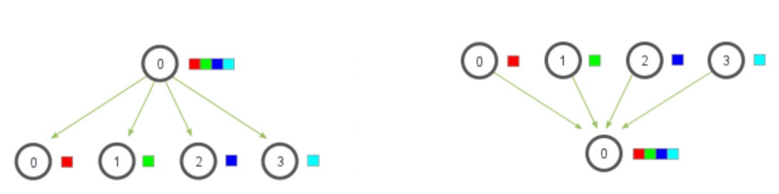

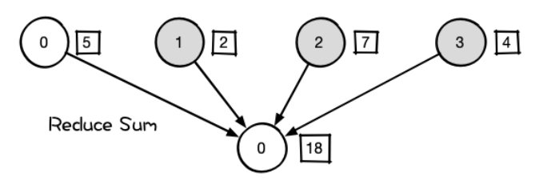

### 1.2 Reduce Scatter / All Gather

相比基础原语，**Reduce Scatter** 和 **All Gather** 更常用于优化大规模训练中的通信瓶颈。

**【Reduce Scatter】**

本质是一个跨节点的分片reduce操作。

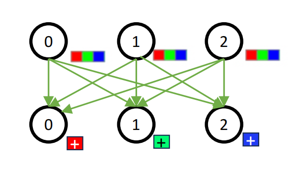

假设有 4 个节点，每个节点持有一段相同维度的向量：

- | 节点 | 输入                     |
  | ---- | ------------------------ |
  | N0   | [1, 2, 3, 4]             |
  | N1   | [10, 20, 30, 40]         |
  | N2   | [100, 200, 300, 400]     |
  | N3   | [1000, 2000, 3000, 4000] |

  **Step 1: Reduce**

  对相同位置元素做加法（加法是最常见的 Reduce 操作）：

  ```
  [1+10+100+1000, 2+20+200+2000, 3+30+300+3000, 4+40+400+4000] = [1111, 2222, 3333, 4444]
  ```

- **Step 2: Scatter**

  - N0 拿到 [1111]
  - N1 拿到 [2222]
  - N2 拿到 [3333]
  - N3 拿到 [4444]

- 常用通信方法：Ring Reduce Scatter

- 通信量：

  - 每个node数据量：G
  - 每个node发出：G * (n-1)/n
  - 总通信量：(n-1)G


**【All Gather】**

每个进程都向所有其他进程广播自己的数据，最终每个进程都有全部数据。

通信量分析同样为：

- 每个node数据量：G
- 每个node发出：G * (n-1)/n
- 总通信量：(n-1)G

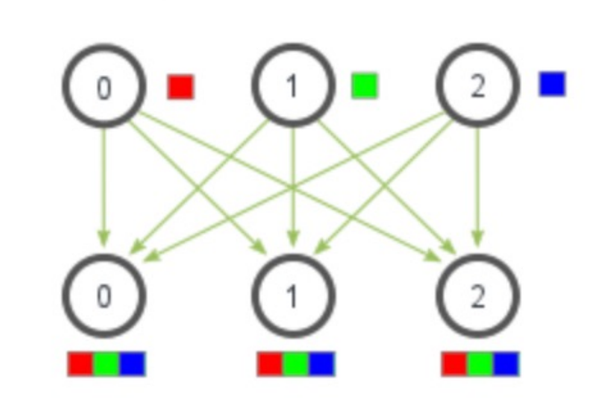

### 1.3 All Reduce

**【通信开销】**

- **All Reduce = Reduce Scatter + All Gather**
- 通信开销 = Cost（Reduce Scatter）+ Cost（All Gather）= 2(n-1)G
  - 假设每个node数据量：G


**【通信方式 - Ring All Reduce】**

All Reduce 的实现方式不止一种。例如：

- **集中式 All Reduce**：先 gather 到一个节点计算，再广播（PyTorch DDP 的早期实现）
  - 缺点：通信带宽瓶颈，其他节点资源利用率不高
- **Ring All Reduce**：各节点只与相邻节点通信，所有节点并行工作，充分利用带宽资源（PyTorch DDP 默认）
- **Tree All Reduce**：以树形结构分层聚合与广播，通信延迟更低，适用于节点数量较多的场景

最有名的 Ring All Reduce 通信结构如下图所示：

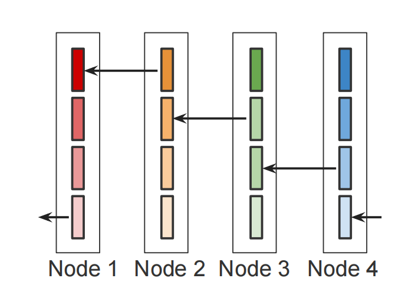

一轮（n次）Reduce Scatter结束：

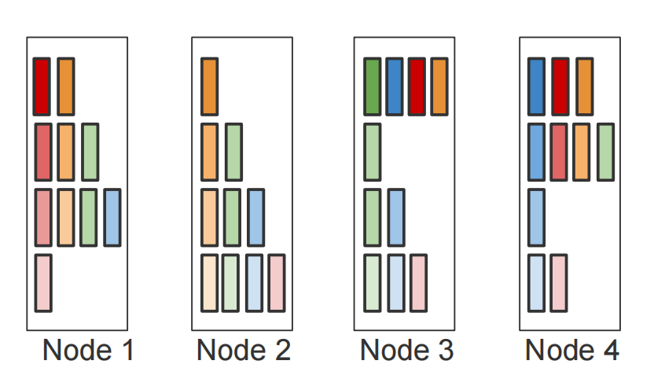

一轮（n次）All Gather & All Reduce结束：

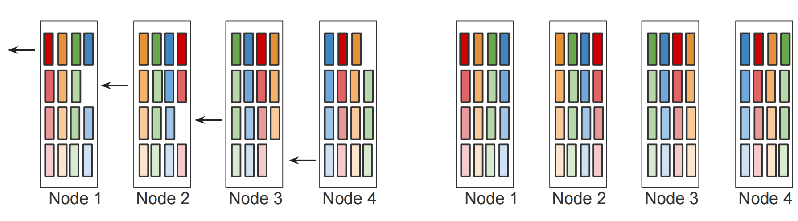


## 2. 通信方式（软硬件）

为了对通信有一个更深入的认识，我们也来简单了解一下其自下而上的对应吧。依次为：

- NV硬件连接层：PCIe / NVLink / IB
- NV中间软件通信库：NCCL
- 上层封装接口：torch.distributed

其中通信又可分为：

-  **机器内通信（Intra-Machine Communication）** 
-  **机器间通信（Inter-Machine Communication）**

例如我们说“一个模型用32张GPU训练”时，它可能实际的部署方式可能是这样：

- **单节点多GPU**：一台服务器（节点）包含多块GPU（例如NVIDIA DGX H100每节点8卡）
- **多节点集群**：多个节点互联，每节点 8 张 GPU，4 个节点共构成 32-GPU 训练系统


### 2.1 PCIe / NVLink / IB 硬件连接

此部分可简单总结为：机器内GPU-GPU互联用NVLink，GPU和其他硬件（如CPU）互联用PCIe，跨机器互联可以使用IB (InfiniBand)作为硬件支持（也可以只用RoCE + 高速以太网）。

**【PCIe】** (Peripheral Component Interconnect Express)

- 标准的高速总线接口，用于连接 GPU、加速器卡等设备
- 传统 PCI 总线：同时间只能单向传输；PCIe：可双向同时通信
- 通常作为 CPU 与 GPU、网卡之间的连接通道

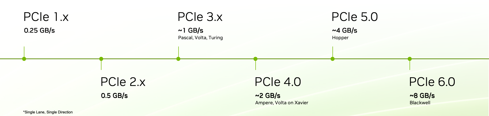

**【NVLink】**

- NVLink 是一种由 NVIDIA 开发的高速互连协议技术，可实现 GPU 之间的直接通信
- NVLink 可以提供比普通 PCIe 更高的带宽和更低的延迟，NVSwitch是基于NVLink的交换设备
- 硬件设计：
  - GPU 同时具备 NVLink 接口和 PCIe 接口
  - **NVLink 专用于 GPU-GPU 直连，PCIe 用于连接 CPU、网卡、存储等**

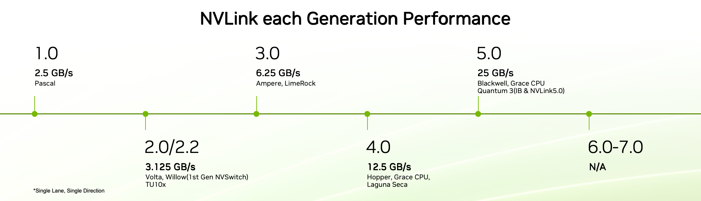

**【IB】**（InfiniBand）

- 一种高带宽、低延迟的网络通信协议
- 支持 RDMA（远程直接内存访问），适用于分布式训练场景
- NV生态：
  - GPUDirect RDMA：允许IB网卡直接访问GPU显存，加速跨节点GPU通信（如分布式训练）
  - NCCL优化：NCCL库优先选择InfiniBand路径，实现高效的跨节点集合通信


【**实例分析：机器内/间通信**】

- **机器内通信**
  - 相关通信硬件：PCIe / NVLink
  - 硬件配置（以 NVIDIA DGX H100 为例）
    - 设备：2 CPU + 8 GPU
    - 互连方式：
      - GPU-GPU：通过 NVLink 4.0 全互连（每 GPU 有 18 条 NVLink 通道）
      - GPU-CPU/其他设备：通过 PCIe 5.0 x16 连接
- **机器间通信**
  - 相关通信硬件：使用IB / 不用IB
  - 硬件配置
    - 单节点配置（共4个）：2 CPU + 8 GPU
    - 网络拓扑：4 个节点通过 InfiniBand 交换机互联
  - 额外注意点
    - IB互联是硬件上的互联了，性能好，但需要修改硬件，灵活性不算特别高
    - 软件层可替代 InfiniBand 的方案：RoCE（RDMA over Converged Ethernet）\+ 高速以太网


### 2.2 NCCL 通信软件库

NCCL是Nvidia Collective multi-GPU Communication Library的简称（发音为"Nickel"），它是一个实现多GPU的collective communication通信（all-gather, reduce, broadcast）库。NV做了很多优化，以在PCIe、Nvlink、InfiniBand上实现较高的通信速度。

NCCL实现了集体通信（collective communication）和点对点（point to point）发送/接收原语。主要有：

- **Collective Operations**（与第 1 节中通信原语对应）

  - AllReduce, Broadcast, Reduce, AllGather, ReduceScatter...
  - 它们做了hardware awareness的优化，实现高效通信

- **Group Calls**

  - 多 GPU 在单线程中操作时，需要通过 group call 保证同步性与死锁避免
  - 核心函数：`ncclGroupStart()` 和 `ncclGroupEnd()`，用于将多个通信操作合并为原子性执行组
  - 用途：
    - 多 GPU 单线程管理，避免死锁
    - 通信操作聚合，减少启动开销
    - 复杂点对点模式融合，将多个 `ncclSend()` 和 `ncclRecv()` 合并为单一操作组

  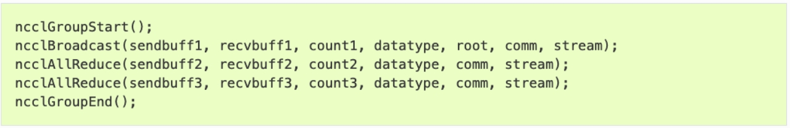

- **Point-To-Point Communication**

  - 核心函数：`ncclSend()` 和 `ncclRecv()`，需成对调用且参数一致
  - 举例：
    - Sendrecv：两个 Rank 同时发送和接收数据
    - One-to-All：单 Rank 向所有其他 Rank 分发数据（Scatter）
    - All-to-One：所有 Rank 向单 Rank 聚合数据（Gather）
    - All-to-All：每个 Rank 与其他所有 Rank 交换数据
    - Neighbor Exchange：在网格拓扑中与相邻 Rank 通信

NCCL也有预先的**环境设置（System Configuration）**，通过环境变量优化通信行为，一些关键配置举例：

| **类别**         | **环境变量**            | **作用**                                                     |
| :--------------- | :---------------------- | :----------------------------------------------------------- |
| **网络接口选择** | `NCCL_SOCKET_IFNAME`    | 指定使用的 IP 接口（如 `eth0`），绕过自动选择。              |
|                  | `NCCL_IB_HCA`           | 指定使用的 InfiniBand/RDMA 设备（如 `mlx5_0,mlx5_1`）。      |
|                  | `NCCL_IB_GID_INDEX`     | 在 RoCE 网络中指定 GID 索引（通常设为 `3`）。                |
| **协议与传输层** | `NCCL_SOCKET_FAMILY`    | 强制使用 IPv4/IPv6（设为 `AF_INET` 或 `AF_INET6`）。         |
|                  | `NCCL_PROTO`            | 指定通信协议（如 `SIMPLE`,`LL`,`LL128`），默认自动选择最优。 |
| **线程与资源**   | `NCCL_SOCKET_NTHREADS`  | 设置每个网络连接的 CPU 辅助线程数（默认 2，增大可提升吞吐但增加延迟）。 |
|                  | `NCCL_NSOCKS_PERTHREAD` | 控制每个线程管理的 Socket 数量（调整网络连接并发度）。       |


### 2.3 torch.distributed 前端

`Pytorch` 中通过 `torch.distributed` 包提供分布式支持，包括 `GPU` 和 `CPU` 的分布式训练支持。

- [Official Tutorial](https://pytorch.org/tutorials/beginner/dist_overview.html)

- [Official Doc](https://pytorch.org/docs/stable/distributed.html)

**【部分并行API】**

- Distributed Data-Parallel (DDP): `torch.distributed.DistributedDataParallel`
- Fully Sharded Data-Parallel Training (FSDP): `torch.distributed.fsdp`
- Tensor Parallel (TP): `torch.distributed.tensor.parallel`
- Pipeline Parallel (PP): `torch.distributed.pipelining`

**【支持的3种后端】**

- MPI：CPU，需要安装MPI 库（如 OpenMPI）
- NCCL：GPU，效率最高，推荐优先使用
- Gloo：Facebook 提供的通信库，兼容 CPU/GPU，但 GPU 表现不佳，CPU 略逊于 MPI

**【相关概念及定义】**

- Process 进程：每个训练进程，独立执行模型训练，仅交换必要数据（如梯度）
- Group 进程组：是我们所有进程的子集。默认情况下，只有一个组（所有进程的全集）
- Backend：通信后端，支持 NCCL、GLOO、MPI
- world_size：在进程组中的进程数
- Rank 秩：表示进程序号，用于进程间通讯，表征进程优先级。`rank = 0` 的主机为 `master` 节点，范围为[0, world_size -1]
- local_rank：进程内的GPU编号，非显式参数。例如：`rank = 3，local_rank = 0` 表示第 3 个进程内的第1块GPU


### 2.4 Torch.distributed 实例


在 PyTorch 中，使用 `torch.distributed` 进行分布式训练通常遵循以下基本流程（对应步骤已在代码中标注）：

1. **初始化进程组**
    使用 `init_process_group()` 初始化通信环境，这是使用 `torch.distributed` 的前置步骤，必须在调用任何其他分布式函数之前完成。
2. **创建子进程组（可选）**
    如需在一个训练任务中进行**子组级别的通信**，可通过 `new_group()` 创建子分组（例如在模型并行中应用）。
3. **构建分布式模型封装器**
    将模型封装为 `DistributedDataParallel`（即 `DDP(model, device_ids=device_ids)`），以实现梯度同步与自动通信优化。
4. **为数据加载器配置分布式采样器**
    使用 `DistributedSampler` 为训练数据集创建采样器，确保每个进程加载互不重复的数据子集。
5. **启动多进程训练脚本**
    使用 `torch.distributed.launch` 或推荐的 `torchrun` 工具，在每台主机上启动训练脚本，分配不同的 `rank`。
6. **训练结束后销毁进程组（推荐）**
    使用 `destroy_process_group()` 清理通信资源，确保程序正常退出。

```python
def train(rank, world_size):
    # 1. 初始化进程组
    # 没有设置小组内集体通信
    dist.init_process_group(
        backend="gloo",
        init_method="tcp://localhost:12355",
        rank=rank,
        world_size=world_size
    )

    # 设置设备
    device = "cpu"
    print(f"Rank {rank} using device: {device}")

    # 2. 创建模型 + DDP封装
    model = SimpleModel().to(device)
    model = DDP(model)

    # 3. 数据加载器 + 分布式采样器 Sampler
    dataset = DummyDataset()
    sampler = DistributedSampler(dataset, num_replicas=world_size, rank=rank)
    dataloader = DataLoader(dataset, batch_size=8, sampler=sampler)

    # 优化器
    optimizer = optim.SGD(model.parameters(), lr=0.01)

    # 简单训练循环（2个epoch）
    for epoch in range(2):
        sampler.set_epoch(epoch)
        for x, y in dataloader:
            x, y = x.to(device), y.to(device)
            output = model(x)
            loss = nn.CrossEntropyLoss()(output, y)
            optimizer.zero_grad()
            loss.backward()
            optimizer.step()
        if rank == 0:
            print(f"Rank {rank}, Epoch {epoch}, Loss: {loss.item():.4f}")
    # 6. 结束后销毁进程组
    dist.destroy_process_group()

################### Step 4: 函数入口 ###################
# 5. 启动入口
if __name__ == "__main__":
    world_size = 2
    
    # 启动多进程
    torch.multiprocessing.spawn(
        train,
        args=(world_size,),
        nprocs=world_size,
        join=True
    )
```

由于之前说的只有单GPU的问题，我用了CPU + gloo后端。它的output：

```bash
Rank 1 using device: cpu
Rank 0 using device: cpu
Rank 0, Epoch 0, Loss: 0.5726
Rank 0, Epoch 1, Loss: 0.8204
```


## 3. 单卡训练计算流

此处假定你已经熟悉了一些训练的基础术语和流程，以下是部分关键概念的回顾：

- **常见术语**
  - Batch Size：每次前向和反向传播处理的数据样本数
  - 1 Iteration = 处理 1 个 Batch 并完成一次参数更新
  - 1 Epoch：表示完整遍历一次所有训练数据
  - Learning rate：weight在某方向上改变的步长，$ W' = W - \eta * f(\nabla W)$
- **优化器 optimizer** - $f(\nabla W)$ 
  - SGD （随机梯度下降），默认不包含动量；在 PyTorch 中可通过 `momentum` 参数开启
  - RMSProp（自适应梯度缩放），简言之引入了norm（通过梯度平方的指数移动平均自适应调整学习率）
  - Adam（Adam = Momentum + RMSProp 的结合体）
- **Learning Rate Scheduler 学习率调度器**
  - 学习率 $\eta$ 大：收敛快，但可能跳过最优点
  - 学习率 $\eta$ 小：稳定但慢，可能卡住不动
  - 调度器的作用：根据训练进度动态调整学习率


### 3.1 模型训练过程

在扩展到多 GPU 之前，让我们先快速回顾在单卡 GPU 上训练模型的基本流程。单卡训练中，单层通常包括三步：

- 前向传播（forward pass）：输入数据通过模型，得到输出
- 反向传播（backward pass）：计算梯度
- 权重更新（weight update）：利用梯度更新权重等参数

> 一个标准流程：Forward → Loss → Backward (update parameters)

让我们以一个典型的多层感知机（MLP，含多个Linear Layer）为例，来看看计算的具体流程。


**【Forward Pass】**

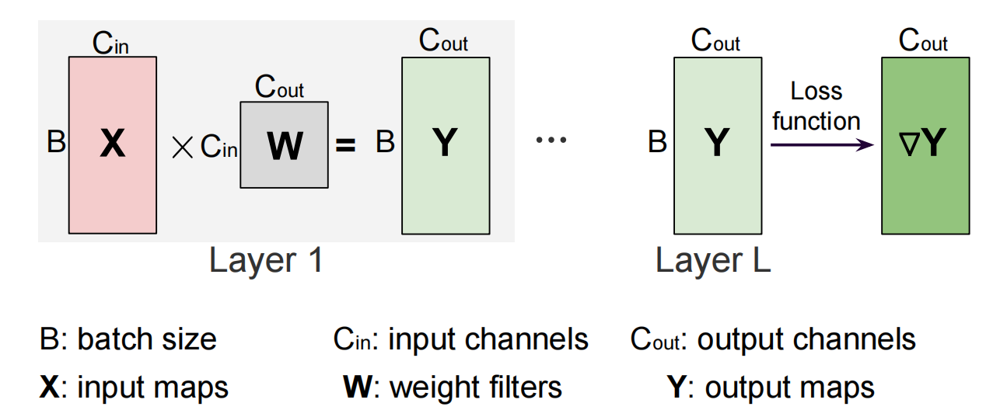

- Linear Layer 计算公式：$X @ W= Y$
- 存储需求：
  - weight (W, b)：必须存储
  - Activation (X - 上一层的output，Y - 本层的output)：**存储视后向的计算需求而定（后面会详细讲）**
  - 注意：PyTorch 中偏置项 $b$ 的加法自动广播至 batch 维度，无需显式扩展


**【所有Forward结束后 - 计算Loss】**

- Loss 的本质：损失函数的作用是衡量模型最终输出与真实标签之间的差距
- 反向传播的起点：Loss 是反向传播的起点，计算 Loss 后，通过链式法则（自动微分）逐层回传梯度，最终更新所有层的参数
- 常见 Loss 类型：
  - 分类任务：交叉熵损失（Cross-Entropy Loss）
  - 回归任务：均方误差（MSE Loss）、L1 Loss
- 计算公式：
  - $ L = Loss(Y)$ - 使用真实label计算
  - $\nabla Y = \frac{\partial L}{\partial Y}$ - 反向第一步梯度计算


**【Backward Pass】**

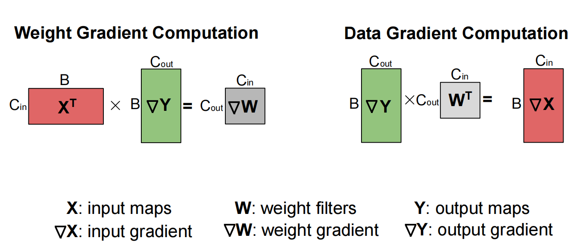

- 根据链式法则，计算对所有input和weight的权重
- Linear Layer 计算公式：
  - $\nabla W = X^T @ \nabla Y$ （用于更新W）
  - $ \nabla X = \nabla Y @ W^T$ （用于辅助前一层的计算）

**【Weight Updates】**

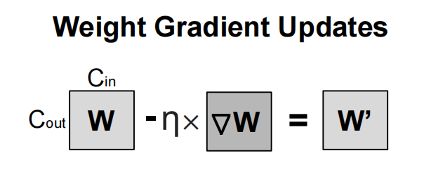

- 计算公式：$ W' = W - \eta * f(\nabla W)$​​
- 学习率（$\eta$）：通常由优化器（如 torch.optim.SGD）控制。
- 优化器的作用：实际训练中可能使用更复杂的更新规则（如动量、Adam），但上面的公式表示的是最基础的 SGD


### 3.2 Transformer 中的显存使用

**【回顾：Model 计算流】**

我们刚刚以简单的`batch_size = 1` 的 MLP 为例梳理了训练过程。实际上，无论是 MLP 还是 Transformer，其训练过程都可以抽象为以下阶段：

- 一个Model由多层组成，执行：
- Forward 前向传播（多层） -> 计算loss -> 开始后向
- Backward后向传播
  - 每层计算对input的gradient，以用于传给上一层
  - 每层计算对weight参数的gradient，以用于更新weight
    - 使用计算出的gradient，选择optimizer，更新weight
    - $ W' = W - \eta * f(\nabla W)$

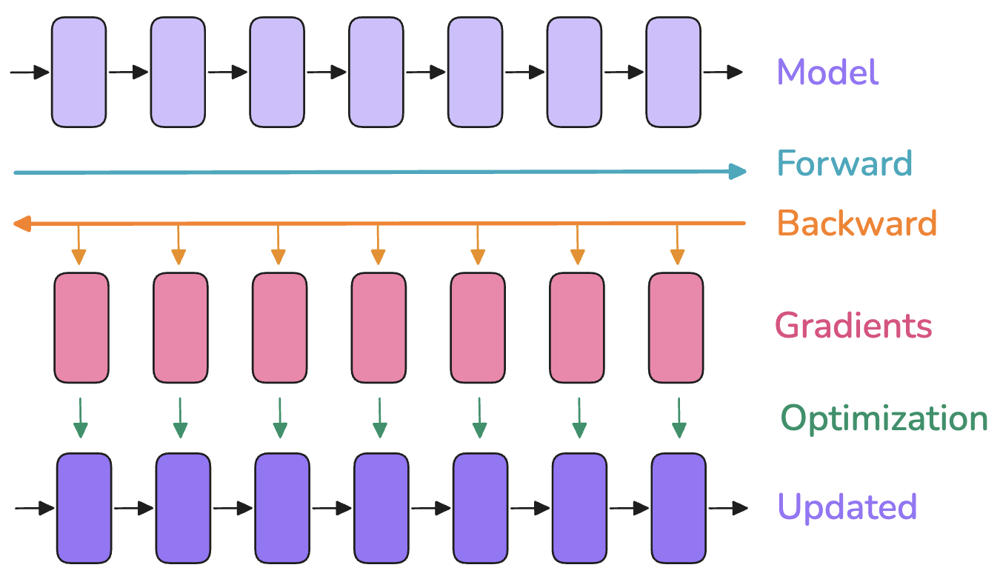

**【显存占用】**

在训练神经网络模型时，一般需要存储：

- **模型权重** (weights, $W$)
- **模型梯度** (gradients, $\nabla W$)
- **优化器状态** (optimizer states)：如动量、方差等
- 用于反向传播的**激活值** (activations, $X$ & $Y$​)
  - 大小和batch size 成正比（实际是$BX$ & $BY$​）
  - 需要临时计算并存储它们的Gradient（$\nabla X$ & $\nabla Y$）
  - 可选择性保留或动态释放

这些需要存储的项目以Tensor的形式存在，不同Tensor有不同的 **形状（shape）**和 **精度（precision），直接影响其内存占用：

- **形状**：由例如 batch size、序列长度、模型隐层维度、注意力头数、词表大小，以及是否进行模型切分等超参数决定
- **精度**：对应 FP32、BF16 或 FP8 等格式，会影响每个元素所占的字节数（4、2 或 1 字节）
  - 混合精度训练就是其优化的一个方向
  - 也有的优化保存两份weight（高精度+低精度），低精度用于优化计算，同时高精度的保存又能尽量减少精度损失

**【分析显存使用】**

借助 PyTorch 的 profiler 工具，我们可以查看训练过程中不同阶段的显存分配。

发现显存使用并非静态，而是在训练过程（尤其是单个 Iteration 内）不断变化：

- 前向传播时，会随着激活值的产生，显存占用快速上涨
- 在反向传播时，梯度逐渐累加，但之前存储的激活值可以逐步释放
- 优化步骤，此时需要所有梯度，然后更新优化器状态，此时暂存的计算值临时上升

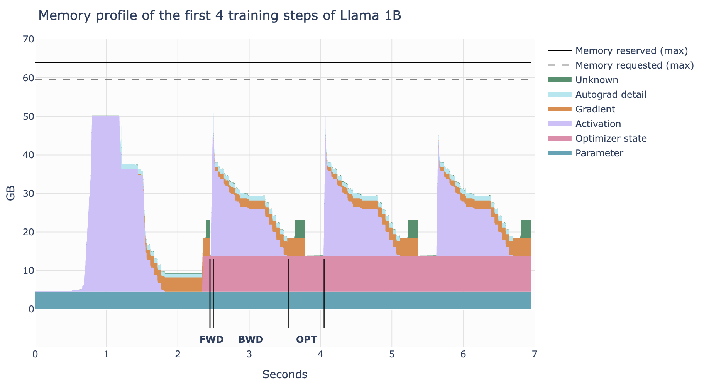

**【权重、激活值、梯度和优化器状态的显存】**

其实可以计算具体的数值，但我认为太过于细节了所以略过了，如果你感兴趣细节可以查看[ 这里](权重、梯度和优化器状态的显存)

- 相对固定的3个

  - 模型权重 $N$​​：

    - 和精度选取有关，如果都使用FP32(4 byte)，则 $m_{para} = 4N$

    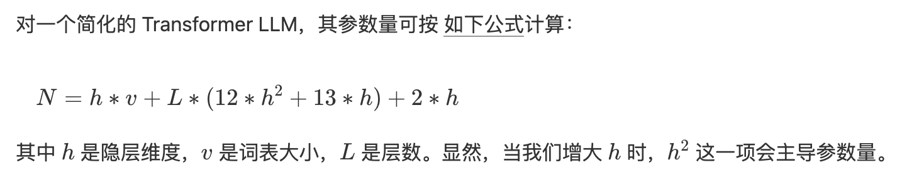

  - 梯度亦然：$m_{grad} = 4*N$

  - 优化器状态：

    - 优化器在使用 Adam 时，需要存储动量和方差各 4 字节，还会加上一些管理用的结构。总结起来
    - $m_{opt} = (4+4)*N$

- **激活值占用**：

  - 重点：随 `batch_size`, `seq_len` 线性增长
  - 在计算图中随时变化，周期性分配和释放
  - **对于大输入 tokens（即大 batch size/长序列），激活值会成为主要的显存负担。**

  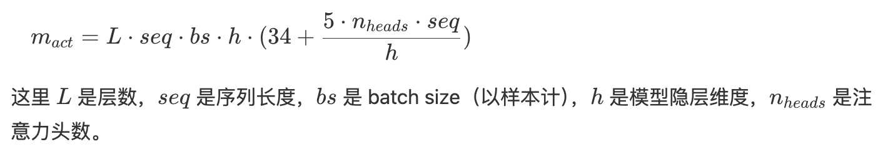

  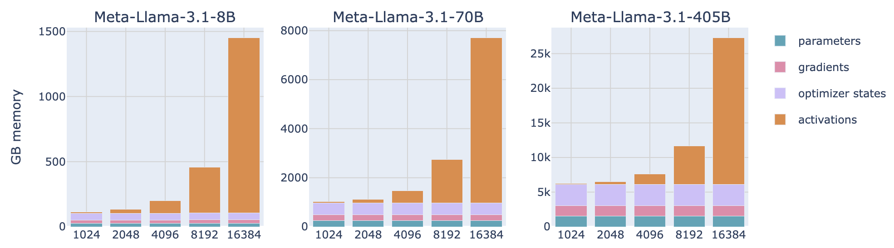


### 3.3 Activation优化 - 激活重计算

根据上一步我们发现，Activation对显存的影响很大！

为应对激活值高占用的问题，可使用 **激活重计算** 技术（又称 Gradient Checkpointing 或 Rematerialization）。

核心思想是：在前向传播时丢弃部分激活值，从而省显存；需要它们做反向传播时，再运行一次子前向过程把它们计算回来，换取多一些计算量来节省显存。

- 若不开启重计算：我们会在每个可学习操作（比如 feed-forward，layernorm 等）之间都保存激活值
- 启用重计算后：我们**只保存少量关键位置的激活值**；当反向传播需要时，再用已保存的进行部分前向运算重算出所需内容。

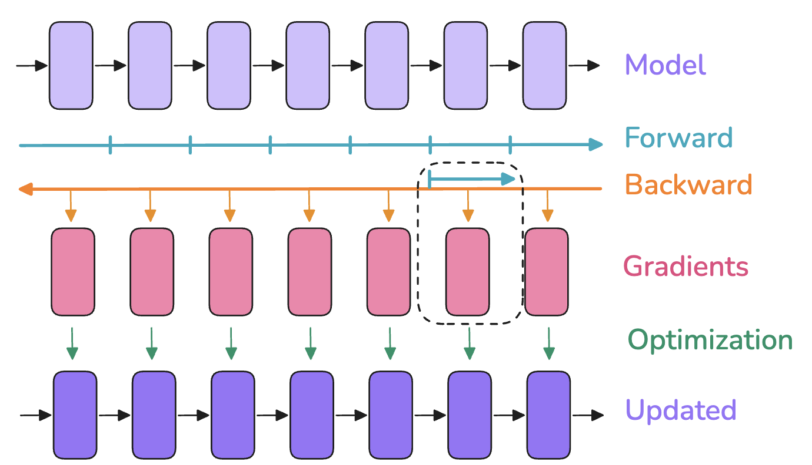


### 3.4 Activation优化 - 梯度累加

已知Activation还正比于 `batch_size` 所以还有一个节省Activation的技巧 —— **梯度累加**（Gradient accumulation），用于避免因过大 batch size 带来的显存爆炸。

思路：把原本的一次大 batch，拆成多个更小的 micro-batch

- 每次处理一个小 batch，执行前向 + 反向并累加梯度
- 把这些梯度累加起来，最后再做一次优化器更新（`optimizer.step()`）

效果：

- 存储需求：只需要 micro-batch的activation + gradient
- 缺点：每个优化步骤需要重复多次前后向，因此增加了计算量，放慢了训练速度🤔


## 4. 代码实现

本章节我们先来熟悉一下`torch.distributed` 的使用吧，在接下来的分布式代码详解中我都会使用这个库。

> 配套代码：[本地 ipynb](../code/03-distributed-demo.ipynb) ｜ [Colab](https://drive.google.com/file/d/15V25khFs8M8Ui3LW-_zDXUkquQytvBgq/view?usp=drive_link)

不过值得注意的是：

- `torch.distributed` 支持三种后端：nccl、mpi、gloo，正常的多GPU分布式应该用**NCCL后端**（在“2. 通信方式（软硬件）-> torch.distributed 前端”部分也有讲解）
- 但是由于我用的是免费的Google Colab（最多提供 1 个免费 GPU 😭），因此后续部分示例将使用 **GLOO 后端+ CPU 模拟**（不选 MPI 是因为配置略繁琐）

### 4.1 通信原语测试

**【结构搭建】**

在 PyTorch 中，使用 `torch.distributed` 进行分布式训练通常遵循以下基本流程（对应步骤已在代码中标注）：

1. **初始化进程组**
    使用 `init_process_group()` 初始化通信环境，这是使用 `torch.distributed` 的前置步骤，必须在调用任何其他分布式函数之前完成。
2. **创建子进程组（可选）**
    如需在一个训练任务中进行**子组级别的通信**，可通过 `new_group()` 创建子分组（例如在模型并行中应用）。
3. **构建分布式模型封装器**
    将模型封装为 `DistributedDataParallel`（即 `DDP(model, device_ids=device_ids)`），以实现梯度同步与自动通信优化。
4. **为数据加载器配置分布式采样器**
    使用 `DistributedSampler` 为训练数据集创建采样器，确保每个进程加载互不重复的数据子集。
5. **启动多进程训练脚本**
    使用 `torch.distributed.launch` 或推荐的 `torchrun` 工具，在每台主机上启动训练脚本，分配不同的 `rank`。
6. **训练结束后销毁进程组（推荐）**
    使用 `destroy_process_group()` 清理通信资源，确保程序正常退出。

**【我设置的对应setting函数】**

共用的参数设置为了库函数：

(1) 初始化进程组：`init_process_group()` 初始化通信环境

(6) 训练结束后销毁进程组

**剩下的那些**，由于此处是一个通信源语的test所以：

(2) 没有选择子进程组

(3)(4) 不是模型，不用封装model和数据sampler

(5) 启动器：`torchrun` 是正式推荐的，用于训练任务；但此处用了`mp.spawn()` ，是轻量、灵活的调试工具

```python
%%writefile dist_utils.py
import os
import torch
import torch.distributed as dist

def setup(rank, world_size, port=12355):
    dist.init_process_group(
        backend='gloo',
        init_method=f'tcp://127.0.0.1:{port}',
        rank=rank,
        world_size=world_size
    )

def cleanup():
    dist.destroy_process_group()
```

**【各类通信原语示例】**

值得注意的是：

- 使用`log`代替显式的`print`，可以自动加 `flush=True`，避免 spawn/join 卡死
- 在原语后添加`dist.barrier()`有助于解决结束时的同步和锁死问题

```python
%%writefile commu_funcs.py
import torch
import torch.distributed as dist
import torch.multiprocessing as mp
import time
import sys
from dist_utils import setup, cleanup

# ------------------- 打印封装 ----------------------
def log(msg, rank=None):
    prefix = f"[Rank {rank}] " if rank is not None else ""
    print(f"{prefix}{msg}", flush=True)

# ------------------- 通信原语 ----------------------

def example_broadcast(rank):
    tensor = torch.tensor([1, 2, 3, 4, 5], dtype=torch.float32) if rank == 0 else torch.zeros(5)
    log(f"Before Broadcast: {tensor}", rank)
    dist.broadcast(tensor, src=0)
    log(f"After Broadcast: {tensor}", rank)
    dist.barrier()

def example_reduce(rank):
    tensor = torch.tensor([rank + 1] * 5, dtype=torch.float32)
    log(f"Before Reduce: {tensor}", rank)
    dist.reduce(tensor, dst=0, op=dist.ReduceOp.SUM)
    log(f"After Reduce: {tensor}", rank)
    dist.barrier()

def example_all_reduce(rank):
    tensor = torch.tensor([rank + 1] * 5, dtype=torch.float32)
    log(f"Before AllReduce: {tensor}", rank)
    dist.all_reduce(tensor, op=dist.ReduceOp.SUM)
    log(f"After AllReduce: {tensor}", rank)
    dist.barrier()

def example_gather(rank):
    tensor = torch.tensor([rank + 1] * 5, dtype=torch.float32)
    gather_list = [torch.zeros(5) for _ in range(dist.get_world_size())] if rank == 0 else None
    log(f"Before Gather: {tensor}", rank)
    dist.gather(tensor, gather_list, dst=0)
    if rank == 0:
        log(f"After Gather: {gather_list}", rank)
    dist.barrier()

def example_all_gather(rank):
    tensor = torch.tensor([rank + 1] * 5, dtype=torch.float32)
    gather_list = [torch.zeros(5) for _ in range(dist.get_world_size())]
    log(f"Before AllGather: {tensor}", rank)
    dist.all_gather(gather_list, tensor)
    log(f"After AllGather: {gather_list}", rank)
    dist.barrier()

def example_scatter(rank):
    if rank == 0:
        scatter_list = [torch.tensor([i + 1] * 5, dtype=torch.float32) for i in range(dist.get_world_size())]
        log(f"Rank 0 Scatter List: {scatter_list}", rank)
    else:
        scatter_list = None
    tensor = torch.zeros(5)
    log(f"Before Scatter: {tensor}", rank)
    dist.scatter(tensor, scatter_list, src=0)
    log(f"After Scatter: {tensor}", rank)
    dist.barrier()

def example_reduce_scatter(rank):
    world_size = dist.get_world_size()
    input_list = [torch.tensor([(rank + 1) * (j+1)] * 2, dtype=torch.float32) for j in range(world_size)]
    output_tensor = torch.zeros(2)
    log(f"Before ReduceScatter: {input_list}", rank)
    dist.reduce_scatter(output_tensor, input_list, op=dist.ReduceOp.SUM)
    log(f"After ReduceScatter: {output_tensor}", rank)
    dist.barrier()

def example_barrier(rank):
    log(f"Sleeping {rank} seconds...", rank)
    time.sleep(rank)
    dist.barrier()
    log(f"Passed barrier.", rank)

# ------------------- 启动器 ----------------------

def run(rank, world_size, op_name):
    setup(rank, world_size)

    try:
        ops = {
            "broadcast": example_broadcast,
            "reduce": example_reduce,
            "all_reduce": example_all_reduce,
            "gather": example_gather,
            "all_gather": example_all_gather,
            "scatter": example_scatter,
            "reduce_scatter": example_reduce_scatter,
            "barrier": example_barrier
        }

        if op_name not in ops:
            if rank == 0:
                print(f"[Rank {rank}] Unknown operation: {op_name}", flush=True)
        else:
            ops[op_name](rank)

    except Exception as e:
        log(f"Exception: {e}", rank)

    finally:
        try:
            cleanup()
        except Exception as e:
            log(f"Cleanup failed: {e}", rank)
        sys.exit(0)  # 显式退出

# ------------------- 可执行入口 ----------------------

if __name__ == "__main__":
    import sys
    op = sys.argv[1] if len(sys.argv) > 1 else "broadcast"
    world_size = 3
    mp.spawn(run, args=(world_size, op), nprocs=world_size, join=True)
```

**【调用运行参考】**

```
python commu_funcs.py broadcast
```

```
[Rank 1] Before Broadcast: tensor([0., 0., 0., 0., 0.])
[Rank 2] Before Broadcast: tensor([0., 0., 0., 0., 0.])
[Rank 0] Before Broadcast: tensor([1., 2., 3., 4., 5.])
[Rank 1] After Broadcast: tensor([1., 2., 3., 4., 5.])
[Rank 2] After Broadcast: tensor([1., 2., 3., 4., 5.])
[Rank 0] After Broadcast: tensor([1., 2., 3., 4., 5.])
```


### 4.2 自定义分布式训练测试

同前面的“结构搭建”部分。

**【我设置的对应setting函数】**

**把共用的参数设置为了库函数：**

(1) 初始化进程组：`init_process_group()` 初始化通信环境

(2) 没有选择子进程组

(3)写了个模型，定义为了库函数

(4)写了个简单的数据集，并且定义了数据sampler

(6) 训练结束后销毁进程组

**此外，同上：**

(5) 启动器：`torchrun` 是正式推荐的，用于训练任务；但此处用了`mp.spawn()` ，是轻量、灵活的调试工具

```python
%%writefile ddp_utils.py

import torch
import torch.nn as nn
import torch.optim as optim
import torch.distributed as dist
from torch.nn.parallel import DistributedDataParallel as DDP
from torch.utils.data import Dataset, DataLoader
from torch.utils.data.distributed import DistributedSampler

# ------------------ 强制 CPU 模式 ------------------
torch.cuda.is_available = lambda: False

# ------------------ 1. 通信初始化 ------------------
def setup(rank, world_size, method="tcp://localhost:12355"):
    dist.init_process_group(
        backend="gloo",
        init_method=method,
        rank=rank,
        world_size=world_size
    )

# ------------------ 3. 模型 ------------------
class SimpleModel(nn.Module):
    def __init__(self):
        super().__init__()
        self.layer = nn.Linear(10, 2)
    def forward(self, x):
        return self.layer(x)

# ------------------ 4. 数据集 & Sampler ------------------
class DummyDataset(Dataset):
    def __len__(self):
        return 100
    def __getitem__(self, idx):
        return torch.randn(10), torch.randint(0, 2, (1,)).item()

def get_sampler(dataset, world_size, rank):
    return DistributedSampler(dataset, num_replicas=world_size, rank=rank)

# ------------------ 6. 销毁进程组 ------------------
def cleanup():
    dist.destroy_process_group()
```

**【分布式训练主体】**

```python
%%writefile ddp_simple.py

import torch
import torch.nn as nn
import torch.optim as optim
import torch.multiprocessing as mp
from torch.nn.parallel import DistributedDataParallel as DDP
from torch.utils.data import DataLoader

from ddp_utils import setup, cleanup, SimpleModel, DummyDataset, get_sampler

################### 分布式训练定义 ###################
def train(rank, world_size, epochs):
    # 1. 初始化进程组
    setup(rank, world_size)
    # 设置设备
    device = "cpu"
    print(f"[Rank {rank}] initialized", flush=True)

    # 3. 创建模型 + DDP封装
    model = SimpleModel().to(device)
    model = DDP(model)

    # 4. 数据加载器 + 分布式采样器 Sampler
    dataset = DummyDataset()
    sampler = get_sampler(dataset, world_size, rank)
    dataloader = DataLoader(dataset, batch_size=8, sampler=sampler)

    # 优化器
    optimizer = optim.SGD(model.parameters(), lr=0.01)

    # 简单训练循环（2个epoch）
    for epoch in range(epochs):
        sampler.set_epoch(epoch)
        for x, y in dataloader:
            x, y = x.to(device), y.to(device)
            output = model(x)
            loss = nn.CrossEntropyLoss()(output, y)
            optimizer.zero_grad()
            loss.backward()
            optimizer.step()
        if rank == 0:
            print(f"[Rank {rank}] Epoch {epoch}, Loss: {loss.item():.4f}", flush=True)
    
    # 6. 销毁进程组
    cleanup()

################### 函数入口 ###################
# 5. 启动入口
if __name__ == "__main__":
    world_size = 2
    epochs = 2
    mp.spawn(train, args=(world_size, epochs), nprocs=world_size, join=True)
```

**【调用运行】**

```
python ddp_simple.py
```

```

```


## 参考资料 & 结语

**【参考资料】**

- NYU CSCI-GA.3033-077 Big Data and Machine Learning Systems 相关课件
- NYU CSCI-GA.3033-9483 Efficient AI and Hardware Accelerator Design 相关课件
- 相关帖子：[知乎：Pytorch 分布式训练](https://zhuanlan.zhihu.com/p/76638962)

**【结语】**

本节内容就先到这里咯，之所以整理这部分分布式基础，是因为我感觉直接进入各类分布式策略的paper reading会有一些理解不透彻的问题（正如去年读了那些paper的我一样）。

所以说，回到第一性原理的角度去理解通信与计算流程，真的很重要。下节DP再见！
