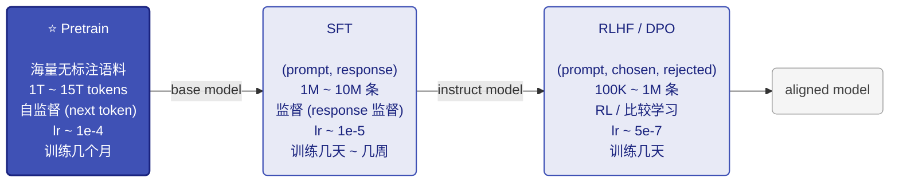
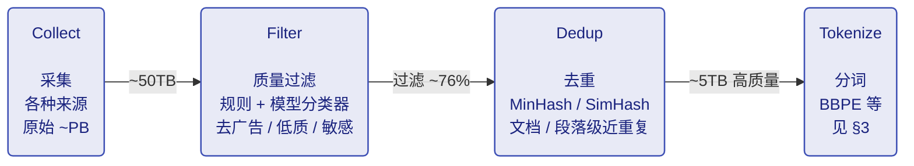
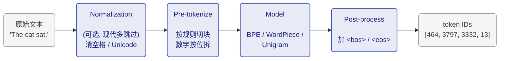

# 01-预训练 Pretrain

> **TL; DR**：完整走一遍预训练 pipeline - 数据 / tokenize / chunk → 模型怎么对齐 label 算 loss → lr 调度 + 训练监控 → 训完的 base model 能做什么

- **[Quick Ref for 手写code]**：mini-pretrain ｜ [ipynb](../code/04_mini_pretrain.ipynb) ｜ [Colab](https://drive.google.com/file/d/1VUB1WrZx9KkHBrY9N8E3-Dfmql7aHnjw/view?usp=sharing)
- **[常考面试点]**：好像只有 tokenize

模型结构和训练策略层面的内容分别见 Transformer 和“训练策略”（并行）系列。虽然面试点不多，但预训练流程是基石，知道全貌很必要。


## 前言

最近被 assign 去做了 SFT 框架迁移。想写SFT，但在进入 SFT 之前，感觉还是要先把预训练简单过一下。

这篇笔记的范围：

- **不展开模型结构**：基于Transformer，但默认对以 LLaMA 为代表 Decoder 已经熟悉，想看细节可以去 [01_01_Transformer.md](../01_模型基础/01_01_Transformer.md)
- **不展开并行 / 显存切分等训练策略**：这些会在"训练策略"系列里单独写

只关心 LLM 训练自己的事，按数据流向走：

- 数据从哪来、prepared 后长什么样
- 数据如何处理成模型 input 并切分送入模型，output 是什么、ground truth 如何定义
- 如何衡量 output 和 GT 的距离、更新模型——也就是训练目标
- 训完之后的 base model 能做什么

整体顺序：原始数据 → Tensor → 模型 → Loss → 参数更新 → base model。

---

## 1. Pretrain 位置

LLM 训练经典的三阶段流程：



Pretrain 训出来的就是所谓的 **base model**（GPT-3、Llama-3-Base、Qwen2.5-Base）——后面 SFT / RLHF 在它基础上调整行为习惯，不再注入新的世界知识。

Pretrain 是最贵、最久、最关键的一步：

- 算力消耗占 LLM 训练总成本的 >99%
- 后面所有能力（聊天、推理、代码）的天花板都在这一步被决定

---

## 2. 数据

预训练里最重要的一步是什么？模型结构大概率稳定了，真正决定 base model 能力上限的还得是**洗数据**。SFT / RLHF 救不回一份糟糕的预训练。

### 2.1 原始数据来源

工业级预训练数据通常以 JSONL 存（每行一条文档），原始字段大致这样：

```json
{
  "text": "中国的传统戏曲在其漫长的发展过程中，主要靠口传心授的传承方式...",
  "url": "http://example.com/article/12345",
  "timestamp": "2024-03-15T08:30:00Z",
  "language": "zh",
  "industry_type": "文学_情感"
}
```

`text` 是核心字段——预训练对 text 做 next-token prediction，没有人工标注、没有 prompt-response 对应关系。这就是"自监督"的含义：标签来自数据自身。

数据来源大致八大类：

| 类别       | 代表数据集               | 特点                 |
| ---------- | ------------------------ | -------------------- |
| 网页       | Common Crawl, RefinedWeb | 量大，需要严格清洗   |
| 书籍       | BookCorpus, Gutenberg    | 长文本，质量高       |
| 学术       | arXiv, S2ORC, PubMed     | 专业领域知识         |
| 代码       | The Stack, GitHub        | 编程能力的来源       |
| 百科       | Wikipedia, 百度百科      | 权威知识             |
| 平行语料   | ParaCrawl, MultiUN       | 多语言 / 翻译        |
| 社交       | Reddit, StackExchange    | 对话感、问答         |
| 多类别混合 | The Pile, Dolma          | 开源研究常用baseline |

混合配比（加多少代码、加多少中文、加多少书）是各家工程秘方，通常不公开。

### 2.2 预处理简单流程

主流程很短：**Collect → Filter → Dedup → Tokenize**。CommonCrawl 原始 ~PB 级、洗到最后剩约 1/10：



**Filter**（质量过滤）通常两套并用：

- **启发式规则**：长度过滤、字符比例过滤、重复 n-gram 过滤、关键词黑名单
- **模型分类器**：训一个小模型区分"高质量正文" vs "广告 / 导航栏 / 垃圾内容"，扫全语料

**Dedup**（去重）几乎所有大模型都做——重复数据会让训练效率暴跌（同样的算力反复学一个相似段落）。工业标配是 **MinHash + LSH**：MinHash 把每篇文档压成一组哈希指纹，保留近重复关系；LSH 把相似指纹直接桶到一起，避免万亿级 token 上 $O(N^2)$ 的两两比较。颗粒度可以选**文档级**（两篇网页基本一样）、**段落级**（导航栏 / 版权声明被复制粘贴）或 **n-gram 级**（连续若干 token 反复出现，如样板 footer）。

Tokenize 放到 §3 跟 batch 拼接一起讲。

### 2.3 Prepared 后的数据

经过预处理之后，得到的 prepared 数据通常仍然是文本形式（还没 tokenize），但**已经满足这些条件**：

- 每条记录是一个**清洗过的文档**（一篇网页正文、一本书的一章、一段代码、一个 Reddit 帖子等）
- 没有重复文档
- 字段精简，通常只剩 `text`（甚至直接是纯文本流）

```
prepared/
├── shard_0001.jsonl    每行: {"text": "..."}
├── shard_0002.jsonl
├── ...
└── shard_9999.jsonl
```

**这就是后面要喂给 tokenize 的输入**。注意：到这一步文本仍然是变长的，每篇可能从几十字到几万字不等，接下来就把它转成模型实际使用的的定长 tensor。

---

## 3. 数据 -> 模型 input

这一节回答：清洗好的文本怎么变成模型实际使用的 tensor。

### 3.1 期望的 input

模型每个 step 吃进去的就是一个固定形状的 batch：

```
input_ids:      shape = [batch_size, seq_len]    元素是 token ID (int)
labels:         shape = [batch_size, seq_len]    见 3.4
attention_mask: shape = [batch_size, seq_len]    见 3.3
position_ids:   shape = [batch_size, seq_len]    [0, 1, ..., seq_len-1]
```

目标很明确：把变长的 prepared 文档，变成形状统一的 `[B, T]` int tensor。下面分两步：先 tokenize（文本 → token ID），再 batch（token ID 序列 → 定长 tensor）。

### 3.2 Tokenize：文本 -> token ID

为什么不能直接用字符或单词？

- **char-level**：词表很小但序列爆长，long context 推不动
- **word-level**：词表会爆炸（英中各种新词、缩写、URL 上百万）；遇到训练时没见过的新词就成了 **OOV**（Out-Of-Vocabulary，未登录词）——词表里查不到，只能映射到 `<unk>`，信息丢失
- **subword tokenization**：折中。词表 30K~150K，常见词整词成 token，罕见词拆成 subword（如 "ChatGPT" → `Chat` + `G` + `PT`），最差也能拆到字节级，**几乎不会 OOV**

**[主流算法、词表大小、特殊 token]**

主流算法：

| 算法                | 代表模型             | 思路                                     |
| ------------------- | -------------------- | ---------------------------------------- |
| **BPE**             | GPT 系、Llama        | 从字符出发，反复合并最高频对             |
| **WordPiece**       | BERT                 | BPE 变种，用似然增益代替频次             |
| **Unigram**         | T5, ALBERT           | 反向：从大词表删，最大化 likelihood      |
| **SentencePiece**   | Llama1/2, Baichuan   | BPE / Unigram 的实现框架，原始字节级     |
| **tiktoken (BBPE)** | GPT-3.5/4, Qwen      | OpenAI 实现的字节级 BPE，特别快          |

现代 LLM 主流是 **字节级 BPE (BBPE)**。"字节级"意思是输入按 UTF-8 byte 切，永远不会有 OOV——任何 Unicode 字符最多分解成几个 byte。

词表大小直接决定了 embedding / lm_head 矩阵的大小：

| 模型        | vocab_size |
| ----------- | ---------- |
| GPT-2       | 50,257     |
| Llama 1/2   | 32,000     |
| Llama 3     | 128,256    |
| Qwen2.5     | 151,936    |
| GPT-4       | ~100,000   |
| DeepSeek-V3 | 129,280    |

权衡：词表越大单 token 信息密度越高（同样的话需要更少 token，训 / 推更快），但 embedding 矩阵和 lm_head 也跟着变大。

特殊 token（pretrain 阶段一般只用前两个）：

| token       | 用途                                       |
| ----------- | ------------------------------------------ |
| `<bos>` / `<s>`     | 序列开始                                   |
| `<eos>` / `</s>`    | 序列结束（也用作多文档分隔）               |
| `<pad>`     | padding（pretrain 几乎用不到，因为 packing）|
| `<unk>`     | 未知（BBPE 用不到）                        |

**[Plus：SFT 阶段的 tokenizer 扩展]**

SFT 时往往会给 tokenizer 加一批新的特殊 token（在 SFT 篇里展开），比如 ChatML 风格的 `<|im_start|>` / `<|im_end|>` / `<|user|>` / `<|assistant|>`，加上工具调用的 `<tool_call>` 等。原因：

- 预训练 tokenizer 面向纯文本，没有"角色"概念，无法区分 user / assistant / system
- 多轮对话需要明确边界，让 attention / loss 能正确 mask
- 这些 marker 必须是**单个 token**，不能拆成 subword，否则模型每次要"组装"一个边界标记，鲁棒性差

实现上把它们作为 `added_tokens` 写进 tokenizer，词表大小从 V 涨到 V+k；model 端要 `resize_token_embeddings(V+k)`，给新 token 在 embedding / lm_head 里开几个新行——通常用现有 embedding 的均值初始化，再让 SFT loss 学到合理位置。

**[Tokenize Pipeline]**

`tokenizer.encode("The cat sat.")` 内部走的是 4 步（Normalization 现代 LLM 多数跳过）：



**[Tokenize 之后的数据是什么样]**

每篇文档经过 tokenize 之后，从字符串变成了**变长的 int 列表**：

```
原文档:    "你好，世界！I love LLM."   (15 个字符)
   │
   ▼ tokenize

token ids: [108386, 3837, 99489, 6313, 40, 2948, 444, 10994, 13]
对应 token: ['你好', '，', '世界', '！', 'I', ' love', ' L', 'LM', '.']
            ↑ 9 个 token，比字符数少（中文常用词整词成 token）
```

prepared 数据集 tokenize 之后，每篇文档都是一段变长 int 序列。这时还不是定长 batch，下一步把这些变长序列拼接 + 切块。

### 3.3 切 batch、保持文档连接

数据集里是上百万篇变长文档，模型要的是定长 tensor `[B, T]`。怎么转？

**[Concat + Chunk：最简单的做法]**

把所有 tokenized 文档**首尾拼成一条长流**，每篇尾部补 `<eos>` 标记边界，然后按 `block_size` 切——每个 chunk 就是一条训练样本。整个过程分三步：

**Step 1**：tokenize 之后每篇文档是一段变长 int 序列。

```
doc_1:  [ t₁,  t₂,  ...,  t₁₂ ]                     长度 12
doc_2:  [ t₁₃, t₁₄, ...,  t₂₀ ]                     长度  8
doc_3:  [ t₂₁, t₂₂, ...,  t₃₀ ]                     长度 10
...
```

**Step 2**：每篇尾部加 `<eos>` 作为文档分隔符，再首尾相连成一条**长流**。

```
[ t₁ ... t₁₂  <eos>  t₁₃ ... t₂₀  <eos>  t₂₁ ... t₃₀  <eos>  ...... ]
  └─── doc_1 ───┘    └─── doc_2 ──┘     └─── doc_3 ──┘
```

**Step 3**：在这条长流上按 `block_size`（比如 2048）等距切块，每块就是一条形如 `[2048]` 的定长训练样本。

```
长流:   [ ────────── 一条几亿 token 的长序列 ────────────────── ]
            │              │              │              │
            ▼              ▼              ▼              ▼
        ┌─ chunk 0 ─┐ ┌─ chunk 1 ─┐ ┌─ chunk 2 ─┐ ┌─ chunk 3 ─┐  ...
        │  2048 tok │ │  2048 tok │ │  2048 tok │ │  2048 tok │
        └───────────┘ └───────────┘ └───────────┘ └───────────┘
```

这样几乎不需要 padding——concat 之后总长度是 `BLOCK` 的整数倍，剩余尾巴丢掉就行（损失 < BLOCK 个 token，可以忽略）。这也是 pretrain 几乎不用 `<pad>` token 的原因；SFT 阶段才会大量用 padding（不能跨样本拼接）。

**[文档边界怎么处理：跨文档 attention 的污染]**

Concat + chunk 之后，一个 chunk 里很可能塞着好几篇毫不相关的文档（前一篇的尾巴 + 几篇完整文档 + 下一篇的开头）：

```
chunk_0: [....doc_1 末尾.... <eos> doc_2 全部 <eos> doc_3 开头....]
```

**问题**：标准 causal attention 只屏蔽"未来"，不屏蔽"邻居"——doc_2 的 token 在算 attention 时会去 attend doc_1 的内容，相当于让模型基于一段无关上文做下一词预测。这是一种轻微但持续的"训练信号污染"。

**两种应对**：

- **方式 A（GPT-2 / 3 早期做法）**：不管，靠 `<eos>` 当软分隔。模型大概能学到 `<eos>` 之后是新主题。简单、对数据流零改动。
- **方式 B（Llama 3 / DeepSeek-V3 等现代做法）**：用 **document-level attention mask** 显式禁止跨 `<eos>` attend。这样每篇文档在 chunk 内部各自做独立的 causal attention。

方式 B 的 mask 形态是 **per-document 下三角、block-diagonal**（左：标准 causal；右：进一步把跨文档的位置也屏蔽掉）：


**工程实现**：直接存这个 `[T, T]` mask 太浪费（T=8192 时 64M 元素），实践里用 **`cu_seqlens`** (cumulative sequence lengths) 这种紧凑表示，喂给 FlashAttention 的 varlen kernel：

```
chunk 里 3 篇 doc 的边界:
   位置 0    4         7              11
    │ doc_1  │  doc_2  │     doc_3    │
    └────────┴─────────┴──────────────┘

cu_seqlens = [0, 4, 7, 11]    ← 累积长度，长度 = num_docs + 1
```

FlashAttention 拿到 `cu_seqlens` 就知道每篇文档的占位区间，每段内部独立做 causal attention，跨段不交互。NeMo / FlashAttention / TransformerEngine 都原生支持，复杂度从 $O(T^2)$ 降到 $O(\sum L_i^2)$，**速度和显存都不退化**。

> Llama 3、DeepSeek-V3 等现代大模型默认开 document mask。社区共识：跨文档 attention 是**轻微但可避免的污染**，做了 mask 收益稳定，工程开销几乎为零。

### 3.4 Labels 怎么构造

Pretrain 的训练信号是 next-token prediction：**用前 t 个 token 去预测第 t+1 个**。所以"标签"其实就藏在输入序列自己里——把 `input_ids` 整体往左挪一位就是每个位置的目标。

把这个 shift 画出来：

```
位置:           0    1    2    3    4    5    6    7
input_ids:    [t_0, t_1, t_2, t_3, t_4, t_5, t_6, t_7]   ← 模型实际看到的输入
                ↓    ↓    ↓    ↓    ↓    ↓    ↓
                t_1  t_2  t_3  t_4  t_5  t_6  t_7  ?     ← 每个位置应该预测的 token
                ↑                                   ↑
              位置 0 的 logits                  最后一位没有"下一个"
              对照 t_1 算 loss                  → -100，跳过 loss
```

这里有个工程上很容易混的点：**labels 张量本身和 input_ids 是同一个东西**——`DataCollatorForLanguageModeling(mlm=False)` 在做的就是 `labels = input_ids.clone()`。"shift by 1" 不是在 collator 里做的，而是在模型 forward 内部计算 loss 时做的。具体地说，HF Transformers 的 `ForCausalLMLoss` 把 labels 末尾补一位 `-100`、再整体左移一位，得到错位的 `shift_labels`，再和 logits 算 cross-entropy：

```python
# HF Transformers 内部 (loss_utils.py)
labels = nn.functional.pad(labels, (0, 1), value=-100)   # 末尾补 -100
shift_labels = labels[..., 1:]                            # 左移一位
loss = cross_entropy(logits.view(-1, V),
                     shift_labels.view(-1),
                     ignore_index=-100)
```

之所以这样设计是为了让数据侧和模型侧解耦：dataloader 只负责吐定长 token 序列，谁是 input、谁是 label 由模型按"自回归 next-token"的语义自己去 shift。

**和 SFT 的对比**（后面 SFT 笔记会展开）：

```
Pretrain:
  input_ids: [t_0, t_1, t_2, ..., t_n]
  labels:    [t_0, t_1, t_2, ..., t_n]                     ← 整段都算 loss

SFT:
  input_ids: [<bos>, p_1, ..., p_k, r_1, ..., r_m, <eos>]
                     └─ prompt ─┘  └─ response ─┘
  labels:    [-100,  -100,  ..., -100, r_1, ..., r_m, <eos>]  ← 仅 response 算 loss
```

两阶段在数据 / loss 层面唯一的差异：是否把 prompt 部分 mask 成 `-100`。其他（shift、cross-entropy、optimizer）完全一样。


## 4. 从 logits 到参数更新

按照 [01_01_Transformer.md §4 手写Transformer](../01_模型基础/01_01_Transformer.md) 里 MiniLlama 的实现，模型现在已经能吃 input_ids、吐出 logits ∈ ℝ^[B, T, V]——**每个位置都是一个 V 维向量**，代表词表上每个 token 的"得分"（未归一化）。

剩下要做的事：

- logits 经 softmax 转成概率分布 → 对齐 label 算 cross-entropy 当 loss
- gradient 配上 lr 沿链式法则反向更新各层 weight
- 评估训得怎么样

### 4.1 logits → loss → gradient

拿到 logits ∈ ℝ^[B, T, V] 之后，每个位置 t 上的 V 维向量先过 **softmax** 归一化成合法的概率分布 p_t：
$$
p_t = \text{softmax}(\text{logits}_t), \quad p_{t,i} = \frac{\exp(\text{logits}_{t,i})}{\sum_j \exp(\text{logits}_{t,j})}
$$
直观说就是从 V 维"原始分数"变成 V 维概率分布（元素 ≥ 0，总和 = 1）：

```
logits[t]:  [-0.2, 1.8, 0.5, ..., 3.2, ..., -1.0]    shape: [V]
                                       ↑
       │                        假设这位对应真实 token "world"
       ▼ softmax
       │
p_t:        [ 0.01, 0.08, 0.02, ..., 0.45, ..., 0.005]   元素 ≥ 0，总和 = 1
                                       ↑
                                  p_t["world"] = 0.45
```

label 这边，等价于一个 V 维 one-hot 向量 q_t（$k_t$ 那位为 1，其余为 0）。这样形状一致就能对齐做距离计算了——衡量两个概率分布距离用 **cross-entropy** 交叉熵损失函数：

$$
\mathcal{L}_t = H(q_t, p_t) = -\sum_i q_{t,i} \log p_{t,i}
$$

q_t 是 one-hot 时只剩 $k_t$ 那一项非零，于是化简成：

$$
\mathcal{L}_t = -\log p_t[k_t]
$$

也就是 **loss 就是模型给真实 token 分配的概率取 log 取负号**。整段序列再各位置取平均：

$$
\mathcal{L} = -\frac{1}{T}\sum_{t=1}^{T} \log p_t[k_t]
$$

```python
loss = F.cross_entropy(logits.view(-1, V), labels.view(-1), ignore_index=-100)
```

这个标量 $\mathcal{L}$ 就是反向传播的**起点**。从这里出发按链式法则一层层穿过 lm_head → final norm → 每层 transformer block → embedding，每个参数 W 拿到自己的 `W.grad`，再交给 **AdamW** 更新一次权重。

### 4.2 学习率调度：Warmup + Cosine Decay

每个参数 W 已经拿到自己的 `W.grad`，更新参数时还要乘上一个标量 **lr（学习率）**——大 lr 走得远但易跨过最优点，小 lr 稳但慢。LLM 预训练标配是：

- **Warmup**：前 1%~3% steps 线性从 0 爬到 peak_lr
- **Cosine Decay**：从 peak_lr 沿余弦曲线降到 end_lr

```
lr
 │       ╱─────╲
 │      ╱       ╲___
 │     ╱            ╲___
 │    ╱                 ╲___
 │   ╱                      ╲__
 │  ╱                          ╲_
 │ ╱                              ╲
 │╱                                 ╲___
 └──────────────────────────────────────────► step
   └warmup┘                            ↑
   1%~3%  ↑                          end_lr
        peak_lr                      (peak/10)
```

### 4.3 评估：训得怎么样

loop 跑起来之后怎么判断模型有没有持续在变好？分两层看：(1) **实时的 loss / PPL 曲线**（廉价、每 step 都有）盯 loop 健不健康，(2) **定期的 evaluate 验证**（贵）反映真实能力。

**[A. 实时监控：loss + PPL 曲线]**

> **Loss 可视化**

每个 step 在当前 batch 上算出来的 cross-entropy Loss实时打到 wandb 等工具里画曲线。一个**健康**的 loss 曲线（ML基础，适用于所有训练）大致是：

- **起点高**：随机初始化的模型预测接近瞎猜
- **指数下降**：前期下降很快，几千 ~ 几万步内从 ~11 降到 3 ~ 4 左右
- **逐渐 flatten**：后期速度放缓，进入"挤毛巾"阶段，每万步可能就降 0.01 ~ 0.05
- **整体平滑**：日常 batch noise ±0.1 以内属于正常波动

健康 vs 异常曲线对比（左 healthy 平滑下降 + 收敛；右 erratic 剧烈震荡）：

<p align="center">
  
  &nbsp;
  
</p>
工程上看到几种异常形态要立刻停训查：突刺 (loss spike)、持续震荡、早早 flatten 在高位。


> **PPL（Perplexity 困惑度）**

光看 loss 数值不直观，所以工业上同时看 PPL，因为它能直接换算成"模型在多少个候选里犹豫"。

大致理解一下（反正不用你手搓计算）：把每个 token 计作 $w$，假设这段文本一共 $n$ 个 token $w_1, w_2, \ldots, w_n$，则模型生成这段文本的联合条件概率概率按链式法则分解为：

$$
P(w_1, w_2, \ldots, w_n) = P(w_1) \cdot P(w_2 \mid w_1) \cdot P(w_3 \mid w_1, w_2) \cdots P(w_n \mid w_1, \ldots, w_{n-1}) = \prod_{i=1}^{n} P(w_i \mid w_{<i})
$$

每个条件概率 $P(w_i \mid w_{<i})$ 就是 §4.1 里 softmax 在真实 token 那一位上的值。PPL 定义为 loss 取指数，几步化简后正好等于这个联合概率的 n 次方根的倒数（也就是模型对每个 token 概率的几何平均的倒数）：

$$
\text{PPL} = \exp(\mathcal{L}) = \frac{1}{\sqrt[n]{P(w_1, w_2, \ldots, w_n)}}
$$

直觉上，模型对每个 token 给一个概率分布；如果它**等概率地在 N 个候选里犹豫**，PPL 就是 N。模型越笃定 PPL 越接近 1，完全瞎猜则 ≈ 词表大小 V。

| Loss | PPL    | 含义                    |
| ---- | ------ | ----------------------- |
| 0.0  | 1      | 完美预测（实际不可能）  |
| 0.5  | 1.65   | 几乎确定                |
| 1.0  | 2.7    | 大约二选一              |
| 2.0  | 7.4    | "在 7 个候选里挑"       |
| 3.0  | 20.1   | "在 20 个候选里挑"      |
| 4.0  | 54.6   | "在 55 个候选里挑"      |
| 10.0 | 22026  | 接近瞎猜（几万词词表）  |

降 0.5 的 loss 在大模型上是巨大改进，常对应几百 B 量级 token 的训练增量。

**[B. Evaluate 验证：两类数据来源]**

当然也要拿一组模型**没参与训练**的数据 evaluate，SFT也是这样。来源分两类，对应不同问题：

**[(a) 同分布 held-out：从原始数据集预先切 1%]**

- **来源**：训练前从你的训练语料里**随机切一小份不参与训练的 holdout**，规模通常 0.1% ~ 1%
- **跑法**：每隔 1K ~ 10K steps 在 holdout 上跑一遍 forward 算 loss / PPL
- **答什么问题**：**有没有过拟合**——training loss 还在降但 holdout PPL 反弹 = 模型开始记训练集
- **关键**：必须和训练**同分布**——这样才能和 training loss 直接对比；如果拿别领域数据当 holdout（比如训中文模型却跑英文 PPL），数值变化和训练好坏没直接关系

**[(b) 公共 benchmark：业界专门维护的外部测试集]**

- **来源**：完全独立于你的训练数据，由其他团队 / 论文专门攒出来公开发布。常见的：

| benchmark         | 谁造的             | 评估什么                    |
| ----------------- | ------------------ | --------------------------- |
| **MMLU**          | UC Berkeley + 学界 | 综合知识（57 学科多选题）   |
| **HellaSwag**     | UW / AI2           | 常识推理（句子续写）        |
| **ARC-c / ARC-e** | AI2                | 科学问答                    |
| **GSM8K**         | OpenAI             | 小学数学应用题              |
| **MATH**          | UC Berkeley        | 高中数学竞赛                |
| **HumanEval**     | OpenAI             | 代码生成（函数补全）        |
| **MBPP**          | Google             | Python 编码                 |
| **BBH**           | Google + 学界      | Big-Bench Hard 综合推理     |

- **跑法**：每隔较大间隔（10K ~ 100K steps）拿一个中间 checkpoint，套 zero-shot / few-shot prompt 模板跑一批 benchmark
- **答什么问题**：**真实能力到没到、跨模型谁强**——业界报"某 base model 的能力"基本就是这一组分数的快照（如 Llama-3-Base / Qwen2.5-Base 的 model card）
- **decontamination 必做**：训练语料几乎一定爬到过这些 benchmark 题，要用 n-gram 重叠检测，把训练数据里和 benchmark 文本重合超过阈值的样本剔除

> 同样这套 (a) + (b) 结构在 SFT / RLHF 也走一遍，只是换数据 / 换 benchmark。这部分留给后续笔记。

---

## 5. 训完的 base model

预训练完，**它没有"对话"能力，只能做一件事——continue the text（续写）**。不过从 logits 里挑下一个 token 的策略（greedy / top-k / top-p / temperature / beam search 等）是推理侧的事，留到推理优化系列展开。

**能做什么**：

- **续写**："The capital of France is" → " Paris. It is one of..."；给 `Q: ... A:` 格式它会接着生成 Q&A 对（因为训练数据里见过大量这种格式）
- **In-Context Learning**：prompt 里给几个 few-shot 例子（如 `apple => pomme / bread => pain / cat =>`）模型能模仿格式产出 ` chat`，不需要任何梯度更新

**不能做什么**：

- 听指令——给"翻译这句"它可能续写出更多指令而不是真去翻译
- 多轮对话——不理解 user / assistant 角色
- 拒绝不当请求——没有 alignment
- 稳定输出特定格式——除非 prompt 里给 few-shot

这些都是 SFT / RLHF 解决的事。

---

## 6. 代码实现：可跑的 pretrain

把 §1~§5 的概念串成最小可跑的版本——wikitext-2 + tiny Qwen2 配置（≈ 40M params），单 GPU / CPU 都能跑：

```python
import torch
from itertools import chain
from datasets import load_dataset
from transformers import (
    AutoTokenizer, AutoModelForCausalLM, Qwen2Config,
    Trainer, TrainingArguments, DataCollatorForLanguageModeling,
)

# 1. Tokenizer (复用 Qwen，免去自己训词表)
tokenizer = AutoTokenizer.from_pretrained("Qwen/Qwen2.5-0.5B")
tokenizer.pad_token = tokenizer.eos_token
EOS, VOCAB_SIZE = tokenizer.eos_token, len(tokenizer)

# 2. Tiny 模型（~40M params，从头随机初始化）
config = Qwen2Config(
    hidden_size=128, intermediate_size=512,
    num_hidden_layers=4, num_attention_heads=4,
    num_key_value_heads=2, vocab_size=VOCAB_SIZE,
    max_position_embeddings=512,
)
model = AutoModelForCausalLM.from_config(config)

# 3. 数据：load → tokenize → concat → chunk（§3.2 + §3.3）
raw = load_dataset("Salesforce/wikitext", "wikitext-2-raw-v1", split="train")
raw = raw.filter(lambda x: len(x["text"].strip()) > 0)
BLOCK = 256

def tokenize_and_chunk(examples):
    texts = [t + EOS for t in examples["text"]]
    tok = tokenizer(texts, add_special_tokens=False)
    flat = {k: list(chain(*v)) for k, v in tok.items()}
    total = (len(flat["input_ids"]) // BLOCK) * BLOCK
    return {k: [v[i:i+BLOCK] for i in range(0, total, BLOCK)]
            for k, v in flat.items()}

dataset = raw.map(tokenize_and_chunk, batched=True, remove_columns=raw.column_names)

# 4. Collator: labels = input_ids.clone()（§3.4）
collator = DataCollatorForLanguageModeling(tokenizer=tokenizer, mlm=False)

# 5. 训练（warmup + cosine，§4.2）
args = TrainingArguments(
    output_dir="./pt_out",
    learning_rate=1e-3,                  # demo 放大 10x，几百步就能看到 loss 降
    warmup_steps=15, lr_scheduler_type="cosine",
    max_steps=300, per_device_train_batch_size=8,
    logging_steps=20, save_strategy="no", report_to="none",
)
trainer = Trainer(model=model, args=args, train_dataset=dataset, data_collator=collator)
trainer.train()
```

50 行不到就把整条 pipeline 跑起来了——当然这个模型本身没什么实用能力（数据量、模型规模都太小），但流程是完整的。要直接跑可以下载 [`ipynb` 文件](../code/04_mini_pretrain.ipynb)（或在 [Colab](https://drive.google.com/file/d/1VUB1WrZx9KkHBrY9N8E3-Dfmql7aHnjw/view?usp=sharing) 上）直接运行，Colab T4 全流程约 2 分钟。
