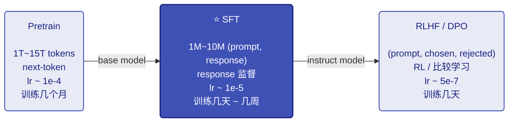

# 02-监督微调 SFT

> **TL; DR**：预训练 vs SFT → Full SFT处理流程 → PEFT 三大流派 → LoRA  → Colab T4 实战

- **[Quick Ref for 手写code]**：mini-lora-sft ｜ [ipynb](../code/05_mini_lora_sft.ipynb) ｜ [Colab](https://drive.google.com/file/d/1NrDWiGrWPoRrk2yszFXIkDe-DeyKW7B0/view?usp=drive_link)
- **[面试点]**：Tokenize, Reshape, Lora? 

手写还没遇到过，可能我简历没什么SFT🤔感觉不是高频面试点


## 前言

[预训练 Pretrain](https://zoey-cheng.github.io/MLSys-Learning-Notes/03_训练方法/03_01_Pretrain.html) 训出来的 base model 是"有知识但不会聊天"的状态——给它一句 `"你好"`，它会按训练分布往下续写 `"你好，今天天气不错。我们来聊聊..."`，并不理解"用户在和我对话、我应该回答"。要把它变成 ChatGPT / Qwen-Instruct 那种能听指令的助手，下一步靠 **SFT (Supervised Fine-Tuning)**。

这篇笔记的范围：

- 不展开模型结构和模型训练的通用流程：默认对 Transformer 结构和模型训练（forward / loss / lr / 评估等）已经基本熟悉，想回顾可以看 [Transformer](https://zoey-cheng.github.io/MLSys-Learning-Notes/01_模型基础/01_01_Transformer.html) 和 [预训练 Pretrain](https://zoey-cheng.github.io/MLSys-Learning-Notes/03_训练方法/03_01_Pretrain.html) 篇
- **不展开并行 / 显存切分等训练策略**：SFT 全量微调时的并行设置和 Pretrain 几乎一致，看 [分布式训练基础](https://zoey-cheng.github.io/MLSys-Learning-Notes/02_训练策略/02_01_分布式训练基础.html) 篇

只关心 SFT 自己特有的事，按数据流向走：

- Full SFT 特殊的数据准备、tokenize 扩展、模型结构修改
- PEFT 微调和 LoRA
- 实战

## 1. SFT 在训练里的位置

LLM 训练经典三阶段：



SFT 是中间层，承上启下：

- 在 base 之上把"会语言"训成"会答题"
- 在 RLHF 之下提供一个能听话的初始模型——直接对未对齐 base 做 RLHF 很难收敛

### 1.1 SFT 想要的

SFT 不教模型新的世界知识（那是 Pretrain 的事），只教**怎么把已有的知识按用户期望的方式表达出来**：

| 能力             | 例子                                                            | 数据怎么体现                              |
| ---------------- | --------------------------------------------------------------- | ----------------------------------------- |
| **指令遵从**     | 用户说"翻译"就翻译，不会跑偏去续写                               | 大量 (instruction, output) 对             |
| **格式输出**     | 让你列点就列点、要 JSON 给 JSON、要代码用 markdown               | response 中显式包含目标格式               |
| **多轮一致性**   | 后一轮能正确引用前一轮内容，"它"指代什么不混                     | ShareGPT / WildChat 等多轮对话数据        |
| **拒绝有害请求** | 用户问怎么造毒品，模型礼貌拒绝                                   | 对齐数据集（HH-RLHF、Constitutional 等）  |
| **思维链 CoT**   | 复杂问题先一步步推理，再给最终答案                               | reasoning 数据集（含 `Let's think...`）   |
| **风格 / 语气**  | 客服模型的礼貌、专家的严谨、角色扮演的人设                       | 风格化 response                           |

### 1.2 SFT vs Pretrain 差异

模型结构、loss 函数都一样（自回归 + 交叉熵，参考 [预训练 Pretrain §4](https://zoey-cheng.github.io/MLSys-Learning-Notes/03_训练方法/03_01_Pretrain.html)），区别在**数据怎么组织 / loss 算哪一段 / 学习率多大**这三点。

**[数据格式对比]**

```
Pretrain:
  input_ids: [t_0, t_1, t_2, ..., t_n]
  labels:    [t_0, t_1, t_2, ..., t_n]                          ← 整段都算 loss

SFT:
  input_ids: [<bos>, p_1, ..., p_k, r_1, ..., r_m, <eos>]
                     └─ prompt ─┘  └─ response ─┘
  labels:    [-100,  -100, ..., -100, r_1, ..., r_m, <eos>]    ← 仅 response 算 loss
```

`-100` 是 PyTorch `CrossEntropyLoss` 的默认 `ignore_index`，标签为 -100 的位置直接跳过不算。

**[为什么 prompt 不算 loss]**

直觉：模型"读问题"时不需要被惩罚——prompt 是用户给的，不是模型生成的，强迫模型预测 prompt 文本是浪费容量、还会损害模型自由组织答案的能力。SFT 的核心 trick 就是**只让模型为自己产出的部分（response）负责**。

**[为什么学习率差一个量级]**

Pretrain 是从随机权重出发，要大 lr 把权重快速推到合理位置。SFT 是在已经训好的权重上小幅调整，lr 太大会**灾难性遗忘**：模型把预训练学到的世界知识丢了，只剩 SFT 数据里那点东西。所以 SFT 用 1e-5 ~ 5e-5（仍然是 warmup + cosine decay）。


## 2. Full SFT 处理流程

大厂用开源训自家业务模型的 SFT 阶段基本都是 **全量微调 (Full SFT)**，也就是更新模型的全部权重。因为算力管够、效果上限最高，资源紧时才退到 PEFT。

这一节参考了最近工作中看到的一些SFT任务，按 Full SFT 自己的处理流程走：

```
原始数据 ──→ (ChatML) 模板 ──→ tokenize 扩展 ──→ 模型结构适配 ──→ 训练 (mask + 冻结)
              §2.1             §2.2              §2.3              §2.4
```

### 2.1 数据处理: ChatML 模板

**[原始数据形态]**

最简单的单轮形式：

```json
{"question": "什么是大语言模型？", "answer": "大语言模型 (LLM) 是基于 Transformer 架构的..."}
```

多轮对话形式（ShareGPT 风格，OpenAI 通用格式）：

```json
{
  "conversations": [
    {"from": "human", "value": "你好"},
    {"from": "gpt",   "value": "你好！我可以帮你做什么？"},
    {"from": "human", "value": "推荐一本书"},
    {"from": "gpt",   "value": "推荐《深度学习》..."}
  ]
}
```

业界常用 SFT 数据集（SFT 阶段质量比数量重要得多）：

| 数据集                  | 规模       | 备注                                |
| ----------------------- | ---------- | ----------------------------------- |
| Alpaca / Alpaca-GPT4    | 52K        | self-instruct 鼻祖                  |
| ShareGPT                | ~90K       | 用户和 ChatGPT 真实对话             |
| OpenHermes              | ~1M        | 高质量混合                          |
| BAAI Infinity-Instruct  | ~9M        | 中英文 + 多任务                     |
| LIMA                    | 1K         | 实验质量胜过数量的极端例子          |

**[ChatML 模板：把对话拼成单条文本]**

要让模型理解"谁在说话"，需要在原始对话外面加一层模板。现在主流的是 **ChatML**（OpenAI 提出，Qwen / 多数开源模型采用）：

```
<|im_start|>system
You are a helpful assistant.<|im_end|>
<|im_start|>user
什么是大语言模型？<|im_end|>
<|im_start|>assistant
大语言模型 (LLM) 是基于 Transformer 架构的...<|im_end|>
```

`<|im_start|>` / `<|im_end|>` 是预先**加进 tokenizer** 的特殊 token，每个固定占 1 个 token id，用来明确**角色边界**——让 attention / loss 能正确 mask、让模型理解 user / assistant / system 的分界。

**[业务模型的自定义模板]**

ChatML 是通用对话的标准模板，业务上常要在它基础上扩展或替换——§2.2 讲的"自定义 token"是 token 粒度的扩展，这里是**整段模板结构**的扩展。常见需求：

- **System 固定指令**：在 system 段塞固定 prefix，锚定身份和风格
- **角色扩展**：Agent 引入 `<|tool|>` / `<|critic|>` / `<|planner|>` 等新角色，loss 可按角色选择性 mask
- **领域 wrapper**：代码用 `<|code_start|>`、多模态用 `<|vision_start|>`、CoT 用 `<|think|>` 标推理段

原则：**尽量靠 ChatML 改、不要完全自创**——base 已经见过 ChatML、下游推理框架（vLLM、HF `apply_chat_template`）开箱即用；自创格式会让 SFT 收敛慢、推理侧也得手写适配。

工程上一般训练框架（如 veomni等）都会开放tokenize模板自定义入口，按规定的接口改就行。

### 2.2 Tokenizer 扩展

预训练 tokenizer 面向纯文本，词表里没有 `<|im_start|>` / `<|im_end|>`、没有"角色"概念。SFT 阶段往 tokenizer 里加新的特殊 token，分两类。

**[ChatML 标准类]**

通用对话所必需的：

- 角色边界：`<|im_start|>` / `<|im_end|>` / `<|user|>` / `<|assistant|>` / `<|system|>`
- 工具调用：`<tool_call>` / `</tool_call>` / `<tool_response>` 等

**[业务自定义类（extend）]**

按下游场景额外加的 token，常见的几种：

| 场景         | 自定义 token 例子                                       | 用途                                  |
| ------------ | ------------------------------------------------------- | ------------------------------------- |
| 客服 / 业务  | `<|product_id|>`、`<|order_id|>`                        | placeholder 一致替换、防止裂解        |
| 多模态边界   | `<|image_pad|>` / `<|vision_start|>`                    | 标记非文本模态的占位区                |
| Agent / 工具 | `<|tool_start|>` / `<|action|>`                         | 让模型一致地输出结构化动作            |

**[为什么必须是单个 token]**

如果让 tokenizer 把 `<|im_start|>` 拆成多个subword，模型每次要"组装"一个边界标记，attention mask 也无法精确对齐到边界。所以这些都要作为 **single special token** 加进去。

**[工程实现]**

```python
tokenizer.add_special_tokens({
    "additional_special_tokens": [
        "<|im_start|>", "<|im_end|>",          # ChatML 标准
        "<|product_id|>", "<|order_id|>",      # 业务自定义
    ]
})
# 词表大小从 V 涨到 V + k
```

加完之后还要让模型端跟上——这是下一步要处理的事。

### 2.3 模型结构适配

tokenizer 加了新 token 后，模型端要相应处理。最直接受影响的是 **embedding 矩阵**和 **lm_head**——它们都是按"词表大小 × hidden_layer" 形状存的。

**[基础场景：开源 base + ChatML resize]**

```python
model.resize_token_embeddings(len(tokenizer))
# embedding / lm_head 形状 [V, d] → [V+k, d]
# 新行用现有 embedding 的均值初始化（peft / hf 默认）
# SFT loss 把这些新 token 学到合理的语义位置
```

> 现代发布的 base model（Qwen2.5-Base、Llama-3-Base 等）通常已经在预训练阶段就**预留好** ChatML 特殊 token 的位置，SFT 时不用 resize——这是最省事的做法。只有用更老的 base（GPT-2 类）或者业务想加自定义 token 时，才需要扩词表 + resize。

**[进阶场景：业务自定义结构]**

业务方未必直接拿最基础的开源 base 做 SFT，有时候也会修改结构，比如先在开源模型上做**结构化剪枝 + 恢复训练**，或者通过其他改造得到一个定制基座，再用这个去 SFT。

预训练框架（Megatron / NeMo / veomni 等）一般都用 **config 文件**描述实际结构（layer 数、hidden dim、head 数等），不一定是标准开源值。SFT 流程从 config 读模型实际形状即可：

- `resize_token_embeddings` 走的是 model 实际形状（hf 默认行为），自动对齐到改造后的维度；不要硬编码标准 transformer 的 d
- 新 token 行的初始化均值是基于**当前**的 V 行（已经反映改造后的语义），不要从原始开源模型里拷贝高维向量再截断（语义会错）

### 2.4 full SFT训练

数据 / token / 模型都准备好之后，SFT 训练的 forward / loss / optimizer 流程和 Pretrain 几乎一样——区别只在两件事：**labels mask 怎么算**、要不要**冻结部分参数**省显存。

**[labels mask（核心）]**

把 ChatML 文本走一遍 tokenizer 得到 input_ids，再构造 labels。**关键：response 起点之前的全部置 -100**：

```
拼完的文本:
<|im_start|>user\n什么是 LLM？<|im_end|>\n<|im_start|>assistant\nLLM 是...<|im_end|>

       │ tokenize
       ▼

input_ids:   [im_start, user, \n, "什", "么", "是", " LLM", "?", im_end, \n,
              im_start, assistant, \n, "LLM", " 是", "...", im_end]

       │ 构造 labels
       ▼

labels:      [-100,    -100, -100, -100, -100, -100, -100, -100, -100, -100,
              -100,    -100,    -100,
              ↑─────── 整个 prompt + ChatML 控制 token 都不算 ───────↑

              "LLM",  " 是",  "...",   im_end]
              ↑──────── 只有 assistant 的回答参与 loss ────────↑
```

实现：trl 提供 `DataCollatorForCompletionOnlyLM`，给它 `response_template = "<|im_start|>assistant\n"`，它会自动定位 response 起点、把前面所有 labels 设为 -100。

> **collator** 就是 dataloader 里把多条样本组装成一个 batch 的小工具——负责 padding、生成 attention_mask、构造 labels 等。SFT collator 多了一步：按模板找 response 起点、把前面 mask 成 -100。

**[多轮对话：每轮 assistant 都参与 loss]**

```
input_ids:  <im_start>user "你好" <im_end> <im_start>assistant "你好！" <im_end>
            <im_start>user "推荐一本书" <im_end> <im_start>assistant "推荐《...》" <im_end>

labels:     -100 ...prompt 1...           "你好！" <im_end>
            -100 ...prompt 2...           "推荐《...》" <im_end>
            ↑ user / 控制 token 都 mask   ↑ 每段 assistant 都参与 loss
```

trl 的 collator 支持双模板（`instruction_template` + `response_template`），自动按 user/assistant 对扫描整条序列做 mask。

**[自定义模板 → 自定义 mask]**

如果 §2.1 / §2.2 里加了业务自己的角色或 token，labels mask 也要跟着扩展。比如 Agent 模型加了 `<|tool|>` 和 `<|critic|>` 角色后，常见 mask 规则：

- `<|tool|>` 段是工具的真实输出、不是模型生成的，要全部 mask 成 -100（同 user）
- `<|critic|>` 段如果是另一个模型给的反馈，也 mask
- 只让 assistant 段（外加 `<|action|>` / `<|think|>` 这些模型自己产出的）参与 loss

trl 的双模板 collator 不够用时，业务通常自己写衍生的 collator——按角色 token 分段扫描，按角色配置查 mask 规则。

**[冻结部分参数：Full SFT 的简化变体]**

Full SFT 还有一种常见的简化变体——**只训部分层 / 部分参数**，剩余冻结。比起更新全部参数省显存，但本质上仍然在原参数空间里改：

- **冻结浅层 / 只训高层**：浅层学的是通用语言特征（语法、tokenization 行为），高层学任务相关行为。SFT 主要想改高层，浅层冻住能省一半显存
- **只训特定模块**：比如只训 lm_head（极端，只能学输出风格）、只训 FFN（FFN 是参数大头，但不动 attn 会限制能力）

实现极简——遍历 `model.named_parameters()`，对要冻的模块设 `requires_grad = False` 就行，不需要任何额外 PEFT 库。

显存收益比 PEFT 弱——梯度和 optimizer state 还是按"未冻结部分的参数量"算，且模型 weight 要全量加载。但实现成本极低、不引入新模块，是 Full SFT 显存吃紧时的常用补丁。

**[一个具体例子：Qwen-VL 系 SFT 的多阶段冻结]**

VLM 的训练通常分多阶段，每阶段冻什么不一样——这是工业级"冻结部分参数"的典型样板：

| 阶段                  | 冻结        | 训练            | 目的                          |
| --------------------- | ----------- | --------------- | ----------------------------- |
| Stage 1 (alignment)   | LLM + ViT   | projector       | 学视觉到语言空间的对齐        |
| Stage 2 (vision SFT)  | LLM         | ViT + projector | 适配领域图像                  |
| Stage 3 (full SFT)    | 不冻        | 全部            | 端到端联合微调                |

## 3. 从全量到 PEFT

### 3.1 全量 SFT 的资源压力

显存账（参考 [分布式训练基础](https://zoey-cheng.github.io/MLSys-Learning-Notes/02_训练策略/02_01_分布式训练基础.html)）：

| 项目             | 含义                  | 7B 模型 占显存（混合精度）              |
| ---------------- | --------------------- | --------------------------------------- |
| Model weight     | 参数本身              | 14 GB（bf16）                           |
| Gradient         | 每个参数的梯度        | 14 GB（bf16）                           |
| Optimizer state  | AdamW 的 m, v (fp32)  | **56 GB**（每参数 8 byte）              |
| Activation       | forward 中间值        | 几 GB ~ 十几 GB                         |
| **合计**         |                       | **~100 GB**（单卡 A100 80G 装不下）     |

7B 单卡爆、70B 要 ~1 TB 显存 + ZeRO-3。SFT 数据量小、计算时间不算瓶颈，**显存才是**——这就是 PEFT 的根本动机：不是为了快，是为了在小卡上跑得动。

### 3.2 PEFT 的核心思想

**[什么是"低秩"]**

矩阵的"秩 (rank)"是它包含的独立信息维度。一个 $d \times d$ 的矩阵理论上有 $d^2$ 个自由参数，但如果它的秩只有 $r$（$r \ll d$），那它**实际上**可以分解成两个细矩阵的乘积：


$\Delta W$ 是低秩的"就是说：微调带来的权重改动虽然形状是 $d \times d$，但实际只有 $r$ 维有效自由度，可以用两个细矩阵表示。

**[LoRA 的关键观察]**

> **微调时 $\Delta W = W_{\text{finetuned}} - W_{\text{pretrained}}$ 的奇异值衰减很快**——也就是说 $\Delta W$ 是低秩的。

直觉：Pretrain 已经把"会语言、有世界知识"这件大事做完了；SFT 只是叠加一个"按格式回答"的行为约束，这个约束在数学上表现为低秩 $\Delta W$。

如果 $\Delta W$ 真的低秩，那直接训整个 $W$ 就是浪费。**Parameter-Efficient Fine-Tuning (PEFT)** 的统一思想就是：冻结绝大多数预训练参数，只训**少量新增**或**少量选定**的参数，达到与全量相当的效果。

### 3.3 PEFT 三大流派

按"在哪里加少量参数"，PEFT 分三个流派——**Prompt / Adapter / LoRA**。

各家都是 冻结主模型 + 只训少量参数，差别在新参数加在哪、是什么形式、推理时有无开销：


下面 3.4 / 3.5 简单过一下 Prompt 和 Adapter，**LoRA 单独放 §4 展开**。

### 3.4 Prompt 类：输入侧软提示

把原 Transformer 完全冻结，只在输入侧（或每层 attention 的 K/V）注入一段可训练的 virtual token——不对应任何真实词汇，是直接学出来的连续向量（"soft" prompt）。代表方法：

| 方法              | 加在哪            | 备注                              |
| ----------------- | ----------------- | --------------------------------- |
| Soft Prompt       | 输入层            | 拼一段可训练 embedding 到序列前   |
| Prefix Tuning     | 每层 attn 的 K/V  | 表达力比 Soft 强                  |
| P-Tuning V1 / V2  | V1 输入层 / V2 每层 | 早期工作                        |


新增参数 0.01% ~ 3%、实现极简。但**小模型效果差**（10B 以下基本不如全量），且推理时序列变长更慢——工业上基本被 LoRA 取代，主要在 100B+ 大模型 + 极致省显存场景偶尔出现。

### 3.5 Adapter 类：block 内插小模块

> 《Parameter-Efficient Transfer Learning for NLP》Houlsby et al. 2019 [[link]](https://arxiv.org/abs/1902.00751)

每个 Transformer block 内插入两个 Adapter——attention 之后一个、FFN 之后一个，主模型冻结，只训 Adapter。新增参数 0.5% ~ 8%。Adapter 内部是**带残差的瓶颈 MLP**：


**致命缺点**：每个 block 多两次小矩阵乘 + 中间非线性 → **无法吸收进原权重**，推理永久多开销。这是它后来被 LoRA 取代的根本原因。

## 4. LoRA：资源紧时的首选

> 《LoRA: Low-Rank Adaptation of Large Language Models》Microsoft 2021 [[link]](https://arxiv.org/abs/2106.09685)

**LoRA 不是工业级 SFT 的首选**——大厂训自家 instruct 模型用的还是 Full SFT。LoRA 真正的舞台是**资源受限的 SFT 场景**。

我问朋友说，还以为lora用的挺多的。楼上做预训练同学答：大多是穷学生用的ovo

但因为这类用户基数大、生态成熟，LoRA 也算是 PEFT 里被讨论最多的，在面试里也是小重点。

### 4.1 模块结构

LoRA 模块本身就是 **两个连续的 Linear 层（中间没有非线性激活）**：


参数：

- $A \in \mathbb{R}^{r \times d_{\text{in}}}$：初始化用高斯分布
- $B \in \mathbb{R}^{d_{\text{out}} \times r}$：初始化为全 0
- 串起来 $BA \in \mathbb{R}^{d_{\text{out}} \times d_{\text{in}}}$，等价于一个新的 Linear 层

**LoRA 故意不加中间非线性**——BA 在数学上就是一个矩阵，可以**合并回原 W**（这是 LoRA 干掉 Adapter / Prefix 的关键）。

LoRA 不替换原 Linear、也不串联，而是**并联**——一条 W₀ 主路 + 一条 BA 修正路，两路相加。**单层计算公式**：

$$
h = W_0 x + \Delta W x = W_0 x + \frac{\alpha}{r} BA x
$$

其中 $\Delta W = \frac{\alpha}{r} BA$ 就是 LoRA 学到的"权重残差"。

由于 $B$ 初始化为 0，**训练第 0 步 $\Delta W = 0$**，模型行为和原 base 完全一致；之后 $B$ 通过反向传播更新，逐步学到 task-specific 修正。

部署时把两路合并：

$$
W' = W_0 + \frac{\alpha}{r} BA
$$

纯加法、$W'$ 形状和 $W_0$ 完全一样，推理流程和原模型也一样：

```python
model = model.merge_and_unload()  # W' = W₀ + (α/r)·BA, 丢弃 (A, B)
```

合完后可以直接用 vLLM / TGI / llama.cpp 部署，**零额外推理开销**。

> **多 LoRA 同时挂载**：合并的线性叠加性允许同时挂载多个 LoRA：$W' = W_0 + \sum_i \frac{\alpha_i}{r_i} B_i A_i$。一份基座 + N 个 LoRA 同时服务，是当前多任务 LLM serving 的主流方案。

### 4.2 设计细节

**[初始化：A 高斯、B 零]**

A 高斯随机、B 全零的组合是为了**让第 0 步 $\Delta W = 0$**，模型从预训练权重平滑出发。其他组合都不行：

| 初始化       | 问题                                                    |
| ------------ | ------------------------------------------------------- |
| 双零         | 对称失效，梯度无法打破对称                              |
| 双高斯       | 第 0 步 ΔW 是非零随机扰动，等于一开始就破坏预训练权重   |
| A=0, B=高斯  | 数学等价但实验效果差（前向梯度流不对称影响优化轨迹）    |

> 详见 *The Impact of Initialization on LoRA Finetuning Dynamics* [[link]](https://arxiv.org/abs/2406.08447)

**[r 和 α：表达力 vs 力度]**

- **r（rank）**：A 和 B 中间的瓶颈维度，决定旁路的表达自由度。r 越大表达能力越强，但参数量 / 显存也跟着大
- **α（alpha）**：缩放因子，控制旁路在最终输出里的力度。α 越大修正越激进

| 任务难度                              | r 推荐 |
| ------------------------------------- | ------ |
| 简单（领域适配 / 格式调整）           | 4      |
| 普通（通用 SFT）                      | 8      |
| 难（多语言 / 长 context / 数学推理）  | 16~32  |

**为什么两个超参共存**：保持 $\alpha/r$ 不变（α 跟着 r 翻倍）→ 旁路作用力不变 → r 改变时 lr 不需要重调。**工程惯例 $\alpha = 2r$**（r=8 → α=16）。先固定 α/r=2，调 lr；效果不行再动 α/r 比值。

**[改哪些层：Q / K / V / O 怎么选]**

LoRA 论文 Table 5 在 GPT-3 175B 上做了消融实验（**同样的可训练参数预算**下比较）：

| target_modules                | r    | 结论                    |
| ----------------------------- | ---- | ----------------------- |
| 单 $W_q$ 或单 $W_k$           | 8    | 较差，K 单独尤其差      |
| $W_q$ + $W_v$                 | 4    | 接近全配置              |
| $W_q$ + $W_k$ + $W_v$ + $W_o$ | 2    | 最优，但和 q+v 几乎打平 |

两个关键结论：

1. **种类比秩重要**：与其调大 r，不如把预算分给更多种类的矩阵（q+v r=4 ≈ qkvo r=2）
2. **K 单独最差**：单独训 W_k 收益最小，推荐组合至少包含 W_v

不同场景的工程惯例：

| 场景            | target_modules                              | 说明                                                          |
| --------------- | ------------------------------------------- | ------------------------------------------------------------- |
| 资源紧（论文）  | `["q_proj", "v_proj"]`                      | 最经典配置，参数最少                                          |
| attention 全开  | `["q_proj", "k_proj", "v_proj", "o_proj"]`  | attn 4 个 Linear 都加，比 q+v 稳一点                          |
| 资源够          | `"all-linear"`                              | attn 4 + FFN 3 = 7 个 Linear。FFN 占 block 参数 2/3，加上效果普遍更好 |

**别加 LayerNorm / Embedding / lm_head**——LoRA 设计就是给 Linear 用的；Embedding 太大、lm_head 直接出概率分布会改变模型输出行为。

**[基座 + adapter 分离存储]**

LoRA 训完后基座 $W_0$ 和增量 $(A, B)$ **分开保存**——这是多任务部署最大的工程便利。Llama-7B + r=8, q+v 的体量：

| 存的什么            | 大小                       |
| ------------------- | -------------------------- |
| 全量 SFT 后的模型   | 14 GB（bf16）              |
| LoRA adapter        | **~8 MB**（4.2M 参数）     |
| 基座 W₀（共享）     | 14 GB（一次就好）          |

**N 个下游任务只需 1 份基座 + N 份小 adapter**，存储成本下降两个数量级。

### 4.3 显存收益

LoRA 的杀手锏不是 forward 算量节省，而是**反向 + 优化器状态的显存大幅下降**——原 $W_0$ 完全冻结，只有 A 和 B 需要梯度和 Adam 状态。这就是单卡 24 GB 也能跑 7B LoRA 的原因。

| 项目              | 全量 SFT (7B)        | LoRA q+v (4.2M trainable) |
| ----------------- | -------------------- | ------------------------- |
| Model weight      | 14 GB（bf16）        | 14 GB（bf16，全冻结）     |
| Gradient          | 14 GB                | ~0.008 GB                 |
| Adam m + v (fp32) | 56 GB                | ~0.034 GB                 |
| **额外训练开销**  | **70 GB**            | **~0.04 GB**              |

forward 算量近似不变——加在 Q/K/V 三个矩阵、r=8, E=4096 时 LoRA 多算的部分相对原 forward < 0.4%，可忽略。

## 5. 实战：mini LoRA SFT

> 参考知乎 [《深入浅出 LoRA》](https://zhuanlan.zhihu.com/p/650197598) 第四节的 peft 微调流程，针对 Colab T4 GPU 整理成可直接跑的版本。完整 ipynb 见 [05_mini_lora_sft.ipynb](../code/05_mini_lora_sft.ipynb) ｜ [Colab](https://drive.google.com/file/d/1NrDWiGrWPoRrk2yszFXIkDe-DeyKW7B0/view?usp=drive_link)（T4 实测 ~3.5 min 跑通）
>

### 5.1 扩词表 + 适配结构

**模型**：Qwen2.5-0.5B——T4 16GB 装得下、ChatML 特殊 token 预训练就预留好了。

```python
import torch
from transformers import AutoTokenizer, AutoModelForCausalLM

MODEL_PATH = "Qwen/Qwen2.5-0.5B"
tokenizer = AutoTokenizer.from_pretrained(MODEL_PATH, trust_remote_code=True)

# T4 不支持 bf16 必须 fp16; attn 走 eager (HF 默认实现, 见下方说明)
model = AutoModelForCausalLM.from_pretrained(
    MODEL_PATH,
    torch_dtype=torch.float16,
    attn_implementation="eager",
    device_map="auto",
)
```

> **`attn_implementation` 三个选项**：
> - `"eager"`：PyTorch 原生 `Q@K^T → softmax → @V`，最朴素最慢但**任何 GPU 都能跑**
> - `"sdpa"`：PyTorch 2.0+ `scaled_dot_product_attention`，会自动选 backend；Ampere+ 上等价 FlashAttn
> - `"flash_attention_2"`：显式调 FlashAttn2 库，**需要 Ampere+ (sm_80+) GPU**，T4 (sm_75) 用不了
>
> T4 上保险起见用 `eager`。

**词表扩展 + reshape**：

Qwen 的 ChatML 系列 token (`<|im_start|>` / `<|im_end|>` 等) 在预训练就预留好了，直接用就行；但业务往往要加自定义 token（§2.2 的 `<|product_id|>` 等），或者用的 base 没预留 ChatML 时也得手动加——两种情况都走同一套 `add_special_tokens` + `resize_token_embeddings`：

```python
extra_tokens = [
    "<|product_id|>", "<|order_id|>",         # 业务自定义
    # "<|im_start|>", "<|im_end|>",            # 如果 base 没预留 ChatML, 也加这里
]
n_added = tokenizer.add_special_tokens({"additional_special_tokens": extra_tokens})
print(f"加了 {n_added} 个新 token, 词表 V → V+{n_added}")

# n_added 为 0 时 resize 是 no-op；但显式判断更清晰
if n_added > 0:
    # embedding / lm_head [V, d] → [V+k, d], 新行用现有 embedding 均值初始化
    model.resize_token_embeddings(len(tokenizer))
```

**训练前置三件套**：

```python
model.gradient_checkpointing_enable()    # 省显存: 不存中间激活, backward 时重算
model.enable_input_require_grads()       # 让 embedding 输出 require_grad, 否则 LoRA 收不到梯度
model.config.use_cache = False           # 训练时关 KV cache (和 checkpoint 冲突, 推理前改回 True)
```

> 这三行常被一起开。`enable_input_require_grads` 是 PEFT + checkpoint 组合的关键——LoRA 把原 weight 全冻了 (`requires_grad=False`)，如果输入 embedding 的输出也不 `require_grad`，backward 链上没有任何带梯度的张量，PyTorch 会跳过整个 graph，LoRA 参数收不到梯度、loss 不降。

### 5.2 LoRA 配置

```python
from peft import get_peft_model, LoraConfig, TaskType

peft_config = LoraConfig(
    task_type=TaskType.CAUSAL_LM,
    inference_mode=False,
    r=8,
    lora_alpha=16,                          # α = 2r 工程惯例
    lora_dropout=0.1,
    target_modules=["q_proj", "v_proj"],    # T4 资源紧；够就 "all-linear"
)
model = get_peft_model(model, peft_config)
model.print_trainable_parameters()
# trainable params: ~1M, all params: ~500M, trainable%: ~0.2%
```

### 5.3 数据 + 自定义 collator

模拟小数据集 + 手写 **response-only mask collator**（§2.4 的 mask 规则）：

```python
from datasets import Dataset

raw = [
    {"question": "什么是 LLM？", "answer": "LLM 是基于 Transformer 的大语言模型..."},
    {"question": "1+1=?",        "answer": "1+1=2"},
    # 实际业务从 jsonl 加载
]
dataset = Dataset.from_list(raw).map(lambda e: {
    "text": (f"<|im_start|>user\n{e['question']}<|im_end|>\n"
             f"<|im_start|>assistant\n{e['answer']}<|im_end|>")
})

ASSIST_START = "<|im_start|>assistant\n"
assist_ids = tokenizer.encode(ASSIST_START, add_special_tokens=False)

def collator(batch, max_len=512):
    enc = tokenizer([b["text"] for b in batch],
                    padding=True, truncation=True, max_length=max_len,
                    return_tensors="pt")
    labels = enc["input_ids"].clone()
    for i, ids in enumerate(enc["input_ids"]):
        # 找 "assistant\n" 起点；之前全部 mask 成 -100
        for j in range(len(ids) - len(assist_ids) + 1):
            if ids[j:j+len(assist_ids)].tolist() == assist_ids:
                labels[i, :j+len(assist_ids)] = -100
                break
        labels[i, enc["attention_mask"][i] == 0] = -100   # padding 也 mask
    return {**enc, "labels": labels}
```

### 5.4 训练

```python
from transformers import Trainer, TrainingArguments

training_args = TrainingArguments(
    output_dir="./out",
    learning_rate=1e-5,                   # §1.2 lr 区间
    warmup_ratio=0.03,
    lr_scheduler_type="cosine",
    num_train_epochs=3,
    per_device_train_batch_size=2,        # T4 16GB, 0.5B + LoRA 大概 2~4
    gradient_accumulation_steps=8,        # 等效 batch=16
    fp16=True,                            # T4 必须 fp16, 不是 bf16
    max_grad_norm=1.0,                    # fp16 防爆
    logging_steps=5,
    save_steps=50,
    report_to="none",
    remove_unused_columns=False,          # 必须关, 否则 Trainer 会删掉 collator 要用的 "text" 列
)

trainer = Trainer(
    model=model,
    train_dataset=dataset,
    args=training_args,
    data_collator=collator,
)
trainer.train()
trainer.save_model("./out/adapter")       # 只存 LoRA，几 MB
```

### 5.5 训完合并 + 推理

部署时合回基座（合并公式 §4.1）：

```python
from peft import PeftModel

base = AutoModelForCausalLM.from_pretrained(MODEL_PATH, torch_dtype=torch.float16)
base.resize_token_embeddings(len(tokenizer))    # 基座也要 resize 到扩展后的 V+k
model = PeftModel.from_pretrained(base, "./out/adapter")
model = model.merge_and_unload()                # W' = W₀ + (α/r)·BA
model.save_pretrained("./out/merged")
tokenizer.save_pretrained("./out/merged")
```

合完后是普通 HF 模型，推理 0 额外开销。
