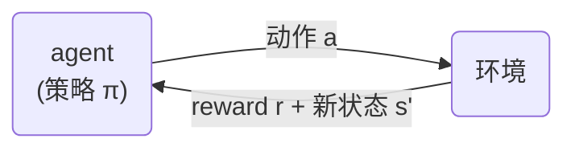
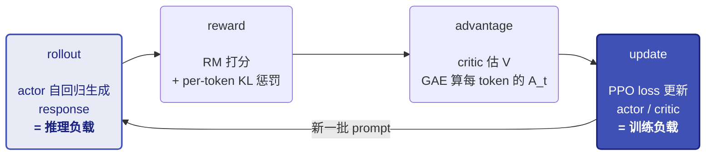
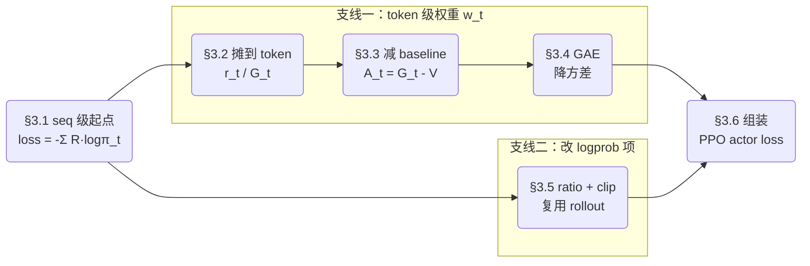

# 01-RL训练基础: loop 与 RLHF-PPO

> **TL; DR**：为什么 SFT 后还要 RL → RL loop: rollout → reward → advantage → update（= 推理 + 训练交替）→ PPO 各部件为什么存在 → RLHF 四模型 + 手写 BasicPPO → 资源画像：显存账 + 两种负载的计算特性

- **[Quick Ref for 手写 code]**：BasicPPO（§4.3）｜ [ipynb](https://github.com/Zoey-Cheng/MLSys-Learning-Notes/blob/main/code/11_basic_ppo.ipynb) ｜ [Colab](https://drive.google.com/file/d/1h7c6Tdk-xz8QPxnmZ1wRN9KxTDVWNGN7/view?usp=sharing)
  - 高频手撕四个纯函数：`sft_logprob` / `compute_rewards` / `compute_gae` / `ppo_loss`
  - 模型组件 + loop 骨架：熟悉结构、能调用即可

本篇是 RL 系列第一篇，系列以 infra 视角为主。Plan的后续篇：02 算法演化（DPO / GRPO），03–06 训推协同，07 Agentic RL。

PS: 面试手撕 PPO 部分，感谢同组做 RL 算法的朋友给的参考 doc！


## 前言

[03_02_SFT.md](../03_训练方法/03_02_SFT.md) 之后，模型能听懂指令、按格式回答。对齐人类偏好、提升推理能力，靠的是 RL（Reinforcement Learning，强化学习）。

本篇的范围：

- **默认已熟**：SFT 基础 和 推理基础（generate / sampling，见 [05_01_推理基础.md](../05_推理优化/05_01_推理基础.md)）
- **算法只讲设计层**：每个部件只回答"为什么需要它"，不追求细节
- **落点是 §5 资源画像**：一个 RLHF (§4) 有几个模型、显存占多少、两种负载（训练推理）

整体顺序：为什么要 RL → loop 本体 → PPO 部件 → 四模型系统 → 资源画像。


## 1. 为什么 SFT 后还要 RL

### 1.1 从信号缺陷到 RL 范式

**[SFT 的信号缺陷]**

SFT 的监督信号是人写的演示：每个位置有唯一 GT（Ground Truth）token。这带来两个限制：

- **没有负反馈**：数据里只有"该怎么写"，没有"不该怎么写"，无法通过梯度抑制坏输出
- **很多目标写不出 GT**：没有唯一正确答案时，标注员写不出完美演示，但比较两个回答哪个更好又快又一致。信号形态从"演示"变成"偏好"，逐 token 交叉熵（CE）loss 就用不上了

**[RL：从评价性反馈学习]**

SFT 缺的这种信号形态，正是 RL 范式的定义。按学习信号分：

- **监督学习（含 SFT）**：指导性反馈——每一步都给出正确动作，**学习 = 模仿**
- **RL**：评价性反馈——没有正确动作，agent 自己做动作，只收到一个分数。**学习 = 试错**：多做拿高分的动作，少做拿低分的

经典 RL 的设定是 agent 和环境的循环：

- agent 观察状态 $s$ → 按策略 $\pi$ 输出动作 $a$ → 环境返回 reward $r$ 和新状态 $s'$ → 目标是最大化累计 reward。



这个范式恰好补上 SFT 的两个缺陷：

- **反馈有高低**：拿低分的动作被抑制——补上"没有负反馈"
- **反馈可以只是整条一个总分**：不需要每步 GT，标注员打得了分——接住"写不出 GT"的目标

新的思考也来自这里：反馈延迟到一局结束才来，功劳怎么分回中间每一步成了新问题。

### 1.2 概率视角：两种 KL 方向

> 回忆 KL 散度：$D_{KL}(q \,\|\, p) = \mathbb{E}_{x \sim q}[\log \frac{q(x)}{p(x)}]$，衡量两个分布有多远，常见于蒸馏
>
> 这里要用它一条性质：**不对称**，$D_{KL}(q \,\|\, p) \ne D_{KL}(p \,\|\, q)$

把人类理想分布记作 $P$，模型分布记作 $\pi_\theta$。"让 $\pi_\theta$ 逼近 $P$" 可以写成两个方向的 KL，SFT 和 RL 各选了一种：

- **SFT 优化 forward KL**：$\min_\theta D_{KL}(P \,\|\, \pi_\theta)$。
  - 期望在 $P$ 上取：$P$ 有概率的地方 $\pi_\theta$ 都必须给概率（mass-covering，全覆盖）

- **RL 优化 reverse KL**：$\min_\theta D_{KL}(\pi_\theta \,\|\, P)$。
  - 期望在 $\pi_\theta$ 自己身上取：自己会生成的地方必须"对"，不会生成的地方不管（mode-seeking，挑重点）。这正是"生成质量"要的性质


方向差异直接决定数据来源：

- SFT 的 forward KL 从 $P$ 采样，即人写的数据集
- RL 的 reverse KL 从 $\pi_\theta$ 采样，再配一个能打分的函数——采样就是 **rollout**，打分就是 **reward**，正好是 §2 loop 的两个组成


## 2. RL loop：训练和推理的交替

### 2.1 RL 概念 ↔ LLM 映射

§1 的 agent-环境循环搬到 LLM 上，"环境"退化得非常简单：没有外部世界。状态转移就是把新 token 拼到序列末尾；反馈在生成结束时来一次。逐项映射如下，生成一条 response 就是一条轨迹：

| RL 概念 | LLM 对应 | 备注 |
| --- | --- | --- |
| 状态 $s_t$ | prompt + 已生成的前 $t-1$ 个 token | 每生成一个 token 状态就转移 |
| 动作 $a_t$ | 第 $t$ 步选出的 token | 动作空间 = 词表 |
| 策略 $\pi_\theta(a_t \mid s_t)$ | LLM 的 next-token 分布 | 就是 logits 过 softmax |
| 轨迹 $\tau$ | 一条完整 response | 长度 = 生成 token 数 |
| 奖励 $r$ | response 级打分 | 整条一个分（§4.1），怎么摊到 token 见 §3 |


策略、状态转移都是现成的——LLM 本身就是一个逐 token 决策的 policy。被训练的这个 LLM，RL 语境里叫 **actor**。整个框架里唯一需要新造的部件是 reward（§4.1）。

### 2.2 loop 本体

一个 RL training step 分四段：rollout → reward → advantage → update。**rollout** 是 RL 术语，指"跑一遍当前策略收集数据"，LLM 下就是 `actor.generate()`：



四段各是什么计算：

- **rollout（推理）**：actor 逐 token 自回归生成 response
- **reward**：RM 给整条打分，组装成 per-token reward（§4.1 / §3.2）——整条一次前向
- **advantage**：critic 估每 token 的 $V$，GAE 算出 $A_t$（§3.3 / §3.4）——整条一次前向
- **update（训练）**：算 PPO loss，更新 actor / critic 权重（loss 见 §3）——前向 + 反向

只有首尾两段是**重负载：rollout 走推理、update 走训练**，两种负载交替出现，且共享 actor 的同一份权重。

中间 reward / advantage 只对整条 response 各做一次前向，没有自回归循环，很轻。

**on-policy** 的含义也在这张图里：用来算梯度的数据必须来自当前策略。策略一更新，旧 rollout 数据就过期了。想复用几步，需要 §3.5 的 importance ratio 修正。


## 3. PPO：每个部件为什么存在

> 最复杂的是 loss 怎么算（§3.1 policy gradient），也可以直接记结论

RL 算法用最基础的 **PPO**（Proximal Policy Optimization，近端策略优化，InstructGPT 采用的算法）。这节不推导，方法是**从最朴素的 actor loss 起步，两个因子各自改造，拼成完整的 PPO loss**（支线结构见 §3.0 末尾的图）。读完能对着最终公式说出每一项的来历。

### 3.0 先和 pretrain / SFT 对齐结构

PPO 是 RL 篇第一个算法。动手前先把它放回"训练一个 LLM"的框架里，和我们熟悉的 pretrain / SFT 对一遍：

| | 输入 | 监督信号 | loss |
| --- | --- | --- | --- |
| **pretrain** | 文本 | **有 GT**：下一个 token 的词表 one-hot（自监督） | 逐 token CE |
| **SFT** | prompt + 演示 response | **有 GT**：response 每个 token 的词表 one-hot（人工监督） | 逐 token CE（mask 掉 prompt） |
| **RLHF-PPO** | prompt（response 由 actor 自己生成） | **无 GT**：整条 response 一个标量 reward（评价性反馈） | 逐 token 加权 logprob，权重 = reward 摊成 token |

三者都是同一个 LLM backbone（RL 里称 policy / actor），loss 也是同一个形状：

$$
\mathcal{L} = -\sum_t w_t \cdot \log \pi_t, \qquad \log \pi_t = \log \pi_\theta(a_t \mid s_t)
$$

**logprob 项** $\log \pi_t$：位置 $t$ 的 logits 过 log_softmax，取该位置实际 token $a_t$ 那一格；$w_t$：该 token 的 loss 权重。三者的差别就两处：

- **token $a_t$ 从哪来**：pretrain / SFT 来自数据集（GT）；RLHF-PPO 来自 rollout，actor 自己采的
- **权重 $w_t$ 是多少**：pretrain / SFT 恒为 1，表现为逐 token CE；RLHF-PPO 手里只有整条 response 一个标量 reward，$w_t$ 没有现成的

> **逐 token CE 是一般 CE 的退化形态**。一般 CE 对词表求和 $-\sum_v q(v) \log p(v)$。$q$ 为 one-hot 时塌缩成 $-\log \pi_\theta(\text{GT}_t \mid s_t)$，即 pretrain / SFT，$w_t \equiv 1$。

所以 §3 把骨架的两个因子逐一填实。**§3.1 起点**用 policy gradient 推出骨架：$w_t \equiv R$、logprob 项原样。之后两个因子分头改造：

- **支线一（§3.2–3.4）改 $w_t$**：seq 级 reward 标量摊成逐 token 权重。
  - 摊到 token（§3.2）→ 绝对值变相对值（§3.3）→ 降方差（§3.4），终点定义 $w_t = A_t$

- **支线二（§3.5）改 logprob 项**：$\log \pi_t$ 换成 clip 过的 ratio $\rho_t$，为复用 rollout；与 credit 分配无关
- **§3.6 组装**：两条支线拼回完整 loss



### 3.1 起点：seq 级 policy gradient (!!)

> 本节是和传统 RL 关系最大的部分，数学最多；也可以跳过推导，直接看 [rollout 梯度结论]

本节回答：actor 的 loss 从哪来。RL 没有 GT，只有一个目标：rollout 的平均 reward 尽量高。**policy gradient** 把这个目标变成能 `backward()` 的 seq 级 loss。

本节的两样产出，供后续使用：

- **理论基础**：loss 按 token 展开就是 §3.0 的两因子骨架（$\mathcal{L} = -\sum_t w_t \cdot \log \pi_t$）；§3.2–3.5 在这个骨架上改造因子
- **seq 打分 $R$ 的去向**：本节拿它当整条的权重；§3.2 起降级为 $r_t$ 末位的一项

**[目标与数据]**

目标：actor 生成的 response 平均 reward 尽量高。这个平均分记作 $J(\theta)$：

$$
\max_\theta \; J(\theta), \qquad J(\theta) = \mathbb{E}_{y \sim \pi_\theta}[R(y)]
$$

- $\theta$：actor（这个 LLM）的全部参数，训练要更新的就是它
- $y \sim \pi_\theta$：§2.2 的 **rollout**（actor 自己推理采样生成的 response）
- $R(y)$：**RM**（Reward Model）给整条的标量打分（§4.1 细讲，目前当黑盒）
- $J(\theta)$：目标本身——当前 actor 采出的 response 的平均打分。$\theta$ 一变，采样分布就变，平均分跟着变，所以是 $\theta$ 的函数

**[梯度怎么来：数学推导]**

> 这步有点复杂，不想研究数学可以直接跳到 [rollout 梯度结论]

这一步是经典 RL 的 **policy gradient（REINFORCE）**，LLM 场景只是把 policy 换成 actor。

要算的是目标 $J(\theta)$ 对 actor 参数 $\theta$ 的梯度。

先回忆 SFT 的梯度怎么来：每个 token 位置，模型前向输出一个词表概率分布，GT 是这个分布的 one-hot 版本，两者代入 CE 公式得 loss，直接 `loss.backward()`。


RL 的 $J(\theta)$ 套不上这个流程。把期望展开成加权求和看它的结构：

$$
J(\theta) = \sum_{y} \pi_\theta(y)\, R(y)
$$

- $\pi_\theta(y)$：每条 $y$ 被采到的概率，取决于 actor 参数 $\theta$ 
- $R(y)$：对应 $y$ 的 reward 打分
- $R(y)$ 里没有 $\theta$——固定一条 $y$，打分就是常数（RM 有自己的参数，但冻结，不算在 $\theta$ 里）

求导本身不难，对权重逐项导：$\nabla_\theta J = \sum_y \nabla_\theta \pi_\theta(y) \cdot R(y)$。难在算值：这个和要**枚举所有可能的序列，算不动**。两个解决 idea：

- **idea 1 恒等式改写（log-derivative trick）**：数学结论 $\nabla_\theta \pi_\theta = \pi_\theta \, \nabla_\theta \log \pi_\theta$，把权重里的 $\pi_\theta$ 补回来，idea 2 就能用上。来历是对数求导法则移项（下方速查）；不想深究可以直接当结论用
- **idea 2 蒙特卡洛**：用多次采样估**期望**，$\mathbb{E}_{y \sim \pi_\theta}[g(y)] = \sum_y \pi_\theta(y)\, g(y)$

先 idea 1 替换、认出期望定义，随后 idea 2 蒙特卡洛采样估计（rollout 一批 $y_i$，对每条算期望括号里的量，求平均）：

$$
\begin{aligned}
\nabla_\theta J &= \sum_y \nabla_\theta \pi_\theta(y) \cdot R(y)
\;\overset{\text{idea 1 代入}}{=}\; \sum_y \pi_\theta(y) \, \nabla_\theta \log \pi_\theta(y) \cdot R(y)
\;\overset{\text{期望定义}}{=}\; \mathbb{E}_{y \sim \pi_\theta}\big[\, \underbrace{R(y)}_{\text{标量系数}} \cdot \underbrace{\nabla_\theta \log \pi_\theta(y)}_{\text{SFT 那个标准反向}} \,\big] \\
&\overset{\text{idea 2 蒙特卡洛}}{\approx}\; \underbrace{\frac{1}{N} \sum_{i=1}^{N}}_{\text{一个 rollout batch 平均}} \underbrace{R(y_i)}_{\text{RM 打分，常数}} \cdot \underbrace{\nabla_\theta \log \pi_\theta(y_i)}_{\text{SFT 那个标准反向}}
\end{aligned}
$$

前三步是恒等变形，最后一步 $\approx$ 才是估计。蒙特卡洛的"多次采样"落到工程上，就是 rollout 一个 batch 一起算。

式里已经抽象出"SFT 那个标准反向"，所以实际计算就是：每条 $y_i$ 做一次 SFT 式前向反向，乘上常数 $R(y_i)$，batch 求平均。

> **速查 · log-derivative trick**（又名 score function estimator；RL 里就是 REINFORCE）
>
> 通用的期望-梯度恒等式，不是 RL / LLM 专有，统计与变分推断也用。
>
> 记号：$p_\theta(y)$ 读作"参数为 $\theta$ 的分布给样本 $y$ 的概率"，一个随 $\theta$ 可导的标量——本节里就是 $\pi_\theta(y)$，actor 给整条 response 的概率。两步：
>
> - 对数求导法则 $(\ln f)' = f'/f$，$f$ 取 $p_\theta(y)$、导数取对 $\theta$ 的梯度：$\nabla_\theta \log p_\theta = \nabla_\theta p_\theta / p_\theta$。移项得 $\nabla_\theta p_\theta = p_\theta \, \nabla_\theta \log p_\theta$——初等微积分结论，直接可用
> - 代入 $\nabla_\theta J$ 替换掉 $\nabla_\theta p_\theta$，多出来的 $p_\theta$ 正好把求和收回期望形状：
>
> $$
> \nabla_\theta \sum_y p_\theta(y)\, f(y) = \sum_y \nabla_\theta p_\theta \cdot f = \sum_y p_\theta \cdot \nabla_\theta \log p_\theta \cdot f = \mathbb{E}_{y \sim p_\theta}\big[\, f(y) \, \nabla_\theta \log p_\theta(y) \,\big]
> $$
>
> 本节取 $f = R$、$p_\theta = \pi_\theta$ 就是上面的梯度。关键：$f$（这里是 $R$）不含模型参数 $\theta$，梯度全落在 $\log p_\theta$ 上。

**[rollout 梯度结论]**

**policy gradient 的 update = 把 prompt + rollout 当 SFT 数据训，每条序列的 loss 乘上自己的 reward**（普通 SFT 相当于权重恒为 1）。一个 batch 里 reward 高的序列概率被推高，低的被压低。落成公式：

$$
\nabla_\theta J \;\approx\; \underbrace{\frac{1}{N} \sum_{i=1}^{N}}_{\text{rollout batch 平均}} \underbrace{R(y_i)}_{\text{RM 打分，常数}} \cdot \underbrace{\nabla_\theta \log \pi_\theta(y_i)}_{\text{SFT 式前向反向}}
$$

对应的具体计算：

- **rollout + 打分**：actor 对每条 prompt 采出 $y_i$；RM 给整条打一个分 $R(y_i)$，此后当常数用
- **SFT 式 loss**：prompt 拼上 $y_i$ 做 teacher-forcing 前向，把 $y_i$ 自己当 label 算逐 token CE（shift 一位、mask 掉 prompt，全同 SFT），求和得整条 seq 的 loss
- **乘分、平均**：每条 loss 乘 $R(y_i)$，batch 求平均——就是 $\nabla_\theta J$ 的蒙特卡洛估计

和 SFT 逐行对齐：

```python
# SFT: token 序列 y 来自数据集
logp = actor(x, y).log_softmax(-1)   # teacher-forcing 前向
loss = -logp.gather(y).sum()         # 每个位置取 y_t 的 logprob, 即以 y 为 label 的 CE
loss.backward()

# policy gradient: y 来自 rollout, 再乘一个标量
y = actor.generate(x)                # 采样, 不进计算图
R = reward_model(x, y)               # 标量, 不含 actor 参数
logp = actor(x, y).log_softmax(-1)   # 同一个前向
loss = -(R * logp.gather(y).sum())   # 唯一差别: 乘 R
loss.backward()                      # 同一个反向
```

**[loss 换成逐 token 读法]**

目前的 loss 是整条 seq 一个数，结构 = $R \times \text{SFT 式 loss}$。

两个因子里，分数 $R$ 是常数。SFT 式 loss 就是逐 token CE 求和——**CE 天然逐 token 算、再求和**。按 token 展开（简写 $\log \pi_t = \log \pi_\theta(a_t \mid s_t)$）：

$$
\mathcal{L} = -R \cdot \big(\log \pi_1 + \log \pi_2 + \cdots\big)
= -\big(R \log \pi_1 + R \log \pi_2 + \cdots\big)
= -\sum_t w_t \cdot \log \pi_t, \qquad w_t = R
$$

这就是 §3.0 承诺的形状（$w_t$ 当**常数**用，stop-grad，被求导的只有 $\log \pi$）。

问题：$w_t$ 恒 $= R$，写对和写错的 token 同奖同罚，不合理。支线一（§3.2–3.4）把 $w_t$ 换成逐位置的量。logprob 项的问题是复用：rollout 贵，一批数据想多次更新。支线二（§3.5）把它换成 ratio 并 clip。分步见 §3.0 末尾的图。

### 3.2 token 级权重（1）：$r_t$ 与 $G_t$

本节造两个逐 token 的量，引入一个新模型（ref），作 §3.3 权重的原材料。

- $r_t$：第 $t$ 个 token 的**即时 reward**，由逐 token 的 KL 惩罚和末位的 RM 分组成
- $G_t$：第 $t$ 个 token 的**回报（return）**：身后 $r_k$ 的 suffix sum，从这一步到整条结束的总 reward，含末位的 RM 分
- **ref**（reference model）：actor 出发时那份模型权重的冻结副本，= KL 惩罚的基准

**[造 token reward $r_t$]**

RM 只在整条结束时给一个分，中间 token 没有即时 reward。于是我们定义：

$$
r_t = \underbrace{-\beta \,\big(\log \pi_\theta(a_t \mid s_t) - \log \pi_{\text{ref}}(a_t \mid s_t)\big)}_{\text{每个 token：KL 惩罚}} \;+\; \underbrace{\mathbb{1}[t = T] \cdot r_{\text{RM}}}_{\text{末位：RM 整条打分}}
$$

关于 KL 惩罚：

- **为什么扣它**：actor 可能找到打分高、实际很差的输出（**reward hacking**）；KL 把 actor 约束在出发点 ref 附近，偏得越远扣得越多
- **怎么算**：冻结副本 ref 不参与 rollout。序列采出后，actor 和 ref 各对 prompt + response 做一次前向，logprob 逐位相减；比的是两个模型给同一个 token 的概率（类似蒸馏的 teacher-student）
- **不走梯度**：它沿 $r_t \to G_t \to A_t$ 一路当常数


**[回报 $G_t$：定义]**

- **只算身后**：token 只能影响从这一步起的 reward；身前的 $r_k$ 在它生成时已定，不算进它的功劳——所以基础 idea 是 suffix sum
- **RM 分怎么摊到 token**：末位的 $r_{\text{RM}}$ 通过 suffix sum 传回每个位置；RM 分本身始终只在末位
- **折扣因子 $\gamma$**：经典 RL 还给远期 reward 打折，通式 $G_t = \sum_{k \ge t} \gamma^{k-t} r_k$；LLM 常取 $\gamma = 1$
- **递归形式**：等价写法 $G_t = r_t + \gamma G_{t+1}$，实现从末位倒着递推；§3.4 的改造从它出发


### 3.3 token 级权重（2）：advantage 与 critic

最直接的想法是拿 $G_t$ 当权重，但有两个问题：

- **没区分度**：末位 RM 分是 $G_t$ 的主项，每个位置都含它（KL 项很小）；各位置数值接近，写对写错同奖同罚
- **方差大**：跨样本看，后半段的采样随机性把整条 $G_t$ 一起抬高或压低，梯度估计噪声大

**修正**：减一个逐位置的 baseline，权重换成 **advantage（优势）**：

$$
A_t = G_t - V(s_t)
$$

$V(s_t)$ = 从 $s_t$ 出发预期拿多少分，$A_t$ = 比预期好多少（正 = 推高该 token，负 = 压低）。对上前面的问题：

- **区分度**：$V$ 逐位置不同，影响 $A_t$
- **方差**：$A_t$ 压到 0 周围，有正有负


$V$ 由 **critic** 估出——第二个要训练的模型：

- **结构**：actor 同构的 LLM，lm_head 换标量 head（`nn.Linear(d, 1)`），每位置输出一个 $V(s_t)$
- **训练**：loss = $\text{MSE}(V(s_t), G_t)$ 回归，梯度更新整个模型（初始化常复用 RM，见 §4.2）

### 3.4 token 级权重（3）：GAE 结论

§3.3 的 $A_t = G_t - V(s_t)$ 还剩一个噪声源：$G_t$ 是身后每一步实际采样的 $r_k$ 加出来的，response 越长随机项越多（方差大）。

降噪思路：不把身后全部走完，只走一步，剩下的用 critic 预估收尾。分两步：

- **恒等展开**：用 §3.2 的递归把 $A_t$ 里的 $G_t$ 展开一层，$A_t = G_t - V(s_t) = r_t + \gamma G_{t+1} - V(s_t)$，此时无近似
- **近似替换**：方差全部藏在 $G_{t+1}$ 里（身后实际采样的 suffix sum），用 critic 的预估 $V(s_{t+1})$ 顶替它，得到 $A_t$ 的新估计：

$$
\delta_t = r_t + \gamma V(s_{t+1}) - V(s_t)
$$

这就是**单步 TD 残差**（temporal difference）。实际值只用了 $r_t$ 一步，方差小；代价是 critic 估不准就有偏。

> 现在我们有了两个极端：$G_t - V(s_t)$ 把身后全走完，无偏但方差大；$\delta_t$ 只走一步，方差小但有偏。

**GAE（Generalized Advantage Estimation）** 在两者之间折中，形式是一个简单递归：

$$
A_t = \delta_t + \gamma\lambda \, A_{t+1}
$$

读法：本步的实际残差 $\delta_t$ 全额保留，身后的估计 $A_{t+1}$ 按 $\lambda$ 打折。打折按等比数列累乘：离得越远的 $\delta$ 被打折越多次，信得越少。$\lambda = 0$ 就是 $\delta_t$；$\lambda = 1$ 恰好还原 $G_t - V(s_t)$；中间是 bias-variance 取舍。LLM 常配 $\gamma = 1$、$\lambda \approx 0.95$。计算从末位倒着递推（$A_{T+1} = 0$）。


到此支线一走完，权重定型：$w_t$ = GAE 递推出的 $A_t$，当常数进 loss。§3.5 转入支线二，改另一个因子 logprob 项。

### 3.5 换 logprob 项：安全复用数据

**[复用 = 同一批数据多次更新]**

rollout 要整条自回归生成，是 loop 里最贵的一段（§5）。一批数据只更新一次就扔，太浪费。

PPO 的做法：rollout 一次，存成一批 **experiences**（序列、每 token 的旧 logprob、算好的 $A_t$），用它连做 **ppo-epochs** 次前向反向。生成只发生一次；复用的是数据，不是重跑 prompt 重新采样。

**[代价：数据过期]**

第一次更新后 $\pi_\theta$ 就变了，这批数据却是旧策略 $\pi_{\theta_{\text{old}}}$ 采的——on-policy 被打破。§3.1 的梯度公式以"数据来自当前策略"为前提，直接再用有系统性偏差。

**[修正：importance ratio]**

修正的 idea 是 **importance sampling**：拿旧分布的样本估新分布的期望。办法是给每条样本乘一个改正系数 = 新旧分布给它的概率比（不展开推导）。直觉：新策略比旧策略更爱生成的 token，权重调大；反之调小。落到每个 token，**loss 里的 $\log \pi_t$ 换成系数 $\rho_t$**：

$$
\rho_t = \frac{\pi_\theta(a_t \mid s_t)}{\pi_{\theta_{\text{old}}}(a_t \mid s_t)}, \qquad \mathcal{L} = -\,\mathbb{E}_t\big[\, \rho_t \, A_t \,\big]
$$

- **分子分母**：都是概率，不是 logits（logits 未归一化，跨前向不可比）。实现里存 logprob，$\rho_t = \exp(\log\pi_\theta - \log\pi_{\theta_{\text{old}}})$；分母来自 experiences，常数；分子由当前 actor 实时前向算出

**[clip：限步长]**

概率在 $(0, 1]$ 内，但概率的**比值**没有上限：旧策略给某 token 0.001、新策略给 0.5，$\rho_t = 500$。这种 token 会主导梯度，一步把参数推得很远——复用的前提"新旧策略接近"就被破坏了。PPO 截断：

$$
\mathcal{L}^{\text{clip}} = -\,\mathbb{E}_t\Big[ \min\big( \rho_t A_t, \; \text{clip}(\rho_t,\, 1-\epsilon,\, 1+\epsilon) \, A_t \big) \Big]
$$

$\rho_t$ 出了 $[1-\epsilon, 1+\epsilon]$ 就被换成边界常数，常数没有梯度，该 token 不再推动更新。

效果：每个 token 的概率每轮最多推到旧策略的 $1 \pm \epsilon$ 倍附近，新策略被限制在 $\pi_{\theta_{\text{old}}}$ 的邻域内。这就是名字里 Proximal（邻近）的含义。min 让截断只单向生效：只挡"朝优势方向继续推"，往回修正的梯度保留。


复用 rollout 多次更新的整体设计：


训推一致性（06 篇）的问题源头在这里：这个公式假设 $\rho_t$ 的分子分母来自同一套计算。实际系统里分母由推理引擎算、分子由训练引擎算，两边数值本身就有差异。

### 3.6 组装：完整的 actor loss

把 §3.1–3.5 拼起来，就是 PPO 实际用的 actor loss：

$$
\mathcal{L}^{\text{actor}} = -\,\mathbb{E}_t\Big[ \min\big( \rho_t A_t, \; \text{clip}(\rho_t,\, 1-\epsilon,\, 1+\epsilon) \, A_t \big) \Big]
$$

对照 §3.0 的骨架 $\mathcal{L} = -\sum_t w_t \cdot \log \pi_t$，两条支线在此汇合：

- **支线一：$w_t \to A_t$**：GAE（§3.4）递推的优势，原材料是 per-token reward $r_t$（§3.2）和 critic 估的 $V$（§3.3）
- **支线二：$\log \pi_t \to$ clip 过的 $\rho_t$**：importance ratio 让一批 rollout 复用 ppo-epochs 次，clip 限每步步长（§3.5）

外加 critic 自己的 loss $\text{MSE}(V, G_t)$（§3.3），和 actor 同步更新。

这套 loss 同时要 4 个模型在场：actor、critic、RM、ref——正是 §4 逐个交代、§5 算账的对象。

**[一个 step 的完整计算链]**

现在直接利用所有结论，按一个 training step 走一遍：

1. **rollout**：actor 对 prompt 采出 response（推理负载）
2. **no-grad 前向**：四个模型各对 prompt + response 前向一次
   - actor 出 old_logp（$\rho_t$ 分母，存进 experiences）
   - ref 出 ref_logp、RM 出末位标量 $r_{\text{RM}}$、critic 出逐位置 $V(s_t)$——都是算 $A_t$ 的原材料
3. **组装 $r_t$**：old_logp − ref_logp 得 KL 惩罚，末位叠 $r_{\text{RM}}$（§3.2）
4. **GAE**：$r_t$ 配 $V$ 倒序递推出 $A_t$（actor 权重）；顺带 $G_t = A_t + V$，作 step 5 critic 参数更新的 label（§3.3 / 3.4）
5. **update × ppo-epochs**：
   - 每轮 actor 前向出 new_logp（唯一带梯度的前向）→ $\rho_t$ → clip → actor loss；
   - critic 前向出新 $V$ → $\text{MSE}(V, G_t)$；
   - 一起反向、step（§3.5）

1–4 每个 step 只算一次，产物全程当常数；只有 5 在更新参数。逐行实现见 §4.3。


## 4. RLHF 四模型 (InstructGPT)

§3 的四个模型里只剩 RM 还是黑盒。整条 response 的分数从哪来？开放对话没有可编程的打分规则，分数只能来自人。

**把人类偏好标注训成打分模型，拿它当 reward 跑 RL，就是 RLHF**（Reinforcement Learning from Human Feedback，人类反馈强化学习）。InstructGPT（OpenAI 2022，ChatGPT 的方法原型）把它定型成**三阶段：SFT → 训 RM → PPO**。

### 4.1 RM：偏好怎么变成分数

数据形态 §1.1 已经给出：标注员写不出完美演示，但比较两个回答哪个更好，又快又一致。所以 RM 要**从"比较"学出"标量分"**。

- **数据**：
  - pair $(x, y_w, y_l)$ = 同一 prompt $x$ + 两条完整 response，$y_w$ 好（chosen）、$y_l$ 差（rejected）
  - 人类偏好 = 单 pair 二选一，但一批 pair 可以定出连续分——同 ELO：大量单场胜负拟合出每人一个 rating

- **结构 / IO**：
  - 与 critic 同构——SFT 后模型的 backbone + 标量 head `nn.Linear(d, 1)`，从 SFT 初始化
  - 输入一条 (prompt, response)，输出标量 $r_\phi(x, y)$。差别只在读位：critic 每位置都出 $V(s_t)$，RM 只取末位那个当整条分数（causal mask 下只有末位能看到整条）

- **训练（InstructGPT 第 2 阶段）**：
  - 每 pair 前向两次得打分 $r_w, r_l$
  - $\sigma$ = sigmoid，$\sigma(r_w - r_l)$ = "$y_w$ 更好" 的预测概率；loss 是它的二分类 CE（label 恒为 $y_w$ 赢），反向更新整个模型：


$$
\mathcal{L}_{\text{RM}} = -\log \sigma(r_w - r_l), \qquad r_w = r_\phi(x, y_w),\ \ r_l = r_\phi(x, y_l)
$$

模型 forward 始终是"一条 → 一个分"，成对只在 loss；所以训完能直接当 loop 里的单条 reward。训好冻结（§4.2）。


### 4.2 四模型系统

RM 就位，四个模型到齐。对照章首的三阶段：前两阶段的产物，在 **第三阶段 PPO** 里各占一个位置：

| 模型 | 结构 | 来自哪个阶段 | 训练？ | 在 loop 里做什么 |
| --- | --- | --- | --- | --- |
| **actor** | LLM | SFT 模型 | ✅ 训练 | rollout 生成；update 被更新 |
| **critic** | LLM + 标量 head | 常从 RM 初始化 | ✅ 训练 | 每 token 估 $V(s_t)$，供 GAE |
| **RM** | LLM + 标量 head | SFT 模型经 §4.1 偏好训练 | ❄️ 冻结 | response 级打分 |
| **ref** | LLM | SFT 模型副本 | ❄️ 冻结 | 提供 KL 惩罚的基准 logprob |

每个模型在一个 step 里算什么、什么时候算，§3.6 的计算链已排过时序；§4.3 用代码逐行走一遍。四个模型、两种负载，这就是 §5 要算账的对象。

### 4.3 手写 BasicPPO

把 §4.2 的表和 §3.6 的计算链落成能跑的代码，分两档。**高频手撕的纯函数**是面试重点，练到可默写；**模型组件 + loop 骨架**熟悉结构、能调用即可。toy 规模（词表 100、hidden 64），CPU 直接跑通；完整可运行版见 [11_basic_ppo.ipynb](https://github.com/Zoey-Cheng/MLSys-Learning-Notes/blob/main/code/11_basic_ppo.ipynb)。真实系统的工程项省略。


**[高频手撕：四个纯函数]**

> 面试手撕 PPO 部分，感谢同组做 RL 算法的朋友给的参考 doc！

四个函数 = 一条四段流水线，一段一个：

- `sft_logprob`：SFT 式 logprob $\log\pi_t$（§3.0）
- `compute_rewards`：per-token reward $r_t$（§3.2）
- `compute_gae`：优势 $A_t$，最终的 per-token 权重（§3.4）
- `ppo_loss`：clip 版 actor loss，多轮复用（§3.6）

**后两个是纯 PPO 手撕的核心**；前两个是 RLHF 特有的前置，纯 PPO 没有。下面按这个分界拆成两块。

**① logprob + ② per-token reward**（RLHF 前置）：

```python
import torch
import torch.nn as nn
import torch.nn.functional as F

def sft_logprob(model, ids, p_len):
    """
    计算 response 段每 token 的 logprob（§3.0），即 SFT 逐 token CE 里那个 logprob

    参数:
    - model: actor 或 ref
    - ids: prompt + response 拼好的完整序列，形状为 (B, T)
    - p_len: prompt 长度，用来切掉 prompt 段

    返回:
    - response 每位的 log π(a_t | s_t)，形状为 (B, T_resp)
    """
    # 整体左移一位: 输入 ids[:-1], 位置 j 的输出去预测真实的下一个 token ids[j+1] (teacher-forcing)
    logp = model(ids[:, :-1]).log_softmax(-1)      # (B, T-1, V)  位置 j 的分布 = 对 ids[j+1] 的预测
    tgt  = ids[:, 1:].unsqueeze(-1)                # (B, T-1, 1)  label = 右移一位取真实 token, 同 SFT
    logp = logp.gather(-1, tgt).squeeze(-1)        # (B, T-1)     每位取实际 token a_t 那一格的 logprob
    # response 首 token 落在位置 p_len; 因左移一位, 它的预测分在索引 p_len-1, 往后全是 response 段
    return logp[:, p_len - 1:]                     # (B, T_resp)  只留 response 段, prompt 段不进 loss

def compute_rewards(old_logp, ref_logp, r_rm, mask, beta=0.1):
    """
    组装 per-token reward r_t（§3.2）：每 token 一份 KL 惩罚，最后一个有效 token 叠 RM 分

    参数:
    - old_logp / ref_logp: actor / ref 对同一序列的 logprob，形状为 (B, T_resp)
    - r_rm: RM 给整条的标量分，形状为 (B,)
    - mask: 1=有效 response token，0=EOS 之后的 pad，形状为 (B, T_resp)

    返回:
    - 每 token 的即时 reward，形状为 (B, T_resp)
    """
    r = -beta * (old_logp - ref_logp) * mask       # KL 惩罚, pad 位清零
    last = mask.sum(1).long() - 1                   # 每条最后一个有效 token 的下标
    r[torch.arange(len(r)), last] += r_rm           # RM 分加在最后有效位 (§3.2 的 1[t=T]·r_RM)
    return r
```

**③ GAE 优势 + ④ clip loss**——PPO 核心。

`compute_gae` 把参考 doc 的 `dones` 换成 LLM 的 EOS/pad 边界：

```python
def compute_gae(r, v, mask, gamma=1.0, lam=0.95):
    """
    计算 Generalized Advantage Estimation (GAE)（§3.4），倒序递推
    δ_t = r_t + γV_{t+1} − V_t，A_t = δ_t + γλ·A_{t+1}

    参数:
    - r: 每 token 即时 reward，形状为 (B, T_resp)
    - v: critic 估的 V(s_t)，形状为 (B, T_resp)
    - mask: 1=有效 token，0=pad，兼作 (1 − done)，形状为 (B, T_resp)
    - gamma / lam: 折扣因子 / GAE 衰减因子

    返回:
    - adv: 优势 A_t，给 actor 当权重，形状为 (B, T_resp)
    - ret: A_t + V_t，给 critic 当回归 label（pad 位均 0），形状为 (B, T_resp)
    """
    adv, A = torch.zeros_like(r), 0
    for t in reversed(range(r.shape[1])):          # 从末位往前推
        if t + 1 < r.shape[1]:
            nonterm = mask[:, t + 1]               # 下一位是否仍是有效 token
            v_next  = v[:, t + 1] * nonterm
        else:
            nonterm, v_next = 0, 0                 # 序列最右端, 无下一状态
        delta = r[:, t] + gamma * v_next - v[:, t]         # 单步 TD 残差 δ_t
        A = delta + gamma * lam * nonterm * A               # 跨到 pad 时 nonterm=0, 重置
        adv[:, t] = A
    return adv * mask, (adv + v) * mask            # pad 位清零

def ppo_loss(new_logp, old_logp, adv, mask, eps=0.2):
    """
    计算 clip 版 actor loss（§3.6）：−E[ min(ρ_t·A_t, clip(ρ_t, 1±ε)·A_t) ]，只在有效位取均值

    参数:
    - new_logp: 当前 actor 实时前向，唯一带梯度，形状为 (B, T_resp)
    - old_logp: rollout 时存下的旧 logprob（常数），形状为 (B, T_resp)
    - adv: GAE 优势 A_t（常数），形状为 (B, T_resp)
    - mask: 1=有效，0=pad，形状为 (B, T_resp)

    返回:
    - 标量 loss
    """
    ratio = (new_logp - old_logp).exp()            # ρ_t = π_θ/π_old, logprob 差取 exp (§3.5)
    surr1 = ratio * adv                            # 不截断
    surr2 = ratio.clamp(1 - eps, 1 + eps) * adv    # 截断到 [1-ε, 1+ε]
    loss  = -torch.min(surr1, surr2)               # 取更小者 (§3.6): 出界那侧梯度 = 0
    return (loss * mask).sum() / mask.sum()        # masked mean, pad 位不算
```

四段里前三段（`sft_logprob` / `compute_rewards` / `compute_gae`）在 loop 里输入都是 no-grad 张量、输出当常数；只有 `ppo_loss` 的 `new_logp` 带梯度。

**[补充结构：四个模型与 rollout]**

这部分面试一般不要求手写，熟悉结构、能调用即可。结构只有两种：带 lm_head 的 Actor，和带标量 head 的 ScalarLM（critic 与 RM 同构，§3.3 / §4.1）：

```python
import copy

V, D = 100, 64                                   # 词表 / hidden, toy 规模
EOS = 0                                           # 约定 token 0 为 EOS, 标 response 结束

class MiniLM(nn.Module):
    """共用 backbone: embedding + 2 层 causal transformer, 输出每位置 hidden"""
    def __init__(self):
        super().__init__()
        self.emb = nn.Embedding(V, D)
        layer = nn.TransformerEncoderLayer(D, nhead=4, dim_feedforward=4 * D,
                                           dropout=0.0, batch_first=True)  # 关 dropout: 前向确定
        self.blocks = nn.TransformerEncoder(layer, num_layers=2)
    def forward(self, ids):                      # [B,T] -> [B,T,D]
        mask = nn.Transformer.generate_square_subsequent_mask(ids.shape[1])
        return self.blocks(self.emb(ids), mask=mask, is_causal=True)

class Actor(nn.Module):
    """LLM 本体: backbone + lm_head"""
    def __init__(self):
        super().__init__()
        self.lm, self.lm_head = MiniLM(), nn.Linear(D, V)
    def forward(self, ids):                      # -> [B,T,V] logits
        return self.lm_head(self.lm(ids))
    @torch.no_grad()
    def generate(self, ids, n_new):              # toy 版 rollout, 无 KV cache
        for _ in range(n_new):                   # 真实系统这段走推理引擎 (§5.2)
            p = self(ids)[:, -1].softmax(-1)     # 真实会在所有序列都出 EOS 时提前停
            ids = torch.cat([ids, torch.multinomial(p, 1)], dim=1)
        return ids                               # 仍生成定长 n_new, EOS 之后靠 mask 屏蔽

class ScalarLM(nn.Module):
    """critic 与 RM 同构: backbone + 标量 head"""
    def __init__(self):
        super().__init__()
        self.lm, self.head = MiniLM(), nn.Linear(D, 1)
    def forward(self, ids):                      # -> [B,T] 每位置一个标量
        return self.head(self.lm(ids)).squeeze(-1)

actor  = Actor()                                 # ✅ 训练
critic = ScalarLM()                              # ✅ 训练 (实际常从 RM 初始化)
rm     = ScalarLM().eval()                       # ❄️ 冻结; 随机权重代替 §4.1 训好的 RM
ref    = copy.deepcopy(actor).eval()             # ❄️ 冻结; actor 出发点的副本
```

**[一个 training step]**

四段注释是 §3.6 计算链的浓缩（组装 $r_t$ + GAE 并成第 3 段）；只有第 4 段带梯度：

```python
opt = torch.optim.Adam([*actor.parameters(), *critic.parameters()], lr=1e-4)

def ppo_step(prompt, n_new=16, ppo_epochs=4):
    p_len, B = prompt.shape[1], prompt.shape[0]
    # 1) rollout: 推理负载
    ids = actor.generate(prompt, n_new)
    # prompt 段已由 sft_logprob 用 p_len 切掉; 这里的 mask 只切 response 内部的 pad
    # response 变长: 各条在不同位置生成 EOS, EOS 之后的位置是 pad, 要 mask 掉
    eos  = (ids[:, p_len:] == EOS).long()            # (B, n_new)  EOS 处为 1
    # cumsum 数"到本位为止的 EOS 数", 减本位得"本位之前"的 EOS 数; ==0 即仍在首个 EOS(含)之前
    mask = (eos.cumsum(1) - eos == 0).float()        # (B, n_new)  到首个 EOS(含)为 1, 之后 pad 为 0
    last = mask.sum(1).long() - 1                     # (B,)  每条最后一个有效 token 在 response 段内的下标
    # 2) no-grad 前向 x4, 产物即 experiences, 更新期间全程当常数
    with torch.no_grad():
        old_logp = sft_logprob(actor, ids, p_len)  # (B, T_resp) ρ_t 的分母 (§3.5)
        ref_logp = sft_logprob(ref, ids, p_len)    # (B, T_resp) KL 基准 (§3.2)
        # V(s_t) = 生成 response 第 t 个 token 前的状态价值 = critic 在位置 t-1 的输出;
        # 同 logp 一样左移一位对齐, 故 response 段取 [p_len-1:-1]
        v        = critic(ids)[:, p_len - 1:-1]     # (B, T_resp) 每个 response 位置的 V(s_t)
        r_rm     = rm(ids)[torch.arange(B), p_len + last]  # (B,) p_len+last=末位绝对下标, 取该处标量作整条分 (§4.1)
    # 3) reward 组装 + GAE
    rewards  = compute_rewards(old_logp, ref_logp, r_rm, mask)
    adv, ret = compute_gae(rewards, v, mask)
    # 4) update: 同一批 experiences 复用 ppo-epochs 次, 训练负载
    for _ in range(ppo_epochs):
        new_logp = sft_logprob(actor, ids, p_len)  # 唯一带梯度的 logprob
        actor_loss = ppo_loss(new_logp, old_logp, adv, mask)           # §3.5 / 3.6
        v_pred     = critic(ids)[:, p_len - 1:-1]
        value_loss = ((v_pred - ret) ** 2 * mask).sum() / mask.sum()   # masked MSE (§3.3)
        opt.zero_grad(); (actor_loss + 0.5 * value_loss).backward(); opt.step()
    return actor_loss.item(), value_loss.item()

for step in range(3):                                # 跑 3 个 step
    print(ppo_step(torch.randint(V, (2, 8))))
```

RM 随机，reward 无意义，所以这段只验接线、不验收敛——loss 上下跳正常。正确性怎么测见 §6。

toy 为了跑通省掉了这些工程项，真实实现都要补上：

- **变长 prompt 的 attention mask**：BasicPPO 处理了变长 response（EOS + response_mask），prompt 却都等长。真实 batch 里 prompt 也长短不一：要左 pad，并加 attention mask 让注意力跳过 pad token。toy 的 `MiniLM` 只有 causal mask（管自回归），没有这个 padding mask。
- **KL 惩罚的另一种放法**：§3.2 把 KL 并进 $r_t$。也可以不并，单独作一项加到 loss（$\mathcal{L}^{\text{actor}} + \beta \cdot \text{KL}$）——目标等价、实现不同。GRPO 用后者，02 篇展开。
- **双引擎**：toy 里 `generate` 和 update 用同一个 `actor` 对象。真实系统 `generate` 走推理引擎（vLLM）、update 走训练引擎（Megatron / FSDP），同一份权重在两套系统各存一份。§5 起全系列都在处理这件事。
- **训练稳定性 trick**：一批只影响"训得稳不稳"、不改设计的调参项，本篇不展开——advantage 按 batch 白化（减均值除标准差，稳梯度尺度）、reward clip、entropy bonus（loss 加一项策略熵，防策略过早塌缩成只输出几个 token）、value clip（限 critic 的 $V$ 单步别跳太远）、actor / critic 分开 optimizer。


## 5. 资源画像

§4 四个模型到齐。本节给一个 RLHF step 算一笔账：显存占多少（§5.1）、rollout 和 update 各是什么负载（§5.2）。这笔账是后续系列的出发点——每一篇要解决的问题都能在这里找到起因，§5.3 汇总成一条后续路线。

### 5.1 显存账

以 7B、bf16 混合精度、Adam 为例，每个模型按状态分两档：

- **训练态**（actor / critic）：权重 2 + 梯度 2 + fp32 master 4 + Adam 状态 8 = **16 bytes/param**
- **冻结态**（RM / ref）：只存 bf16 权重 = **2 bytes/param**

7B 代入：

| 模型 | 状态 | 显存（7B） |
| --- | --- | --- |
| actor | 训练态 | ~112 GB |
| critic | 训练态 | ~112 GB |
| RM | 冻结 | ~14 GB |
| ref | 冻结 | ~14 GB |
| 合计（未算激活 / KV cache） | | **~250 GB** |

这张表带出两个问题：

- **单卡装不下**：~250 GB 远超单卡显存，四个模型怎么摆到一组 GPU 上要专门设计
- **同一份权重、两种运行时**：rollout 时 actor 要额外的 KV cache 和推理引擎运行时，而它训练态的优化器状态此刻全程闲置。放置策略得处理这种切换

### 5.2 两种负载的计算特性

rollout 和 update 的差异，就是推理和训练的差异（细节见 [05_01_推理基础.md](../05_推理优化/05_01_推理基础.md)，此处只列对系统设计有影响的几条）：

| | rollout（推理） | update（训练） |
| --- | --- | --- |
| 计算模式 | 自回归，逐 token decode | teacher-forcing，全序列一次前向 + 反向 |
| 特性 | memory-bound | compute-bound |
| 时长 | 不定，由最长 response 决定 | 相对固定 |
| 想要的引擎 | vLLM / SGLang（KV cache / continuous batching） | Megatron / FSDP（并行 / 优化器分片） |

最关键的是最后一行：**两种负载的最优引擎不是同一个**。工业实践里 rollout 用推理引擎、update 用训练引擎，同一份权重在两套系统里各存一份。这一个事实派生出后续一整串系统问题。


时间上 rollout 通常占大部分，且 response 越长占比越高。reasoning 任务里生成几万 token，rollout 占比可以远超一半。一批 rollout 的时长由最长那条 response 决定：短的先生成完、之后一直空等。这个长尾是后续异步化要处理的对象。

### 5.3 三个结论与后续

收束这张画像：

- **贵**：四个模型、~250 GB 起步，显存主要压在两个训练态模型上
- **慢**：每个 step 内嵌一次完整推理，rollout 长尾决定 step 时长
- **冲突**：两种负载各要一套引擎，同一份权重要在两套系统间保持同步

Plan 后续从这三条分两条线走🤔：

- **算法线（02）**：从"贵"入手，减少在场的模型数——DPO 删掉 rollout 和 RM、GRPO 删掉 critic。算法能删的到此为止
- **系统线（03–06，训推协同四篇）**：剩下的模型和负载拆不掉，在系统层支撑，沿一条因果链推进：
  - **03 架构与放置**：四个模型怎么摆到一组 GPU 上——colocate 合放还是分离部署
  - **04 权重同步**：训练引擎每步更新完，权重要 reshard 成推理引擎的布局再同步过去
  - **05 异步化**：同步卡在 critical path 上，提速只能让 rollout 和 update 异步跑，代价是数据变旧（staleness）
  - **06 一致性**：异步 + 双引擎让 §3.5 的 ratio 分子分母来自两套计算，数值对不上，修正它正好绕回算法

再往后 **07 Agentic RL**：引入多轮、工具调用和环境后，03–06 的问题被放大重演。


## 6. 代码实现

toy 规模（词表 100、hidden 64），CPU 秒级跑通（真实规模的四模型单卡装不下，见 §5.1 的账）：[11_basic_ppo.ipynb](https://github.com/Zoey-Cheng/MLSys-Learning-Notes/blob/main/code/11_basic_ppo.ipynb)。ipynb 的 §1–3 是 §4.3 的代码，§4 验证正确性。RL 没有逐 token GT，跑通 ≠ 算法对，分两步查。

**① 逐个函数对参照**：四个纯函数各有一个能算准的参照，bug 能定位到单个函数。

| 函数 | 参照 |
| --- | --- |
| `sft_logprob` | 真 token logprob $= -\text{CE}$，与 `F.cross_entropy` 取负对齐 |
| `compute_rewards` | actor==ref → KL 恒 0，只剩末位 RM 分，落在最后一个有效 token |
| `compute_gae` | $\lambda{=}1$ 还原 $G_t-V_t$、$\lambda{=}0$ 等于 $\delta_t$；中间与 $\sum_l(\gamma\lambda)^l\delta_{t+l}$ 对齐；pad 清零 |
| `ppo_loss` | ratio 出界朝"继续推"方向梯度 0、"往回修"保留；$\rho{=}1$ 退化成 policy gradient |

**② 整体看 reward 涨**：拼起来没有可对的参照，只能看它学不学得动——换成确定性的 toy reward 训几百 step，batch 平均 reward 单调涨即整体自洽。


CPU 跑通：①②两步检查均 Pass，batch 平均 reward 0.28 → 11.9（warmup → 陡升 → ~11.8 平台）。
