# 03-训推协同: 同步与异步

> **TL; DR**：同步训练一组卡轮流做推理和训练；异步把训推分卡。本文先讲控制和放置，再用一个真实任务的数字走一遍同步到异步。

- **[Quick Ref for 手写 code]**：Ray 最简调度（§5）｜ [ipynb](https://github.com/Zoey-Cheng/MLSys-Learning-Notes/blob/main/code/13_sync_async_ray.ipynb) ｜ [Colab](https://drive.google.com/file/d/1eB5z35b3FmrS82_4zVPINg28eNT_zuU9/view?usp=sharing)
  - 一个 `Worker` actor 当一组卡；同步一个循环、异步两个循环


## 前言

[02 篇](04_02_算法演化.md) 讨论了各类算法。本章我们以 GRPO 任务（带 RM）为例，看它在机器上怎样运行。

> 最近正好做了一个 GRPO 训练任务的性能优化，本篇需要数字的地方，就拿它当 demo计算吧！
>
> Qwen3-30B-A3B，16 卡 B200 同步，RM 是外部打分服务。随后再推到异步的情况。

GRPO 相对 PPO 删去了 critic（[02 篇](04_02_算法演化.md) §3.1：PPO 四模型到 GRPO 的两处替换）。advantage 改用组内统计：同一 prompt 采 G 条，每条的 reward 减组均值、除组标准差。在场的是三个模型：

| 模型 | 状态 | 作用 |
| --- | --- | --- |
| actor | 训练 | 被训的 policy；rollout 用推理引擎，update 用训练引擎 |
| RM | 冻结 | 每条打一个分；可换成规则（RLVR） |
| ref | 冻结 | 出 `ref_logp`，KL 基准 |

RM 有三种常见形态，负载各不相同：

| RM 形态 | 输出 | 负载 | 可用引擎 |
| --- | --- | --- | --- |
| 判别式 RM | 一个标量分 | 无梯度前向 / prefill only | 训练引擎 或 推理引擎 |
| 生成式 RM | 评语 + 分数 | 自回归生成：prefill + decode，有长尾 | 推理引擎 |
| 规则 / verifier | 对错判定 | CPU：规则匹配，或在 sandbox 里执行代码 | 不用 GPU 引擎 |

RM 放在哪些卡上、能否和其他阶段重叠，是 §2 放置的问题。

正文的设定是 G = 8，一个 batch 取 128 个 prompt，共 1024 条 trajectory。一个 step 按 01 的 loop 走四个阶段，下表按计算逐行列出：

| 阶段 | 计算 | 负载 | 引擎 |
| --- | --- | --- | --- |
| rollout | actor 每个 prompt 采 G 条 | 自回归生成 | 推理 |
| reward | RM 每条打一个分 | 随 RM 形态 | 随 RM 形态 |
| compute advantage | 组内减均值、除标准差 | 张量统计 | CPU |
| update 准备 | ref 求 `ref_logp` | 无梯度前向 | 训练 |
| update 准备 | actor 重算 `old_logp` | 无梯度前向 | 训练 |
| update | 分 mini-batch 多轮：前向 → loss → 反向 → step | 训练前后向 | 训练 |

表外说明三点：

- **update 多轮**：可以让一轮 rollout 采出多于一次更新所需的数据，供 actor 多轮更新。
  - 如 rollout 1024 条、mini-batch 取 512 条，训练侧就更新 2 轮。
  - 第 2 轮起 actor 已不是采样时那版，靠 ratio + clip 限制步幅（[01 篇](04_01_RL训练基础.md) §3.5）

- **两个 logprob**：rollout 后、update 前整批算一次，多轮里当常数，不参与 advantage。
  - `old_logp` 要用采样时那版 actor 算，所以必须赶在更新前。
  - `ref_logp` 来自冻结的 ref，何时算都一样。
  - 两者默认用训练引擎，和 `new_logp` 同一套数值实现。变体：`old_logp` 由 rollout 引擎采样时顺带返回，省一次前向；数值差异归 04 篇（训推一致性）。

- **update 里怎么用**：每轮 `new_logp` 对 `old_logp` 组 ratio、对 `ref_logp` 组 KL：

$$
\text{loss} = -\min\big(\rho A,\ \text{clip}(\rho, 1-\epsilon, 1+\epsilon) A\big) + \beta\, \text{KL}(\text{new\_logp}, \text{ref\_logp}),
\qquad \rho = \exp(\text{new\_logp} - \text{old\_logp})
$$

结构对应 [02 篇](04_02_算法演化.md) §3.4 手写 GRPO：`torch.no_grad()` 块先算两个 logprob，再进 update 循环。

一个 step 的流程如下。


这张图是一个闭环，数据和权重各走一个方向。以训练中途的第 17 步为例，rollout 用 v17 生成，update 后得到 v18：

- **数据：推理 → 训练**。update 要等本批的 rollout、打分、logprob 都收齐
- **权重：训练 → 推理**。下一批 rollout 要等 v18 同步进推理引擎

本篇按这两个方向展开：§1 控制（谁来编排每一步）→ §2 放置（各阶段放在哪些卡上）→ §3 同步 / §4 异步（权重方向的等待保不保留）。


## 1. 控制

一个 RL step 要编排 3 个模型、4 个阶段。actor 以推理和训练两种身份出现，RM 负责打分，ref 负责求 logprob。每个模型内部又跨多张卡做 FSDP 或 TP。控制指谁来发起每一步计算、数据经谁流转。

### 1.1 多控制器与单控制器

控制方式按「谁决定下一步算什么」分两种：

- **多控制器（multi-controller）**：没有进程掌握全局。每个进程跑同一份程序、处理不同数据，靠约定好的通信顺序和别人对齐。这种形态叫 **SPMD**（Single Program Multiple Data）
- **单控制器（single-controller）**：一个进程掌握全局流程，决定每一步算什么、数据发给谁；其他进程只执行它发来的调用

PyTorch 的数据并行两种都实现过（训练策略 02 篇 §1.1），今天默认是多控制器：

- **DP**（`torch.nn.DataParallel`）：早期方案，单控制器，GPU 0 的主进程调度所有卡 + 通信（早已不用，这里只作对照）
- **DDP**（`torch.nn.parallel.DistributedDataParallel`）、**FSDP**（`torch.distributed.fsdp`）：多控制器，当代SFT / pretrain 脚本的默认

| | DP：单控制器 | DDP / FSDP：多控制器 |
| --- | --- | --- |
| 进程 | 一个进程驱动所有卡 | 一卡一进程，SPMD |
| 数据路径 | 输入 scatter、输出 gather 都经 GPU 0 | rank 之间直接集合通信，无中转 |
| 结果 | GPU 0 成为瓶颈，被 DDP 取代 | 模型内部高效，Megatron / FSDP 都这样写 |

**[搬到 RL]**

RL 有多个模型，两种写法各走到极端都不行：

| 写法 | 做法 | 问题 |
| --- | --- | --- |
| 全按多控制器 | 每个进程内嵌整条 RL 流程，按 rank 扮演角色 | 模型之间的传输要手写；换放置 / 加模型改所有角色 |
| 全按单控制器 | driver 下发每一步计算 | 模型内部 GB 级通信经 driver 中转，重演 DP 瓶颈 |

「模型之间的传输」指 response 从 actor 的 rank 组交给 RM 的 rank 组：两边布局不同，没有现成 collective，要自己组织 send / recv 并让所有进程顺序一致。模型内部的通信 FSDP 已包好，不是问题。

出路在通信量的差别。RL 的通信分两层，差三个数量级：

- **模型之间**：只传 token 和 logprob，MB 级（§2.4）
- **模型内部**：一次 FSDP 前向要 all-gather 全部参数，30B 约 61 GB

所以控制也按层分：模型内部沿用训练本来的 SPMD；模型之间新加一个 driver，给多模型数据流一个能看到全图的进程。

### 1.2 混合控制：分层

[HybridFlow](https://arxiv.org/abs/2409.19256)（verl 的论文，verl 是其开源实现）按这个思路分层。

**[三层]**

| 层 | 对象 | Ray 对应物 | 职责 |
| --- | --- | --- | --- |
| 上 | driver | 主进程 | 调用各模型，单控制器 |
| 中 | worker group，每模型 1 个 | placement group | 一个模型 |
| 下 | worker，每卡 1 个 | Ray actor，常驻进程 | 装训练 / 推理引擎，SPMD |

- **driver**：只看到 worker group；组内通信不管
- **worker group**：driver 内的对象，持有组内所有 worker 的 handle。卡来自 resource pool：先向 Ray 建 placement group 锁定一组卡，再在上面建 group；几个模型绑同一个 pool 就是共池
- **worker**：每卡一个 Ray actor 常驻进程，权重常驻显存；装该角色的引擎（actor 训练态 FSDP / Megatron，rollout vLLM / SGLang，ref / RM 训练引擎）

**[主流框架]**

主流 RL 框架都是这种分层，上层编排、下层现成引擎：

| 框架 | 上层编排 | 下层训练引擎 | 下层推理引擎 |
| --- | --- | --- | --- |
| verl | Ray，单 driver | FSDP、Megatron | vLLM、SGLang |
| OpenRLHF | Ray | DeepSpeed | vLLM，另有 SGLang 接入 |
| NeMo-RL | Ray | DTensor（FSDP2）、Megatron | vLLM、Megatron，另有 SGLang |
| slime | Ray | Megatron，另有 FSDP | SGLang |
| AReaL | 训练进程自编排，HTTP 调推理服务 | FSDP | SGLang 服务 |

四个用 Ray 做上层编排。AReaL（资源所讲的版本）例外：编排留在训练进程里，推理引擎作为 HTTP 服务调用，Ray 只用来启动进程。具体差异留到 06 篇（框架横向对比）。下面以 verl 为例。

**[为分层多出的三样]**

- **数据格式 DataProto**：verl 定义的跨模型统一的数据格式。一个 batch 从 rollout 到 update 一路是同一个对象：batch 维对齐的 tensor（token、`old_logp`、reward……）加 meta data；各阶段输出 `union` 进去，按第 0 维 `chunk` / `concat`
- **数据 dispatch**：数据切分改由 driver 做（普通 FSDP 里每个 rank 用 `DistributedSampler` 自取），因为每个模型上数据布局可能不同
- **参数 sharding**：不变。每个 rank 在 `init_model` 里自取参数分片，driver 不参与

**[一次调用的路径]**

driver 一行 `ref_policy_wg.compute_ref_log_prob(batch)`，结果是 8 个 rank 各算一片、拼回一个 batch。sharding 已在 `init_model` 做好，不在路径里：

| 步 | 在哪 | 做什么 | 传什么 |
| --- | --- | --- | --- |
| 1 dispatch | driver | DataProto 按 DP 切成 dp_size 片 | — |
| 2 remote | driver → 各 rank | 对每个 handle 发一次 `.remote(片)`，共 8 次，立刻返回 future | 数据片，MB 级 |
| 3 计算 | 各 rank | 跑 Worker 的 `compute_ref_log_prob(片)`，即 FSDP 前向 | 组内 all-gather，GB 级 |
| 4 collect | 各 rank → driver | `ray.get` 拉回各片，按 DP 顺序 `concat`，`union` 回 DataProto | 结果片，MB 级 |

两点细节：

- TP 组内各 rank 拿同一片、算同一片，结果只取一个 rank 的
- all-gather 由各 rank 的 FSDP 自己发起，走到同一层时凑齐，driver 不参与

切法写在方法声明上：计算类（`compute_ref_log_prob`、`update_actor`）按 DP 切、拼；初始化类（`init_model`）原样发给每个 rank。driver 只剩一行调用，换并行配置只改 worker 登记。


对应 verl 的名字（`single_controller` 模块）：

- 声明切法：`@register(dispatch_mode=Dispatch.DP_COMPUTE_PROTO)` / `Dispatch.ONE_TO_ALL`；新版本改用 `make_nd_compute_dataproto_dispatch_fn(mesh_name=...)`
- Ray 版 WorkerGroup：`RayWorkerGroup`；`register` 另有 `blocking` 参数控制是否等齐；回传 rank 取 TP rank 0 且 PP rank 0

### 1.3 fork-join：上层的并发

update 前的三个无梯度计算（RM 打分、actor 重算 `old_logp`、ref 前向）互不依赖，可以重叠。框架默认串行（verl 的 `register` 默认 `blocking=True`）。

分层后并发很好写：`.remote()` 返回 future，先发慢的，再做别的，update 前一起取。以 RM 为外部服务为例：先发出打分，接着做两个前向，update 前取回分数。

- 实际任务里就可以这么做：打分在后台跑，actor、ref 前向趁这段算完，只剩残余等待
- 参考任务里：打分 58 s，两个前向加提前开始的几秒藏住 39 s，剩下等 19 s（§2.3、§3.2）
- 这只是逻辑并发。两个调用如果落在同一批卡上仍会排队，见 §2 放置


## 2. 放置：共池与分池

放置回答：每个计算用什么引擎、放在哪组卡上。先列选项（§2.1），再看三个约束（§2.2–2.4），最后小结（§2.5）。

### 2.1 放置的选项

GRPO 在场三个模型：actor、ref（与 actor 同 backbone，一份冻结权重）、RM（backbone 可以不同）。

放置要为每个计算定两件事：哪个模型用哪种引擎算，放在哪组卡上。只前向和前向 + 反向差别很大，后者才要梯度和优化器状态。

| 计算 | 模型 | 引擎与负载 | 放哪 |
| --- | --- | --- | --- |
| rollout | actor | 推理引擎，prefill + decode | rollout 卡组 |
| RM 打分 | RM | 训练引擎只前向，或推理引擎；规则用 CPU | 与训练共卡 / 单独一池 / 外部服务 |
| `old_logp` | actor | 训练引擎只前向（重算），或推理引擎采样时返回 | 训练侧 / 随 rollout |
| `ref_logp` | ref | 训练引擎只前向 | 训练侧 |
| update | actor | 训练引擎前向 + 反向 | 训练卡组 |

- **RM 和训练共卡**：显存各占各的；计算默认分时串行
  - 框架默认：共池时每卡只有一个 Ray actor 进程，几个角色都在里面，一次只执行一个调用（§1.2）
  - 要真正重叠，就单独一池或放外面（HTTP / RPC）
- **`old_logp` 是省时间与数值一致的取舍**：
  - 推理引擎采样时返回，省一次前向
  - 使用训练引擎，「训推不一致」造成的影响更小（`new_logp` 使用训练引擎）。换引擎差 0.05，ratio 就偏 5%，而 clip 只有 ±0.2
- **`ref_logp` 哪个引擎都行**：KL 系数小，不敏感；用训练引擎只是省事
- 引擎间的差怎么来、怎么处理，见下篇（训推一致性）

最关键的一个选项：actor 的 rollout 和 update 用不用同一组卡。

- **共池（colocate）**：同一组卡，只能轮流执行，所以只能同步（§3）
- **分池（disaggregate）**：各一组卡，可以同时执行，异步的前提（§4）。池间要传权重和 trajectory（rollout 的输出：prompt + 生成的 token）

这和推理侧 PD 混合 / PD 分离是同一个取舍（推理优化 10 篇：prefill 和 decode 拆成两池，代价是池间传 KV）。


本文案例的选择：RM 是外部服务；`old_logp` 用训练引擎重算、`ref_logp` 训练侧。

比较两种放置：同步全共池 8 卡，和异步（rollout 分出）的 8 + 8 卡。

选哪种，看三笔账：

- **容量（§2.2）**：每卡放不放得下，要不要中途 offload
- **配比（§2.3）**：分池时每边给几张卡
- **传输（§2.4）**：分池多出的池间流量

### 2.2 容量账

最省显存的是共池同步：各阶段串行，每个阶段可以独占整张卡。所以先看单个阶段放不放得下，再看能不能几样同时常驻。

以 Qwen3-30B-A3B 为例，按公开配置：

- 总参数 30.5B，每 token 激活 3.3B（MoE，每层 128 个专家选 8 个）
- 48 层，hidden 2048，4 个 KV head，head_dim 128

显存口径沿用 训练策略 02 篇（那篇用 Qwen3-8B 从 config 算到每卡训练显存）。

**[第一关：update]**

update 最耗显存，先看它。默认开 ZeRO-3（FSDP 全分片）和 gradient checkpoint，8 卡时每卡：

| 项 | 计算 | 每卡 |
| --- | --- | ---: |
| actor 训练态 | 30.5B × 16 B / 8 | 61 GB |
| 激活 | 4K token 约 10 GB × micro-batch 2 | 20 GB |
| 合计 | | 81 GB |

- 81 GB 已经超过 H100 的 80 GB，8 卡 H100 放不下；B200（192 GB）绰绰有余
- 激活小，是因为 hidden 只有 2048、每 token 只走 8 个专家，远小于 30B dense
- 未计 all-gather buffer、CUDA context 等杂项

**[推理侧：权重 + KV]**

rollout 每卡要一份推理权重和 KV cache：

- **权重**：bf16 共 61 GB；TP 2 时每卡 30.5 GB
- **KV 每 token**：2 × 层数 × KV head 数 × head_dim × 2 B = 2 × 48 × 4 × 128 × 2 B ≈ 98 KB。取决于 attention 的实现：GQA 只有 4 个 KV head，比 32 个 head 的 MHA 小 8 倍
- **KV 总量**：每卡并发条数 × 序列长度上限 × 98 KB。长度上限由 rollout 的截断设置决定

1024 条分给 4 个 TP 2 副本，每副本 256 条，KV 再切到两张卡上：

| 序列长度上限 | 每卡 KV | 每卡合计 |
| --- | ---: | ---: |
| 1K（短 response） | 12.5 GB | 43 GB |
| 16K（long-CoT） | 200 GB | 放不下，引擎按并发上限分几轮跑 |

**[其余计算]**

- **ref 前向**：一份 bf16 权重，8 卡分片后每卡 7.6 GB；只前向，激活很小
- **`old_logp` 重算**：用 actor 训练态里已有的权重，只前向，不新增常驻显存
- **RM**：外部服务，不占卡

**[要不要 offload]**

各阶段单独都放得下。再看全部常驻：

| 卡 | 全部常驻 | 结论 |
| --- | --- | --- |
| B200，192 GB | 61 + 20 + 7.6 + 30.5 + 12.5 ≈ 132 GB | 放得下，offload 全关 |
| 更小的卡 | 超出 | 阶段切换时释放，峰值降到 max(81, 30.5 + KV) |

- **释放的手段**：推理侧用 vLLM sleep mode、SGLang release memory；训练侧把分片、optimizer state、ref 权重 offload 到 CPU
- **代价**：每个 step 两次搬运。61 GB 按 PCIe 20 GB/s，单程约 3 s

分池时两侧各自常驻、不搬运：训练池每卡 61 + 20 + 7.6 ≈ 89 GB，rollout 池每卡 30.5 GB + KV。B200 上都放得下。所以异步要 16 卡，是因为两边要同时算。

### 2.3 配比账

只有分池要算：两侧同时跑，step 由慢的一侧决定，所以要让两侧耗时接近。batch 固定 1024 条，它是算法超参，不为吞吐随意加。

各阶段耗时随卡数的变化（同步、batch 1024 条、实测取整）：

| 阶段 | 8 卡 | 16 卡 |
| --- | ---: | ---: |
| rollout 生成 | 22 s | 20 s |
| actor 重算 `old_logp` | 16 s | 9 s |
| ref 前向 | 16 s | 9 s |
| actor update | 53 s | 27 s |
| 权重同步 | 6 s | 6 s |
| 外部打分 | 58 s，服务不稳时可到 100 s 以上 | 53 s，与卡数无关 |

总 batch size 固定 1024 条，卡数变就是每卡 batch size 变，两种负载反应不同：

- **rollout 几乎不变**：decode 是 memory-bound，每步读一遍权重加全部 KV；KV 分到每卡 <<  30.5 GB 的权重，所以 batch size 128 还是 256 差别很小。步数由最长 response 决定。
- **训练侧近似线性**：compute-bound，时间和 batch size 成正比
- **权重同步不变**：每卡要装载的推理权重固定（TP 2 时 30.5 GB）

所以 rollout 侧少给卡。但卡数不能随便分，要过两关：

- **整除**：推理的 TP、训练的 DP / TP / PP 都要整除各自的卡数；batch 也要被副本数、DP 数整除
- **容量**（§2.2）：训练侧放得下模型状态；推理侧放得下模型 + KV，每卡 batch size 越大 KV 越多
- 另有偏好：TP 组、训练池尽量不跨机，资源池按整机分

对于demo任务，16 卡以内过得了整除关的分法（训练侧卡数整除 1024，rollout 侧是 TP 2 的倍数）。step = 两侧较慢者 + 权重同步 6 s；打分在外部服务，先单列不计：

| 分法 | rollout 侧 | 训练侧 | 打分（外部） | step，不计打分 | 备注 |
| --- | ---: | ---: | ---: | ---: | --- |
| 8 卡内 4 + 4 | ≈ 22 s | ≈ 170 s | 外部，另算 | ≈ 176 s | 比共池同步 135 s 还慢：分池必须加卡 |
| 16 卡 8 + 8 | 22 s | 85 s | 外部，另算 | 91 s | 按整机切 |

主线用 8 + 8。算术上 4 + 12 更优，但 1024 不被 12 整除，不可选；再加卡应加给训练侧。打分能不能藏进 step，由调度决定：§3.2 同步、§4.2 异步各算一次。

### 2.4 传输账

- **共池**：无跨池传输，权重同卡交接
- **分池**：主要是每 step 一次权重同步，61 GB
  - **权重传输 (主要)**：训练池 → rollout 池，IB 直传约 2.4 s，经 checkpoint 文件约 61 s；§2.3 表取 6 s，含 reshard 和加载
  - **trajectory 传输 (可忽略)**：rollout 池 → 训练池，1–17 MB，忽略
- **RM**：外部服务 - 成本在排队；框架内 - 单独一池时传输同 trajectory，忽略

reshard 和版本切换归 04 篇。

### 2.5 小结

放置的主线：rollout 和 update 共卡还是分卡 → 分卡之后三笔账，评估可行性和收益。

- **共池 / 分池（§2.1）**：共卡只能轮流算（同步），分卡才能同时算（异步）
- **放不放得下（§2.2）**：训练侧看 update，推理侧看权重 + KV；共池时再看能否全部常驻，放不下就阶段间 offload
- **怎么分卡（§2.3）**：rollout 加卡收益小，训练加卡收益大；整除和容量先预筛选
- **分池多出什么传输（§2.4）**：每 step 一次权重同步

分池是为了同时算，不是为了显存。等不等上一批 update，是 §3 同步与 §4 异步的区别。


## 3. 同步：两道等待

### 3.1 理论

**[什么是同步]**

同步和异步差在两处，放置和数据：

| | 同步（synchronous） | 异步（asynchronous） |
| --- | --- | --- |
| 卡 | rollout 和 update 共用一组，串行交替 | 分两组，并行 |
| 数据 | update 用本步刚生成的这批 | rollout 的权重落后训练若干版本 |
| 版本差 Δv 举例 | 0、1（2 轮 mini-batch） | 1、2（领先 1 批，每 2 步同步） |

- Δv 从哪来
  - 同步：一批分 2 轮 mini-batch 更新，第 2 轮用的权重已更新 1 次；靠 ratio + clip 兜住（01 篇的 PPO 式截断）
  - 异步：生成领先几批，Δv 就从几起；几次 update 才同步一次权重，中间每次 update 再加 1（04 篇按这两个设置算 Δv）
- 同步保留两道等待：
  - update 等本批数据收齐（算法依赖，去不掉）；
  - 下一批 rollout 等 update 完成、新权重到位

- 异步去掉第二道：训推分卡，rollout 用旧几版权重

先把同步和异步各画一个周期看区别，两张图同一比例尺，标注了周期；看完再分析同步：

```mermaid
%%{init: {'theme': 'base', 'themeCSS': '.task{stroke-width:1.2px}.activeCrit0,.activeCrit1,.activeCrit2,.activeCrit3{fill:#FAEEC6;stroke:#B58A26}.taskText.critText0,.taskText.critText1,.taskText.critText2,.taskText.critText3{fill:#FFFFFF !important}.taskText.activeText0,.taskText.activeText1,.taskText.activeText2,.taskText.activeText3{fill:#12416F !important}.taskText.activeCritText0,.taskText.activeCritText1,.taskText.activeCritText2,.taskText.activeCritText3{fill:#6F4E08 !important}.grid .tick line{stroke:#E6E4DE !important}.grid .tick text{font-size:12px !important}[id$=pv1],[id$=pv3],[id$=nx1],[id$=nx2]{fill:#FFFFFF;stroke:#A5A49D;stroke-dasharray:4 2}[id$=sp1]{transform:scaleY(.08);fill:#A5A49D;stroke:none}rect.vert{fill:#75746E !important;stroke:none !important;y:36px;height:72px}[id$=cy1]{height:1.5px;y:105px;fill:#75746E !important;stroke:none !important}[id$=cy1-text]{transform:translateY(-2px)}[id$=s4-text],[id$=b4-text]{font-size:11px}.taskText[id$=pv1-text],.taskText[id$=pv3-text],.taskText[id$=nx1-text],.taskText[id$=nx2-text]{fill:#5F5E5A !important}.taskText[id$=cy1-text]{fill:#2C2C2A !important}[id$=sw]{fill:none !important;stroke:none !important}.taskText[id$=sw-text]{fill:#5F5E5A !important}', 'gantt': {'displayMode': 'compact', 'fontSize': 14, 'sectionFontSize': 14, 'topPadding': 40, 'leftPadding': 100, 'rightPadding': 60, 'useWidth': 1050}, 'themeVariables': {'fontFamily': 'Roboto, Noto Sans CJK SC, PingFang SC, Microsoft YaHei, sans-serif', 'textColor': '#2C2C2A', 'titleColor': '#2C2C2A', 'gridColor': '#E6E4DE', 'sectionBkgColor': '#FFFFFF', 'sectionBkgColor2': '#FFFFFF', 'altSectionBkgColor': '#FFFFFF', 'taskBkgColor': '#CDD0F2', 'taskBorderColor': '#747AD6', 'activeTaskBkgColor': '#D3E3F4', 'activeTaskBorderColor': '#3B7DBF', 'critBkgColor': '#747AD6', 'critBorderColor': '#534FBC', 'doneTaskBkgColor': '#EDEBE4', 'doneTaskBorderColor': '#A5A49D', 'taskTextColor': '#2B2D73', 'taskTextDarkColor': '#2C2C2A', 'taskTextLightColor': '#2C2C2A', 'taskTextOutsideColor': '#2C2C2A', 'vertLineColor': '#75746E'}}}%%
gantt
    title 同步 16 卡，推理与训练共卡：一步 1024 条
    dateFormat X
    axisFormat %s
    section 推理与训练
    rollout，1024 条            :active, s1, 0, 20s
    前向                        :s5, after s1, 18s
    等打分                      :done, sw, after s5, 30s
    update ①                    :crit, s2, after sw, 13s
    update ②                    :crit, s3, after s2, 14s
    权重同步                    :done, s4, after s3, 6s
    section 打分，外部服务
    打分，边生成边打分          :active, crit, j0, 0, 68s
    section ​​
    1024 条，102 s              :cy1, 0, 101s
    section ​
    ​                           :done, sp1, 0, 140s
    ​                           :vert, ve0, 0, 0s
    ​                           :vert, ve1, after s4, 0s
```

<div class="gantt-wide" markdown="1">



</div>

<div class="gantt-wide" markdown="1">



</div>

```mermaid
%%{init: {'theme': 'base', 'themeCSS': '.task{stroke-width:1.2px}.activeCrit0,.activeCrit1,.activeCrit2,.activeCrit3{fill:#FAEEC6;stroke:#B58A26}.taskText.critText0,.taskText.critText1,.taskText.critText2,.taskText.critText3{fill:#FFFFFF !important}.taskText.activeText0,.taskText.activeText1,.taskText.activeText2,.taskText.activeText3{fill:#12416F !important}.taskText.activeCritText0,.taskText.activeCritText1,.taskText.activeCritText2,.taskText.activeCritText3{fill:#6F4E08 !important}.grid .tick line{stroke:#E6E4DE !important}.grid .tick text{font-size:12px !important}[id$=pv1],[id$=pv3],[id$=nx1],[id$=nx2]{fill:#FFFFFF;stroke:#A5A49D;stroke-dasharray:4 2}[id$=sp1]{transform:scaleY(.08);fill:#A5A49D;stroke:none}rect.vert{fill:#75746E !important;stroke:none !important;y:36px;height:120px}[id$=cy1]{height:1.5px;y:153px;fill:#75746E !important;stroke:none !important}[id$=cy1-text]{transform:translateY(-2px)}[id$=s4-text],[id$=b4-text]{font-size:11px}.taskText[id$=pv1-text],.taskText[id$=pv3-text],.taskText[id$=nx1-text],.taskText[id$=nx2-text]{fill:#5F5E5A !important}.taskText[id$=cy1-text]{fill:#2C2C2A !important}[id$=w0],[id$=w1]{fill:none !important;stroke:none !important}.taskText[id$=w0-text],.taskText[id$=w1-text]{fill:#5F5E5A !important}', 'gantt': {'displayMode': 'compact', 'fontSize': 14, 'sectionFontSize': 14, 'topPadding': 40, 'leftPadding': 100, 'rightPadding': 60, 'useWidth': 1050}, 'themeVariables': {'fontFamily': 'Roboto, Noto Sans CJK SC, PingFang SC, Microsoft YaHei, sans-serif', 'textColor': '#2C2C2A', 'titleColor': '#2C2C2A', 'gridColor': '#E6E4DE', 'sectionBkgColor': '#FFFFFF', 'sectionBkgColor2': '#FFFFFF', 'altSectionBkgColor': '#FFFFFF', 'taskBkgColor': '#CDD0F2', 'taskBorderColor': '#747AD6', 'activeTaskBkgColor': '#D3E3F4', 'activeTaskBorderColor': '#3B7DBF', 'critBkgColor': '#747AD6', 'critBorderColor': '#534FBC', 'doneTaskBkgColor': '#EDEBE4', 'doneTaskBorderColor': '#A5A49D', 'taskTextColor': '#2B2D73', 'taskTextDarkColor': '#2C2C2A', 'taskTextLightColor': '#2C2C2A', 'taskTextOutsideColor': '#2C2C2A', 'vertLineColor': '#75746E'}}}%%
gantt
    title 异步 16 卡，生成 2 + 判分 6 + 训练 8：两步各 512 条
    dateFormat X
    axisFormat %s
    section 推理 2 卡
    rollout 第 k 批             :active, q1, 0, 18s
    rollout 第 k+1 批           :active, q2, after pv3, 18s
    rollout 第 k+2 批           :active, nx1, after b0, 18s
    section 判分 6 卡
    打分 第 k 批                :active, crit, k1, 0, 59s
    打分 第 k+1 批              :active, crit, k2, after pv3, 61s
    打分 第 k+2 批              :active, crit, nx2, after b0, 59s
    section 训练 8 卡
    前向 第 k-1 批              :pv1, 0, 16s
    update 第 k-1 批            :pv3, after pv1, 25s
    前向 第 k 批                :g0, after pv3, 16s
    ​                           :done, w0, after g0, 2s
    update 第 k 批              :crit, b0, after w0, 25s
    前向 第 k+1 批              :g1, after b0, 16s
    ​                           :done, w1, after g1, 2s
    update 第 k+1 批            :crit, b1, after w1, 25s
    权重同步                    :done, b4, after b1, 6s
    section ​​
    1024 条，92 s               :cy1, after pv3, 92s
    section ​
    ​                           :done, sp1, 0, 140s
    ​                           :vert, ve0, after pv3, 0s
    ​                           :vert, ve1, after b4, 0s
```

两张图的设置，时长都是实测取整，详细设定见下面两个案例：

- **同步**：16 卡共卡，RM 是外部服务；mbs = 512，rollout 一批 1024 条，update 两次
- **异步**：生成 2 + 判分 6 + 训练 8 卡；mbs = 512，生成领先 1 批，每 2 步同步一次权重

**[单 step 分析]**

下面只看同步，一个 step 就够。图上两点补充：

- 训练和推理模型都常驻，所以切换没有开销
- 外部打分和两个前向（actor、ref）重叠，前向不依赖分数，update 依赖

**[时间]**
$$
T_{\text{sync}} = T_{\text{gen}} + T_{\text{old}} + T_{\text{ref}} + T_{\text{update}} + T_{\text{sync\_w}} + \max(J - H,\ 0)
$$

- **T_gen**：rollout，生成一批
- **T_old、T_ref**：两个前向，actor 算 old_logp，ref 算 ref_logp
- **T_update**：前向 + 反向，分 mini-batch 几轮
- **T_sync_w**：权重同步，训练引擎 → 推理引擎
- **J**：打分一批的耗时；**H**：预算，能和打分重叠的计算，同步下是两个前向，边生成边打分再多几秒
- **max(J − H, 0)**：等打分，打分比预算长出的部分

空转来自等打分和权重同步；long-CoT 下再加 rollout 长尾，见本节末尾。

### 3.2 案例

参考任务 16 卡同步，就是上面同步图里的那一步。先看一个 step 的时间和利用率。

**[设定]**

- **算法**：GRPO，每批 128 个 prompt × G = 8，共 1024 条；update 分 2 个 mini-batch
- **actor**：Qwen3-30B-A3B（MoE）；ref 是它的冻结副本
- **卡**：16 张 B200，共池
- **RM**：35B 生成式打分模型，外部服务，SGLang FP8，10 张 H100
- **两个前向**：`old_logp` 重算和 `ref_logp` 都在训练侧
- **耗时**：放置一节配比账那张表的 16 卡列

**[一个 step]**

```mermaid
%%{init: {'theme': 'base', 'themeCSS': '.task{stroke-width:1.2px}.activeCrit0,.activeCrit1,.activeCrit2,.activeCrit3{fill:#FAEEC6;stroke:#B58A26}.taskText.critText0,.taskText.critText1,.taskText.critText2,.taskText.critText3{fill:#FFFFFF !important}.taskText.activeText0,.taskText.activeText1,.taskText.activeText2,.taskText.activeText3{fill:#12416F !important}.taskText.activeCritText0,.taskText.activeCritText1,.taskText.activeCritText2,.taskText.activeCritText3{fill:#6F4E08 !important}.grid .tick line{stroke:#E6E4DE !important}.grid .tick text{font-size:12px !important}[id$=g5-text],[id$=g7-text],[id$=g6-text]{font-size:12px}[id$=m1],[id$=s0]{fill:none !important;stroke:none !important}.taskText[id$=m1-text],.taskText[id$=s0-text]{fill:#5F5E5A !important}', 'gantt': {'displayMode': 'compact', 'fontSize': 14, 'sectionFontSize': 14, 'useWidth': 1050, 'leftPadding': 100, 'rightPadding': 20, 'topPadding': 40}, 'themeVariables': {'fontFamily': 'Roboto, Noto Sans CJK SC, PingFang SC, Microsoft YaHei, sans-serif', 'textColor': '#2C2C2A', 'titleColor': '#2C2C2A', 'gridColor': '#E6E4DE', 'sectionBkgColor': '#FFFFFF', 'sectionBkgColor2': '#FFFFFF', 'altSectionBkgColor': '#FFFFFF', 'taskBkgColor': '#CDD0F2', 'taskBorderColor': '#747AD6', 'activeTaskBkgColor': '#D3E3F4', 'activeTaskBorderColor': '#3B7DBF', 'critBkgColor': '#747AD6', 'critBorderColor': '#534FBC', 'doneTaskBkgColor': '#EDEBE4', 'doneTaskBorderColor': '#A5A49D', 'taskTextColor': '#2B2D73', 'taskTextDarkColor': '#2C2C2A', 'taskTextLightColor': '#2C2C2A', 'taskTextOutsideColor': '#2C2C2A', 'vertLineColor': '#75746E'}}}%%
gantt
    title 16 卡共池同步，一个 step 102 s
    dateFormat X
    axisFormat %s
    section 16 卡
    rollout 生成 v17         :active, g1, 0, 20s
    actor 前向               :g2, after g1, 9s
    ref 前向                 :g3, after g2, 9s
    等打分 30 s              :done, m1, after g3, 30s
    update ① v17 → v18       :crit, g5, after s1, 13s
    update ② v18 → v19       :crit, g7, after g5, 14s
    权重同步                 :done, g6, after g7, 6s
    section 外部打分
    ​                        :done, s0, 0, 15s
    打分 J = 53 s            :active, crit, s1, after s0, 53s
```

<div class="gantt-wide" markdown="1">



</div>

**[利用率]**

各阶段的 GPU 利用率差别很大。实测取整，Grafana 30 s 采样，按阶段叠成一步：

| 阶段 | 时长 | GPU 利用率 | SM 活跃度 |
| --- | ---: | ---: | ---: |
| rollout 生成 | 20 s | 44% | 24% |
| 两个前向 | 18 s | 58% | 39% |
| 等打分 | 30 s | 11% | 6% |
| update | 27 s | 81% | 52% |
| 权重同步 | 6 s | 52% | 26% |
| **整步avg** | 101 s | **47%** | **29%** |

- **生成最低**：decode 是 memory-bound，SM 比训练段还低
- **等打分接近 0**：16 张卡都在等外部服务，残余是采样跨了段界

RL 任务的平均利用率天然低于 SFT：只有 update 那四分之一时间接近满载。要提升，对症的是缩短等待。


**[同步内能做的一：重叠]**

- **打分与两个前向重叠**：预算 H = 两个前向 18 s + 提前开始的 5 s = 省23 s
- **step 外的停顿**：存 ckpt、validation 挪到后台

重叠的上限是预算。打分比预算长的部分，怎么排都省不掉。

**[同步内能做的二：卡数]**

16 卡是从 8 卡加上来的。对照 8 卡的实测，看卡数改变了什么：

| 卡数 | rollout | actor 前向 | ref 前向 | update | 权重同步 | 等打分 | step | 卡时 |
| ---: | ---: | ---: | ---: | ---: | ---: | ---: | ---: | ---: |
| 8 | 22 s | 16 s | 16 s | 53 s | 6 s | 19 s | 135 s | 1080 GPU·s |
| 16 | 20 s | 9 s | 9 s | 27 s | 6 s | 30 s | 102 s | 1632 GPU·s |

```mermaid
%%{init: {'theme': 'base', 'themeCSS': '.task{stroke-width:1.2px}.activeCrit0,.activeCrit1,.activeCrit2,.activeCrit3{fill:#FAEEC6;stroke:#B58A26}.taskText.critText0,.taskText.critText1,.taskText.critText2,.taskText.critText3{fill:#FFFFFF !important}.taskText.activeText0,.taskText.activeText1,.taskText.activeText2,.taskText.activeText3{fill:#12416F !important}.taskText.activeCritText0,.taskText.activeCritText1,.taskText.activeCritText2,.taskText.activeCritText3{fill:#6F4E08 !important}.grid .tick line{stroke:#E6E4DE !important}.grid .tick text{font-size:12px !important}[id$=a6-text],[id$=b6-text]{font-size:9px}[id$=b2-text],[id$=b3-text]{font-size:12px}[id$=am],[id$=bm],[id$=a0],[id$=b0]{fill:none !important;stroke:none !important}.taskText[id$=am-text],.taskText[id$=bm-text],.taskText[id$=a0-text],.taskText[id$=b0-text]{fill:#5F5E5A !important}', 'gantt': {'displayMode': 'compact', 'fontSize': 14, 'sectionFontSize': 14, 'useWidth': 1050, 'leftPadding': 100, 'rightPadding': 20, 'topPadding': 40}, 'themeVariables': {'fontFamily': 'Roboto, Noto Sans CJK SC, PingFang SC, Microsoft YaHei, sans-serif', 'textColor': '#2C2C2A', 'titleColor': '#2C2C2A', 'gridColor': '#E6E4DE', 'sectionBkgColor': '#FFFFFF', 'sectionBkgColor2': '#FFFFFF', 'altSectionBkgColor': '#FFFFFF', 'taskBkgColor': '#CDD0F2', 'taskBorderColor': '#747AD6', 'activeTaskBkgColor': '#D3E3F4', 'activeTaskBorderColor': '#3B7DBF', 'critBkgColor': '#747AD6', 'critBorderColor': '#534FBC', 'doneTaskBkgColor': '#EDEBE4', 'doneTaskBorderColor': '#A5A49D', 'taskTextColor': '#2B2D73', 'taskTextDarkColor': '#2C2C2A', 'taskTextLightColor': '#2C2C2A', 'taskTextOutsideColor': '#2C2C2A', 'vertLineColor': '#75746E'}}}%%
gantt
    title 同步的卡数：8 卡 135 s，16 卡 102 s
    dateFormat X
    axisFormat %s
    section 共池 8 卡
    rollout 生成             :active, a1, 0, 22s
    actor 前向               :a2, after a1, 16s
    ref 前向                 :a3, after a2, 16s
    等打分 19 s              :done, am, after a3, 19s
    update ①                 :crit, a5, after as, 26s
    update ②                 :crit, a7, after a5, 27s
    权重同步                 :done, a6, after a7, 6s
    ​                        :done, a0, 0, 15s
    打分 58 s                :active, crit, as, after a0, 58s
    section 共池 16 卡
    rollout 生成             :active, b1, 0, 20s
    actor 前向               :b2, after b1, 9s
    ref 前向                 :b3, after b2, 9s
    等打分 30 s              :done, bm, after b3, 30s
    update ①                 :crit, b5, after bs, 13s
    update ②                 :crit, b7, after b5, 14s
    权重同步                 :done, b6, after b7, 6s
    ​                        :done, b0, 0, 15s
    打分 53 s                :active, crit, bs, after b0, 53s
```

<div class="gantt-wide" markdown="1">



</div>

- **rollout 几乎不变**：22 → 20 s，decode 是 memory-bound，配比账里说过
- **训练侧减半**：两个前向 32 → 18 s，update 53 → 27 s
- **等打分反而变长**：打分不随卡数变，预算却从 39 s 缩到 23 s，等打分 19 → 30 s
- **真正缩短 step 的是 update**：135 → 102 s 的 33 s 里，update 占 26 s
- **结果**：16 卡快 1.32 倍，卡时多 51%

两条路都压不掉等打分：重叠的上限是预算，加卡反而让预算变小。要让卡不空等，只能训推分卡、错开版本，这就是下一章的异步。

### 3.3 此外：long-CoT 的长尾

参考任务 response 短，看不到长尾；long-CoT 任务里它可能是最大的空转。

- **现象**：一批 rollout 由最长那条决定。90% 在 4K 内结束、最长 16K 时，后 3/4 的时间只剩一成请求在跑
- **空缺填不上**：推理服务靠 continuous batching 补新请求；同步 RL 一批就是一批，中途没有新请求
- **打分**：异步还可以错开周期；共卡则一起被推后

同步内只能在这批 prompt 里想办法：

| 手段 | 机制 | 代价 |
| --- | --- | --- |
| over-sampling | 发 160 组，够 128 组就停 | 多发的浪费；数据偏短 |
| 截断 / 按长度分批 | 超长截掉；长度相近的同批 | reward 不完整；长度难预估 |
| DAPO 动态采样 | 丢全对 / 全错的组，补采 | 补采又是一轮长尾 |

都还在同步里。要填上空位，得让下一批提前进来，还是异步。


## 4. 异步：分卡，错开版本

### 4.1 理论

**[两件事]**

异步 = 训推分卡 + 错开版本。错开几批，生成和打分就能藏几步。变了三处：

- **卡分两组**：rollout、训练各一组，不切换；判分在外部 or 单独一组
- **循环变了**：下一批 rollout，和上一批训练并行
- **权重跨卡同步**：每 N 次 update 一次，中间 rollout 用旧权重

画出来就是同步一章开头那张异步图，这里再放一遍，下面的公式对着它看：

<div class="gantt-wide" markdown="1">


</div>

**[off policy 程度]**

两个设置定 Δv（04 篇 用同一套记法）：

- **领先几批 L**：rollout 最多比训练多采 L 批；Δv 的起点（案例是领先1批）
- **几次 update 同步一次 N**：中间每次 update Δv 加 1，同步后回到 L（案例是 2 step同步一次）

平均 off policy 程度：

$$
\overline{\Delta v} = L + \frac{N - 1}{2}
$$

- 案例 L = 1、N = 2 → 1、2 交替，平均 1.5
- 同步是 L = 0：2 轮 mini-batch → 0、1，平均 0.5


**[时间]**

训练组每步只剩自己的计算，外加一个等待：一批的生成 + 打分，能不能藏进领先的 L 步里。

$$
T_{\text{async}} = T_{\text{old}} + T_{\text{ref}} + \max(T_{\text{gen}} + J - H_a,\ 0) + T_{\text{update}} + T_{\text{sync\_w}} / N
$$

$$
H_a = L \cdot T_{\text{async}} + T_{\text{old}} + T_{\text{ref}}
$$

- **T_old、T_ref**：两个前向，actor 算 old_logp，ref 算 ref_logp
- **T_update**：前向 + 反向
- **T_sync_w / N**：跨卡权重同步，N 步摊一次
- **T_gen、J**：rollout 一批、打分一批，和同步公式里的一样；边生成边打分，两段有重叠，合起来取实测
- **H_a**：预算。批在 L 步前发出，本步两个前向做完才要分数；L 每加 1，预算多一整步
- **等数据** = max(T_gen + J − H_a, 0)：一批从发出到分数齐，藏不进预算的部分
- **地板**：两个前向 + update，由训练卡数定

两段各由自己那侧定：

- **T_gen**：rollout 侧的卡数、回答长度、长尾
- **J**：打分侧放哪、几张卡、回答上限、失败重试

打分放哪有三种：

| 放法 | 打分的卡 | 特点 |
| --- | --- | --- |
| 外部服务 | 服务的卡数 | 不占训练卡；跟不上就成瓶颈 |
| 内部，单独几张卡 | 分给打分的卡数 | 自己加卡；和生成同时进行 |
| 内部，与 rollout 共卡 | rollout 组的卡数 | 先生成再打分，用 rollout 的空闲 |

**[代价]**

- **数据相比同步旧**：多出领先批次 L
- **传输**：每 N 步跨卡传一份权重，量见放置一节的传输账
- **闲卡**：L = 1 时生成卡、判分卡大半空着

### 4.2 案例

**[设定]**

任务同上一章的案例，改成异步。

- **卡**：生成 2 + 判分 6 + 训练 8，共 16。生成用 vLLM，判分每卡一份 SGLang BF16
- **批**：一批 512 条，两步 1024 条；下面的时间按两步算，好和同步比
- **错开**：生成领先 1 批，每 2 步同步一次权重，Δv 1、2
- **判分搬进任务**：生成 8 卡太浪费，分 6 卡给内部判分；FP8 格式错多，改 BF16

**[一个窗口]**

```mermaid
%%{init: {'theme': 'base', 'themeCSS': '.task{stroke-width:1.2px}.activeCrit0,.activeCrit1,.activeCrit2,.activeCrit3{fill:#FAEEC6;stroke:#B58A26}.taskText.critText0,.taskText.critText1,.taskText.critText2,.taskText.critText3{fill:#FFFFFF !important}.taskText.activeText0,.taskText.activeText1,.taskText.activeText2,.taskText.activeText3{fill:#12416F !important}.taskText.activeCritText0,.taskText.activeCritText1,.taskText.activeCritText2,.taskText.activeCritText3{fill:#6F4E08 !important}.grid .tick line{stroke:#E6E4DE !important}.grid .tick text{font-size:12px !important}[id$=tm1],[id$=tm2]{fill:none !important;stroke:none !important}.taskText[id$=tm1-text],.taskText[id$=tm2-text]{fill:#5F5E5A !important}', 'gantt': {'displayMode': 'compact', 'fontSize': 14, 'sectionFontSize': 14, 'useWidth': 1050, 'leftPadding': 100, 'rightPadding': 20, 'topPadding': 40}, 'themeVariables': {'fontFamily': 'Roboto, Noto Sans CJK SC, PingFang SC, Microsoft YaHei, sans-serif', 'textColor': '#2C2C2A', 'titleColor': '#2C2C2A', 'gridColor': '#E6E4DE', 'sectionBkgColor': '#FFFFFF', 'sectionBkgColor2': '#FFFFFF', 'altSectionBkgColor': '#FFFFFF', 'taskBkgColor': '#CDD0F2', 'taskBorderColor': '#747AD6', 'activeTaskBkgColor': '#D3E3F4', 'activeTaskBorderColor': '#3B7DBF', 'critBkgColor': '#747AD6', 'critBorderColor': '#534FBC', 'doneTaskBkgColor': '#EDEBE4', 'doneTaskBorderColor': '#A5A49D', 'taskTextColor': '#2B2D73', 'taskTextDarkColor': '#2C2C2A', 'taskTextLightColor': '#2C2C2A', 'taskTextOutsideColor': '#2C2C2A', 'vertLineColor': '#75746E'}}}%%
gantt
    title 异步 16 卡，生成 2 + 判分 6 + 训练 8：两步 1024 条，92 s
    dateFormat X
    axisFormat %s
    section 训练 8 卡
    前向 第 k 批             :t1, 0, 16s
    ​                        :done, tm1, after t1, 2s
    update 第 k 批           :crit, t2, after tm1, 25s
    前向 第 k+1 批           :t3, after t2, 16s
    ​                        :done, tm2, after t3, 2s
    update 第 k+1 批         :crit, t4, after tm2, 25s
    权重同步                 :done, t5, after t4, 6s
    section 生成 2 卡
    生成 第 k+1 批           :active, g1, 0, 18s
    生成 第 k+2 批           :active, g2, after t2, 18s
    section 判分 6 卡
    打分 第 k 批，上一步已开始 :active, crit, j0, 0, 18s
    打分 第 k+1 批           :active, crit, j1, 0, 61s
    打分 第 k+2 批           :active, crit, j2, after t2, 41s
```

<div class="gantt-wide" markdown="1">



</div>

读图：

- **训练卡几乎不停**：两步 92 s，实测 93 s
- **打分几乎藏住了**：剩 2 s 等待来自偶发的拖尾批，判分回答写满上限、失败重发
- **生成卡、判分卡半闲**：只领先 1 批，生成完要等训练开始下一步

**[利用率]**

| 角色 | 卡 | 每步 46 s 里忙 | GPU 利用率 | SM 活跃度 |
| --- | ---: | ---: | ---: | ---: |
| 训练 | 8 | 41 s，89% | 79% | 55% |
| 生成 | 2 | 17 s，37% | 27%，与判分合计 | 21%，与判分合计 |
| 判分 | 6 | 16 s，34% | 同上 | 同上 |
| 全部 | 16 | | 53% | 38% |

- **训练卡**：SM 28% → 55%，同步时的等打分没了
- **全部卡**：GPU 利用率 45% → 53%，生成和判分那 8 张卡拉低了平均

**[和同步比]**

实测，统一成 1024 条：

| 配置 | 卡 | 打分 | 1024 条 | 条 / 秒 | 等打分 | 卡时 | 数据旧几次 update |
| --- | ---: | --- | ---: | ---: | ---: | ---: | ---: |
| 8 卡同步 | 8 | 外部，10 张 H100 | 135 s | 7.6 | 19 s | 1080 GPU·s | 0.5 |
| 16 卡同步 | 16 | 外部，10 张 H100 | 102 s | 10.1 | 30 s | 1632 GPU·s | 0.5 |
| 16 卡异步 2 + 6 + 8 | 16 | 内部 6 卡，已计入 | 93 s | 11.0 | 3 s | 1488 GPU·s | 1.5 |

异步只比 16 卡同步快 10%，但账不一样：同步的打分在外部，另用了 10 张 H100；异步把判分收进 16 卡里，占 6 张，训练卡从 16 减到 8，两个前向 + update 从 45 s 涨到 83 s，等打分省下的 27 s 几乎被吃掉。训练卡是地板，下一步是把它加回去。

**[加卡：24 卡]**

训练卡 8 → 16，其余不变。先看判分侧没改时的窗口：

```mermaid
%%{init: {'theme': 'base', 'themeCSS': '.task{stroke-width:1.2px}.activeCrit0,.activeCrit1,.activeCrit2,.activeCrit3{fill:#FAEEC6;stroke:#B58A26}.taskText.critText0,.taskText.critText1,.taskText.critText2,.taskText.critText3{fill:#FFFFFF !important}.taskText.activeText0,.taskText.activeText1,.taskText.activeText2,.taskText.activeText3{fill:#12416F !important}.taskText.activeCritText0,.taskText.activeCritText1,.taskText.activeCritText2,.taskText.activeCritText3{fill:#6F4E08 !important}.grid .tick line{stroke:#E6E4DE !important}.grid .tick text{font-size:12px !important}[id$=tm1],[id$=tm2]{fill:none !important;stroke:none !important}.taskText[id$=tm1-text],.taskText[id$=tm2-text]{fill:#5F5E5A !important}', 'gantt': {'displayMode': 'compact', 'fontSize': 14, 'sectionFontSize': 14, 'useWidth': 1050, 'leftPadding': 100, 'rightPadding': 20, 'topPadding': 40}, 'themeVariables': {'fontFamily': 'Roboto, Noto Sans CJK SC, PingFang SC, Microsoft YaHei, sans-serif', 'textColor': '#2C2C2A', 'titleColor': '#2C2C2A', 'gridColor': '#E6E4DE', 'sectionBkgColor': '#FFFFFF', 'sectionBkgColor2': '#FFFFFF', 'altSectionBkgColor': '#FFFFFF', 'taskBkgColor': '#CDD0F2', 'taskBorderColor': '#747AD6', 'activeTaskBkgColor': '#D3E3F4', 'activeTaskBorderColor': '#3B7DBF', 'critBkgColor': '#747AD6', 'critBorderColor': '#534FBC', 'doneTaskBkgColor': '#EDEBE4', 'doneTaskBorderColor': '#A5A49D', 'taskTextColor': '#2B2D73', 'taskTextDarkColor': '#2C2C2A', 'taskTextLightColor': '#2C2C2A', 'taskTextOutsideColor': '#2C2C2A', 'vertLineColor': '#75746E'}}}%%
gantt
    title 异步 24 卡，生成 2 + 判分 6 + 训练 16，判分优化前：两步 1024 条，76 s
    dateFormat X
    axisFormat %s
    section 训练 16 卡
    前向 第 k 批             :t1, 0, 10s
    等打分 10 s              :done, tm1, after t1, 10s
    update 第 k 批           :crit, t2, after tm1, 15s
    前向 第 k+1 批           :t3, after t2, 10s
    等打分 10 s              :done, tm2, after t3, 10s
    update 第 k+1 批         :crit, t4, after tm2, 15s
    权重同步                 :done, t5, after t4, 6s
    section 生成 2 卡
    生成 第 k+1 批           :active, g1, 0, 15s
    生成 第 k+2 批           :active, g2, after t2, 15s
    section 判分 6 卡
    打分 第 k 批，上一步已开始 :active, crit, j0, 0, 20s
    打分 第 k+1 批           :active, crit, j1, 0, 55s
    打分 第 k+2 批           :active, crit, j2, after t2, 43s
```

<div class="gantt-wide" markdown="1">



</div>

- **训练侧硬约束变短**：两个前向 + update 83 → 48 s
- **打分成了元凶**：预算 62 → 48 s，拖尾批 60–90 s 藏不住，等打分 3 → 21 s；1024 条只从 93 降到 76 s
- **两条路**：(1) 缩短判分；(2) 多错开一批，off policy 程度升一级

> 任务后续选了前者：等打分压到 7 s，2 step = 1024 条 = 62 s。

### 4.3 案例之外：再放宽

案例一批一个权重版本，还能再放宽两档：

| 级别 | 训练一批里的权重 | 一条 response 里的权重 | 新权重到了 |
| --- | --- | --- | --- |
| 案例 | 同一版 | 同一版 | 生成卡正空着，直接换 |
| 流式 queue | 混几版 | 同一版 | 在途的写完，新请求用新版 |
| 完全异步 | 混几版 | 混几版 | 在途的也换 |

**[流式 queue]**


- **rollout 不按批**：一直产出，落后训练到设定的版本数才停
- **打完分当场凑batch**：凑够一批就送去 update，一批里混着几版权重生成的
- **收益**：训练不等 rollout 和打分最慢的那条；空出的位置随时补新请求
- **代价**：off policy 程度更高，而且一批里混着几种 Δv

**[完全异步]**

判据：一条 response 里的 token 是否由不同版本的权重生成。

案例里不会，一条写完才换权重；完全异步里新权重到了就切：

<div class="gantt-wide" markdown="1">


</div>

- **可中断生成**（[AReaL](https://arxiv.org/abs/2505.24298)）：打断在途的 response，重 prefill，换新权重接着写
- **变体**（[Kimi K1.5](https://arxiv.org/abs/2501.12599) partial rollout）：不等新权重，按额度切，每轮 rollout 时间封顶。两个超参：
  - 回答上限：整条最长，到了截断结束。一般都有
  - 每轮额度（K1.5 加的）：每条每轮最多写多少（如 8K），到了暂停、下轮续写
- **代价**：版本要记到 token 段，下一章讲

## 5. 代码：Ray 调度最小实现

把控制一章的三层写成 toy 代码，能跑的在 [ipynb](https://github.com/Zoey-Cheng/MLSys-Learning-Notes/blob/main/code/13_sync_async_ray.ipynb) ｜ [Colab](https://drive.google.com/file/d/1eB5z35b3FmrS82_4zVPINg28eNT_zuU9/view?usp=sharing)。两处简化：

- 一组卡当成一个整体，只起一个 actor：不模拟组内多卡，也就不用 worker group 切片、拼回
- 各阶段用 sleep 模拟，不装真模型

概念和代码的对应：

| 自上而下 | 是什么 | 代码里 |
| --- | --- | --- |
| driver | 主进程，决定每步算什么、数据发给谁 | `sync_step`、`run_async` 的循环 |
| 一组卡 | 常驻进程，装着引擎等 driver 派活；Ray 叫 actor | `@ray.remote class Worker`，`Worker.remote()` 起一个 |
| 派活 | `.remote()` 发出去，立刻返回凭据（future），不等 | `w.rollout.remote(x)` |
| 取结果 | `ray.get(凭据)` 才等 | `ray.get(ref)` |

**[Worker：一组卡]**

四个方法对应前言阶段表的四个阶段：

```python
@ray.remote
class Worker:
    def rollout(self, prompts): ...           # rollout：生成一批，记下生成时的权重版本 bv
    def logp(self, batch): ...                # 两个前向：old_logp、ref_logp，不需要分数
    def update(self, batch, scores): ...      # 前向 + 反向，一个 mini-batch，版本号 +1
    def load_weights(self, version): ...      # 权重同步：训练引擎 → 推理引擎

@ray.remote
class Judge:
    def score(self, batch): ...               # 打分一批：外部服务，或任务内的判分卡
```

**[同步：driver 的一个 step]**

- 一个 Worker 轮流当推理引擎和训练引擎
- 打分先发后取，和两个前向重叠

```python
def sync_step(w, judge, prompts, n_mb=2):
    batch = ray.get(w.rollout.remote(prompts))              # rollout，推理态
    score_ref = judge.score.remote(batch)                   # 发给打分，立刻返回 future
    ray.get(w.logp.remote(batch))                           # 两个前向，和打分重叠
    scores = ray.get(score_ref)                             # update 要分数：等打分
    for _ in range(n_mb):                                   # update，分 mini-batch
        ray.get(w.update.remote(batch, scores))
    ray.get(w.load_weights.remote(ray.get(w.get_version.remote())))   # 权重同步，同卡交接
```

**[异步：driver 的两个循环]**

- 生成、判分、训练各一个 actor
- `inflight` 里最多 L 批在途，就是"领先 L 批"：trainer 取走一批，生成侧补一批
- 每 N 次 update 给生成侧推一次权重

```python
def run_async(gen, judge, train, n_steps, L=1, N=2):
    inflight = collections.deque()                          # 在途的批，最多 L 个

    def dispatch():
        b = gen.rollout.remote(next_prompts())              # 生成侧用它当前的权重采一批
        inflight.append((b, judge.score.remote(b)))         # 生成完直接交给判分，driver 不等

    for _ in range(L):
        dispatch()                                          # 先领先 L 批
    for step in range(n_steps):
        b_ref, s_ref = inflight.popleft()                   # trainer 取走最早的一批
        dispatch()                                          # 生成侧立刻补一批，保持领先 L
        batch = ray.get(b_ref)
        ray.get(train.logp.remote(batch))                   # 两个前向
        scores = ray.get(s_ref)                             # 等打分，通常已经好了
        up = ray.get(train.update.remote(batch, scores))
        if (step + 1) % N == 0:                             # 每 N 次 update 跨卡同步一次权重
            ray.get(gen.load_weights.remote(up['version'] + 1))
```
